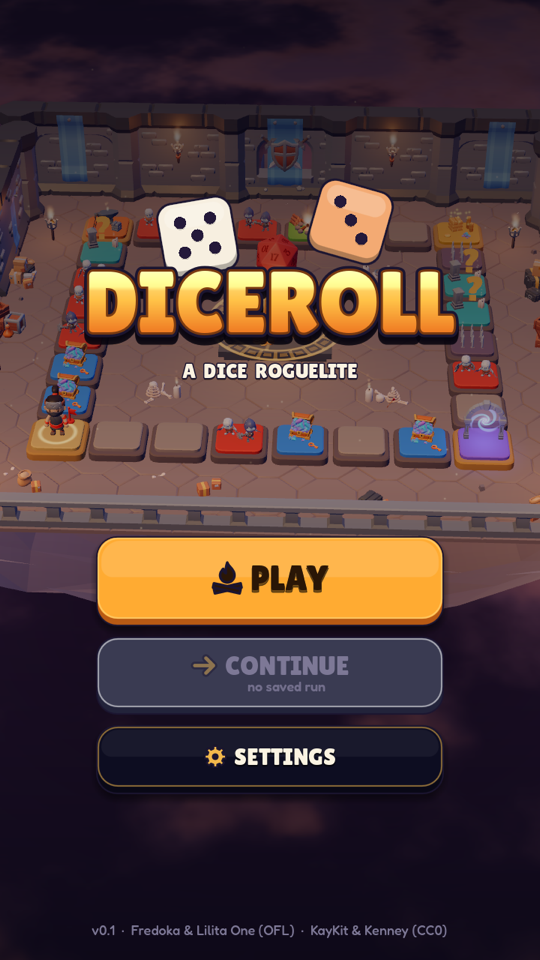
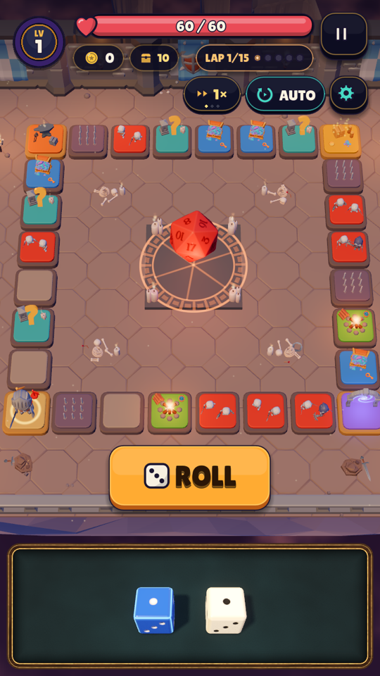
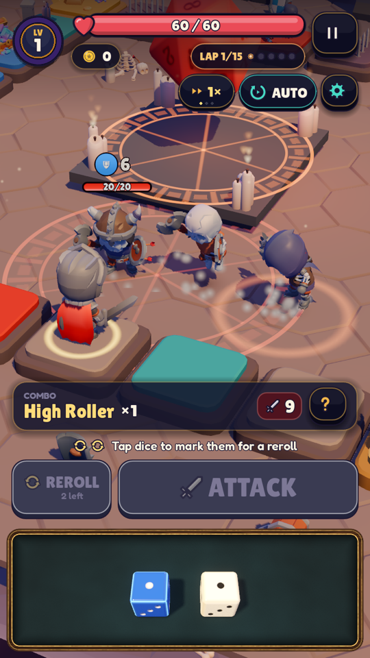
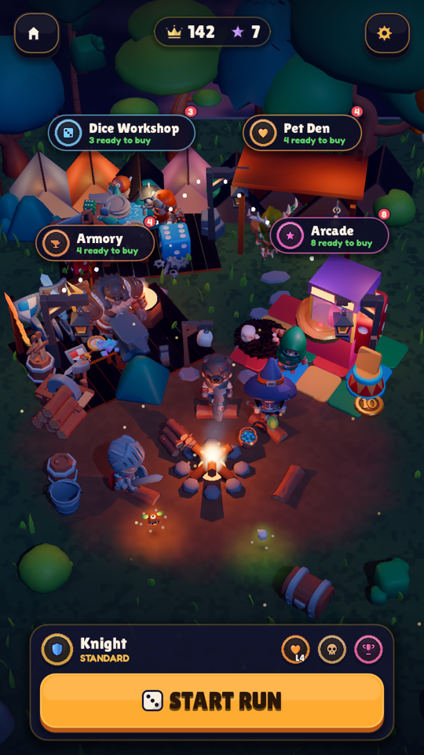

# Diceroll

A cozy dice-rolling roguelite board game. Roll your dice to move around a looping board, fight
monsters with dice combos, collect runes and gear, survive three biomes and a boss, then grow your
camp between runs. Built with [Godot 4.7](https://godotengine.org) in GDScript, for iPhone, iPad,
Android, macOS, Windows, Linux and the web.

<p align="center">
  
  
  
  
</p>

## Features

- **Dice-driven board runs**: every lap is a loop of fight, shop, chest, event, forge and portal
  tiles; the dice you roll move you and power your attacks (pairs, straights and other combos).
- **Classes** with distinct dice, runes, affixes, gear with real item models, potions and pet familiars.
- **Biomes and bosses**: seed-driven routes through themed biomes, mini-bosses and final bosses.
- **Camp meta-progression**: Armory, Dice Workshop, Pet Den and an Arcade of minigames.
- **AUTO play** with configurable rules, speed control and a UI-size setting.
- Responsive layout from phones (safe areas, foldables) to 1080p desktops.

## Download

Get the latest build from [GitHub Releases](https://github.com/vladzaharia/diceroll/releases):

| Platform | File | Notes |
|---|---|---|
| macOS (Apple Silicon + Intel) | `Diceroll-<v>-macos.dmg` / `.zip` | Signed and notarized when the release was built with Apple credentials; otherwise right-click > Open the first time. |
| Windows x86_64 | `Diceroll-<v>-windows-x86_64.zip` | Unzip and run `Diceroll.exe`. |
| Linux x86_64 / arm64 | `Diceroll-<v>-linux-*.tar.gz` | Steam Deck: use x86_64. |
| Android | `Diceroll-<v>-android.apk` | Sideload, or track releases with [Obtainium](https://obtainium.imranr.dev). |
| iPhone / iPad | `Diceroll-<v>-ios-sideload.ipa` | Via SideStore/AltStore: add the source `https://github.com/vladzaharia/diceroll/releases/download/channels/altstore-source.json`. |
| Web | `Diceroll-<v>-web.zip` | Static files, no special headers needed (single-threaded build). |

Desktop builds from GitHub update themselves: new content downloads in the background
(signed and verified) and applies on the next launch. You can turn this off in Settings.
Release checksums are in `SHA256SUMS.txt`.

## Build from source

The code in this repository is open source (MIT), but **the game's third-party art, audio and
fonts are not included**: the KayKit EXTRA packs are sold by their creator, so all third-party files
stay out of git. You need to obtain them yourself. Without them the game stops at a "Required game
assets are missing" screen with a link back here (tests and headless tools still run).

### 1. Prerequisites

- [Godot 4.7.2](https://godotengine.org/download/archive/4.7.2-stable/) (standard build, not .NET)
  and, for exports, its export templates (Editor > Manage Export Templates).
- `rsync`, `curl`, `unzip`, and optionally `ffmpeg` (re-encodes the music to 96 kbps).
- Python 3.10+ for the CI tooling in `tools/ci/` (optional).

### 2. Get the asset packs

All KayKit packs are CC0; the EXTRA tiers and Mystery Monthly are paid. The game currently needs
**all** of the packs below (FREE and EXTRA). Download the glTF versions and extract each one into
`third_party/kaykit/<folder>` using exactly these folder names:

| `third_party/kaykit/` folder | Pack | Tier |
|---|---|---|
| `KayKit_Adventurers_2.0_FREE` | [Adventurers 2.0](https://kaylousberg.itch.io/kaykit-adventurers) | FREE |
| `KayKit_Adventurers_2.0_EXTRA` | [Adventurers 2.0](https://kaylousberg.itch.io/kaykit-adventurers) | EXTRA |
| `KayKit_Character_Animations_1.1` | [Character Animations 1.1](https://kaylousberg.itch.io/kaykit-character-animations) | FREE |
| `KayKit_Skeletons_1.1_FREE` | [Skeletons 1.1](https://kaylousberg.itch.io/kaykit-skeletons) | FREE |
| `KayKit_Skeletons_1.1_EXTRA` | [Skeletons 1.1](https://kaylousberg.itch.io/kaykit-skeletons) | EXTRA |
| `KayKit_Mystery_Monthly_Series_4` | [Mystery Monthly Series 4](https://kaylousberg.itch.io/kaykit-series-4) | paid |
| `KayKit_Dungeon_Pack_1.1_FREE` | [Dungeon Pack 1.1](https://kaylousberg.itch.io/kaykit-dungeon-pack) | FREE |
| `KayKit_Dungeon_Pack_1.1_EXTRA` | [Dungeon Pack 1.1](https://kaylousberg.itch.io/kaykit-dungeon-pack) | EXTRA |
| `KayKit_Forest_Nature_Pack_1.0_EXTRA` | [Forest Nature Pack](https://kaylousberg.itch.io/kaykit-forest) | EXTRA |
| `KayKit_ResourceBits_1.0_FREE` | [Resource Bits](https://kaylousberg.itch.io/resource-bits) | FREE |
| `KayKit_ResourceBits_1.0_EXTRA` | [Resource Bits](https://kaylousberg.itch.io/resource-bits) | EXTRA |
| `KayKit_RPGToolsBits_1.0_FREE` | [RPG Tools Bits](https://kaylousberg.itch.io/rpg-tools-bits) | FREE |
| `KayKit_RPGToolsBits_1.0_EXTRA` | [RPG Tools Bits](https://kaylousberg.itch.io/rpg-tools-bits) | EXTRA |
| `KayKit_FantasyWeaponsBits_1.0_FREE` | [Fantasy Weapons Bits](https://kaylousberg.itch.io/fantasy-weapons-bits) | FREE |
| `KayKit_FantasyWeaponsBits_1.0_EXTRA` | [Fantasy Weapons Bits](https://kaylousberg.itch.io/fantasy-weapons-bits) | EXTRA |
| `KayKit_BoardGameBits_1.0_FREE` | [Board Game Bits](https://kaylousberg.itch.io/board-game-bits) | FREE |
| `KayKit_BlockBits_1.0_FREE` | [Block Bits](https://kaylousberg.itch.io/block-bits) | FREE |
| `KayKit_HalloweenBits_1.0_FREE` | [Halloween Bits](https://kaylousberg.itch.io/halloween-bits) | FREE |
| `KayKit_Platformer_Pack_1.0_FREE` | [Platformer Pack](https://kaylousberg.itch.io/kaykit-platformer) | FREE |

Music (CC0, from OpenGameArt by RandomMind and cynicmusic): download each track into
`third_party/music/<folder>/` keeping the file name. A missing track is only a warning: that music
bed stays silent.

| file | track | used for |
|---|---|---|
| `randommind/Loop_The_Bards_Tale.wav` | [Medieval: The Bard's Tale (loop)](https://opengameart.org/content/medieval-the-bards-tale) | title |
| `randommind/Loop_The_Old_Tower_Inn.wav` | [Medieval: The Old Tower Inn (loop)](https://opengameart.org/content/medieval-the-old-tower-inn) | camp / calm |
| `randommind/harvestseason.wav` | [Medieval: Harvest Season](https://opengameart.org/content/medieval-harvest-season) | glade |
| `randommind/Lament_for_a_Warriors_Soul_REUPLOAD.mp3` | [Fantasy: Lament for a Warrior's Soul](https://opengameart.org/content/fantasy-lament-for-a-warriors-soul) | crypt |
| `randommind/Rising_Moon_0.mp3` | [Fantasy: Rising Moon](https://opengameart.org/content/fantasy-rising-moon) | frost |
| `randommind/battle_1.wav` | [Medieval: Battle](https://opengameart.org/content/medieval-battle) | throne |
| `cynicmusic/GameMusic_ForestTheme_24_0.mp3` | [Dark Forest Theme](https://opengameart.org/content/dark-forest-theme) | hollow |
| `cynicmusic/battleThemeB.mp3` | [Battle Theme B for RPG](https://opengameart.org/content/battle-theme-b-for-rpg) | magma |
| `cynicmusic/battleThemeA.mp3` | [Battle Theme A](https://opengameart.org/content/battle-theme-a) | boss |

UI art (the 2026-09-30 reskin): the RhosGFX vector packs go into `third_party/rhosgfx/<folder>`,
unzipped as downloaded. The Quaternius pack goes into `third_party/quaternius/<folder>`.
- The UI only copies the SVGs it references.
- A missing RhosGFX pack is only a warning. Those controls and icons keep the built-in drawn look.

| `third_party/` folder | Pack | Tier |
|---|---|---|
| `rhosgfx/cartoony-ui-pack-full` | [Cartoony UI Pack](https://rhosgfx.itch.io/cartoony-ui-pack) (Full) | paid |
| `rhosgfx/vector-icon-pack-pro` | [Vector Icon Pack](https://rhosgfx.itch.io) (Pro) | paid |
| `rhosgfx/vector-keyboard-controls` | [Vector Keyboard Controls](https://rhosgfx.itch.io) | free (CC0) |
| `rhosgfx/vector-emojis` | [Vector Emojis](https://rhosgfx.itch.io) | free (CC0) |
| `rhosgfx/vector-hats` | [Vector Hats](https://rhosgfx.itch.io) | RhosGFX licence |
| `quaternius/ultimate-platformer-pack` | [Ultimate Platformer Pack](https://quaternius.com) by Quaternius | free (CC0) |

Fonts (OFL) and Kenney sound effects (CC0) are downloaded for you by the import script.

### 3. Import, run, test

```sh
tools/import_assets.sh --fetch       # third_party/ -> assets/kaykit, assets/audio, assets/fonts, assets/ui
godot --headless --path . --import   # first import (a few minutes)
godot --path .                       # play (or open the project in the editor)
./tests/run.sh                       # headless test suite (fails on any SCRIPT ERROR)
godot --headless --path . -s tools/sim.gd -- --runs=50 --class=all   # balance simulator
tools/export.sh macos|windows|linux|web|android|ios   # exports (see the script header)
```

Screenshots of any scenario, in the background: `tools/shoot.sh <scenario> /abs/out.png 720x1280`,
or the device matrix: `tools/shoot_matrix.sh <scenario> <dir> quick`. Git hooks (asset guard +
Conventional Commits): `git config core.hooksPath tools/git-hooks`.

### Forks and CI

GitHub Actions runs static checks (asset/secret guard, gitleaks, actionlint, shellcheck, tooling
self-tests) on every PR. Jobs that need the game assets (unit tests, balance smoke, screenshots
across the device matrix, exports) use encrypted asset bundles from a private repository, so they
**skip on forks** and on PRs from forks; a maintainer's run covers them. To run the full pipeline
on your own fork, create your own private asset store and secrets as described in
[docs/RELEASE.md](docs/RELEASE.md) and [docs/ASSETS.md](docs/ASSETS.md).

## Documentation

- [docs/RELEASE.md](docs/RELEASE.md): CI/CD, release channels, versioning, secrets, auto-updates
- [docs/ASSETS.md](docs/ASSETS.md): third-party asset layout and the CI asset bundles
- [docs/CONVENTIONAL_COMMITS.md](docs/CONVENTIONAL_COMMITS.md), [CONTRIBUTING.md](CONTRIBUTING.md)
- [CHANGELOG.md](CHANGELOG.md), design notes in [docs/design](docs/design) and [docs/plans](docs/plans)

## License

Code, docs and original art: [MIT](LICENSE) © 2026 Vlad Zaharia. Third-party assets are
licensed by their authors: see [THIRD_PARTY_NOTICES.md](THIRD_PARTY_NOTICES.md). Please support
[Kay Lousberg](https://kaylousberg.itch.io) by buying the KayKit packs.
