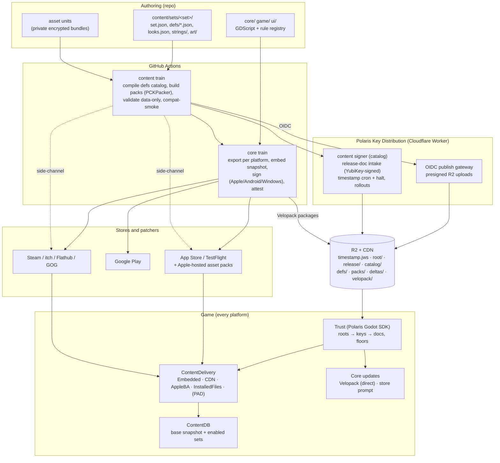
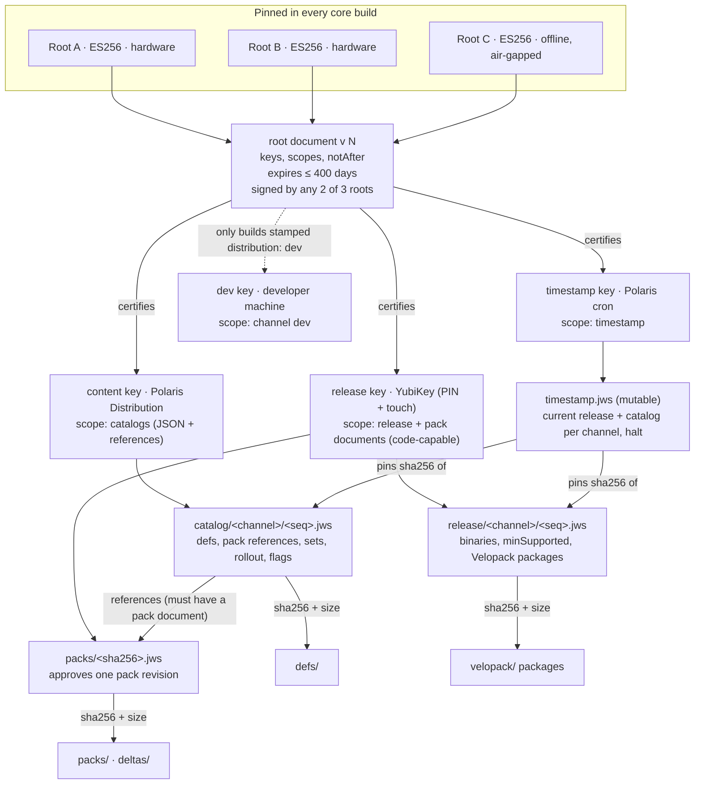
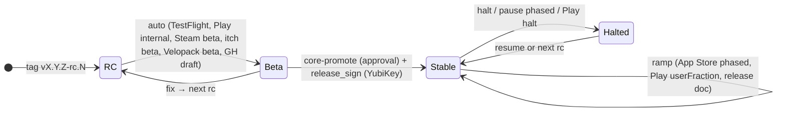
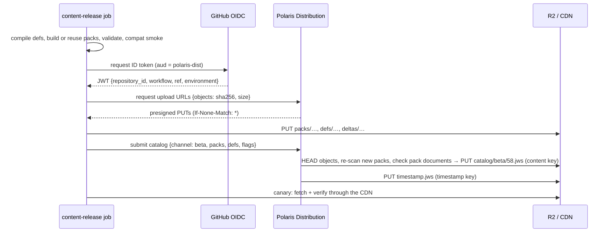

# Distribution, updates, signing and content packs (v2)

Date: 2026-09-29. Status: **proposal for Vlad's decision.** Nothing here is implemented yet.
Supersedes the delivery, manifest, security, hosting and phasing parts of
[`2026-09-29-content-streaming.md`](2026-09-29-content-streaming.md) (§3–5, §7–9, §11). Its size
measurements, experiments and the BootShell loader UX (§2, §6, appendix A) still stand; see
appendix A for what carries over.

Implementation plan: [`docs/plans/2026-09-29-distribution-v2-plan.md`](../plans/2026-09-29-distribution-v2-plan.md).
Research inputs (point-in-time, with sources and verified/uncertain marks):
[`docs/research/distribution-2026-09/`](../research/distribution-2026-09/README.md).

Scope: how every platform build is distributed and updated; how maps, classes, heroes, monsters,
weapons, tools and the rest become **data that ships in small content packs without a core update**;
how packs are grouped for small updates; how everything is signed and verified; the per-platform
delivery layer the game sits behind (Background Assets, Play, Steam, our CDN…); the CI that builds and
releases it; and what Polaris Key needs to run it.

---

## 0. Summary

**The short version:** the game becomes a **core** (engine + code + rules + a built-in copy of all
content) plus **content** (a small signed definitions catalog + data-only asset packs). They ship on
two independent release trains. Each platform gets its best native channel for the core, and a
per-platform `ContentDelivery` backend for content. One trust chain (offline roots, scoped online keys,
Polaris Key as the publishing gateway and timestamp signer) covers every byte the game mounts, no
matter who delivered it.

Terms used throughout: a **release channel** is `dev`, `beta` or `stable`; a **distribution** is
where a build came from (App Store, Play, Steam, the direct installer, the Web…).

### 0.1 Decisions (recommended)

| # | Decision | Why |
|---|---|---|
| D1 | **Two release trains.** *Core* (binary: engine, GDScript, rule registry, base content snapshot) goes through stores and installers. *Content* (definitions catalog + asset packs) ships on its own cadence, without store review wherever the platform allows | New weapons, maps and enemies are data; new mechanics are code. Separating them is what lets content ship without a core update |
| D2 | **Content definitions become JSON** (+ JSON Schema), authored per *content set*, compiled into one signed **defs catalog** (~40 KB gz). Rules dispatch on declared rule ids, not on item/enemy/biome ids | Today a pack can't add even a copy of an existing weapon: `core/item_logic.gd` branches on 51 item ids. JSON is the only Godot format that can't execute code (`.tres`, `.tscn`, `ConfigFile`, `str_to_var` all run embedded scripts, tested on 4.7.2) |
| D3 | **Asset packs are data-only PCKs**, grouped as ~8 *library* packs (shared art by source and co-usage) plus append-only *set* packs for new art. 1–25 MB each; tens of packs, not hundreds. New content lands in **new** packs; old packs rarely change | Small, cacheable, delta-friendly on every store patcher (Apple-hosted packs re-download whole, one more reason new art goes into new packs); KayKit meshes are shared across domains so per-domain asset packs would duplicate them |
| D4 | **The game sits behind `ContentDelivery`**, with backends: Embedded, CDN, Apple Background Assets, Steam/installed files, (optional) Play Asset Delivery. Every pack is hash-verified against a trusted list before its first mount, whatever delivered it | One code path for mounting and trust; the platform decides only *where bytes come from* |
| D5 | **Desktop direct builds update the core with Velopack** (Windows installer, macOS pkg, Linux AppImage; per-file zstd deltas), wrapped in a small GDExtension that only applies packages our signed release document lists. **The `--main-pack` code-pack updater is retired** | Official 4.6+ export templates refuse `--main-pack` (verified on our shipped rc.3 binary), so today's desktop code updates can't work. Velopack gives small binary+code deltas with one integration on three OSes |
| D6 | **Stores update the core** (App Store, Play, Steam, itch, Flathub, GOG, Epic). The game only *prompts* (min-version from the signed release document; Play In-App Updates on Play) | Stores already patch well; self-updating store builds is against policy (Microsoft 10.2.5, Steam guidance) |
| D7 | **iOS/iPadOS App Store: art packs via Apple-hosted Background Assets** (managed asset packs, OS 26+); definitions via our CDN. Everything needed for a complete offline run stays in the IPA | Apple-hosted packs can be added and updated **without a new app binary** (reviewed per version, served to every installed build); definitions stay instant |
| D8 | **Google Play: base + launch packs install-time in the AAB; live content from our CDN** (data-only, allowed by Play policy). PAD fast-follow/on-demand only if the game outgrows ~500 MB | Play has no public asset-only updates: every PAD change needs a new AAB and review |
| D9 | **Trust v2 ("DIST-1"):** ES256 (ECDSA P-256) JWS documents: offline **root** keys (2 of 3) → root-signed key list → scoped keys. Documents: `root`, `timestamp` (the only mutable file; freshness + halt), `release` (binaries, per release channel), `catalog` (content, per release channel), `pack` (approves one asset-pack revision; also shipped inside store-delivered packs). Monotonic sequence floors, expiry, clock floor | Fixes freeze/rollback/key-rotation gaps in today's single RSA key. ES256 verifies natively in Godot (~1 ms); Ed25519 doesn't load in Godot's mbedTLS (a pure-GDScript verifier exists and is kept in the SDK for Polaris's existing EdDSA documents) |
| D10 | **Key custody by blast radius.** The *release* key on a YubiKey signs release documents (binaries) **and pack documents** approving each new asset-pack revision: one touch per core release or art drop. The *content* key, held by Polaris Key, signs catalogs (JSON definitions plus references to approved packs) after verifying the CI job's GitHub OIDC token and policy. The *timestamp* key runs in a Polaris cron. Roots stay offline | Balance changes and data-only sets (the common case) ship with no human in the loop. JSON can't execute code; binary resources could in principle embed a script, so every new pack is approved on hardware **and** scanned in CI and on the device before its first mount |
| D11 | **Hosting: Cloudflare R2** behind a custom domain. Immutable, content-addressed objects with bucket locks; one short-cached `timestamp` file. GitHub Releases keeps human downloads, checksums and attestations | $0–7/month at 100k installs; zero egress; Range requests for resume; no Worker on the hot path, so the game never depends on the Worker being up |
| D12 | **Polaris Key gains a Distribution service** (separate Worker from the same monorepo) and a **Godot SDK**: OIDC publish gateway, content signer, release-document intake, timestamp cron + halt switch, rollouts, GC, console and `pkey dist` CLI. Serving stays static on R2 | Keeps long-lived Cloudflare and signing secrets out of GitHub; gives one place for rollouts, kill switches and audit; reusable by other products |

### 0.2 Per-platform at a glance

| Platform | Core (binary) channel and updates | Content: definitions | Content: asset packs |
|---|---|---|---|
| **iPhone / iPad** | App Store + TestFlight (auto-update, phased release; in-game min-version prompt) | CDN | **Background Assets (Apple-hosted)**; launch set embedded |
| **Mac (direct)** | Developer ID, notarized; **Velopack** `.pkg`, deltas | CDN | CDN → Application Support |
| **Mac App Store** (later) | Store, universal purchase with iOS | Apple-hosted pack | Background Assets (same packs as iOS) |
| **Windows (direct)** | **Velopack** per-user installer, deltas; Artifact Signing | CDN | CDN → `%LOCALAPPDATA%` |
| **Linux (direct)** | **Velopack AppImage** (x64/arm64); tar.gz fallback | CDN | CDN → `~/.local/share` |
| **Steam** (Win/Linux/Deck/mac) | SteamPipe depots and branches | CDN (optional) + depot copy | depot files (append-only) |
| **Flathub** | Flatpak (self-update off) | CDN (optional) | bundled |
| **itch.io** | butler channels (itch app) | CDN (optional) | bundled |
| **GOG / Epic** (later) | their patchers | bundled (+ optional CDN) | bundled |
| **Microsoft Store** | deferred: games must update only through the Store | Store | Store |
| **Android (Play)** | AAB, Play auto-update + In-App Updates | CDN | install-time (all v1 library packs) + CDN (new set packs) |
| **Android (GitHub / Obtainium)** | Play-signed universal APK | CDN | embedded (all v1) + CDN |
| **iOS sideload** (SideStore/AltStore) | unsigned "full" IPA + source JSON (by-product only) | CDN | embedded + CDN |
| **Web** | always latest (R2-hosted build folders + itch mirror) | CDN | CDN, lazy, browser cache |

### 0.3 What it costs

- **Money:** Apple Developer Program $99/yr (already needed), Steam $100 once, Azure Artifact Signing
  $9.99/month (if eligible), three YubiKeys (~$165 once), Cloudflare R2 + Workers ≈ $0–7/month.
- **Work:** about **27–39 agent-weeks** in total (135–197 agent-days), much of it parallel. About a
  third is the content-as-data refactor, which is also what makes packs able to add content at all.
  The plan orders it so every step ships on its own (plan doc, milestones M0–M7). With two or three
  lanes in parallel and review time, that's roughly 4–6 calendar months to the first live drop on
  test tracks, plus store lead times for public launches.

---

## 1. What we learned (facts that change the plan)

Each fact below was verified this session against a primary source or an experiment on Godot
4.7.2; the research notes carry the details.

1. **Desktop code updates are broken on every shipped build.** Godot 4.6 turned off `--main-pack`
   (and `--path`, `-s`, …) in official export templates (godotengine/godot#111909). Our rc.3 Linux
   binary aborts with "`--main-pack` was specified on the command line, but this Godot binary was
   compiled without support for path overrides". `game/update/updater.gd` relaunches with it, so a
   GitHub desktop install that stages a pack fails to start twice, rolls back and skips that version.
2. **A content pack can't add a weapon today, even a copy of an existing one.** The data in
   `core/content/*.gd` is already JSON-shaped (77.5 KB, 22 KB gz, 3.3 ms to parse), but the rules
   dispatch on content ids: `item_logic.gd` checks 51 item ids and 51 variant ids, and so do the AUTO
   bot and `meta_run.gd`; passives, pets, potions, runes, events, affixes, the four older biome twists
   and the Moon King are hard-wired by id. Enemy intents/traits, the new biome twists, class
   mechanics, dice kinds and unlock conditions are already generic.
3. **Saves destroy unknown content.** `Profile.from_dict` drops ids it doesn't recognise, so a pack
   that isn't mounted at load time would permanently erase its unlocks and items on the next save.
4. **Only JSON is safe for pack definitions.** On 4.7.2, a pack-shipped `.tres` with an embedded
   GDScript runs it on `load()`; a `.tres` can point at a downloaded `user://` script and run it;
   `ConfigFile` and `str_to_var` instantiate scripts; a binary `.scn` can embed a script that
   `get_dependencies()` doesn't report. `JSON.parse_string` only yields plain values (and turns
   every number into a float).
5. **Godot crypto:** RSA PKCS#1 v1.5 and ECDSA P-256 verify natively; RSA-PSS doesn't; **Ed25519
   keys don't load** (mbedTLS); there's no SHA-512. A pure-GDScript Ed25519 + SHA-512 verifier
   written for this investigation passes RFC 8032 and a cross-language JWS conformance corpus at
   ~15 ms per verify on desktop with fully unrolled field arithmetic (~74 ms for a simpler version).
6. **Pack mounting:** no unload API (4.7 or 4.8-dev); with `replace_files=false` the first mounted
   file wins; pack files are re-opened by path on every read (never overwrite a mounted pack, so
   files must be content-addressed); each mount re-reads the UID and class caches (~10 ms per pack
   with large caches, so keep packs to tens); packs built by a newer engine minor are rejected;
   `uid://` into pack content needs a per-pack UID map registered at mount.
7. **Apple-hosted Background Assets** (iOS/iPadOS/macOS 26+): asset packs are uploaded and versioned
   separately from builds and can be updated or added **without a new app version**; each pack
   version is reviewed (the first packs must ride in the first app submission; at most 10 packs per
   submission); once approved it is served to **every installed app version**; archiving a pack
   removes all its versions; limits are 200 packs and 200 GB per app record; a `StoreDownloaderExtension` target and an App Group are
   required; `url(for:)` gives a plain file path valid for the process. Not available to Developer ID
   Mac apps. On the Mac App Store, guideline 2.4.5(iv) forbids downloading resources that add
   functionality from anywhere else. On-Demand Resources is deprecated in iOS 27.
8. **Google Play:** asset packs change only with a new app version (bundletool's `ASSET_ONLY`
   bundles are not publicly available). Play policy allows downloading non-executable data. Godot
   4.7's AAB export already puts the game in an install-time asset pack and meets the API 36 and
   16 KB page-size rules. There's no Godot 4 PAD plugin. **Android developer verification:** apps
   not registered by **2026-09-30** are removed from Play; enforcement for sideloaded installs on
   certified devices rolls out globally in 2027.
9. **Stores:** Steam wants new content as new files, no pack-level compression or encryption, and
   says "do not require users to download content inside your game"; the default branch can only be
   set live by hand. Microsoft Store policy 10.2.5 requires games and in-game content to be installed
   and updated only through the Store. GodotSteam moved to Codeberg (v4.22, Godot 4.7.2).
10. **Our release pipeline stamps the wrong distribution** on several builds: Steam and itch get the
    GitHub desktop build (so they would self-update from GitHub), the sideload APK is stamped `play`
    and the sideload IPA `appstore`. Old clients also reject any manifest whose `schema` isn't
    exactly 1, so the "additive schema 2" of the previous proposal can't reuse the same URL.
11. **The update signing key is a code-signing key** (the pack carries all GDScript) held as an
    ungated repository secret, with no key id, expiry, freshness or rollback floor.
12. **Web and CDN:** GitHub Releases downloads carry no CORS headers, so the Web build can't fetch
    from them; Cloudflare Workers static assets and Pages cap files at 25 MiB (our `index.wasm` is
    39.5 MB); `HTTPRequest.download_file` is broken on Web in 4.7.2; `user://` on Web is copied into
    memory on every page load. Between rc.1 and rc.3 no asset file changed, only 0.5–1.2 MB of code.
13. **GitHub:** immutable releases (GA Oct 2025) conflict with the rolling `channels` release;
    scheduled workflows in public repos are disabled after 60 days of inactivity (so a daily
    freshness re-sign can't rely on them); Cloudflare's API has no GitHub OIDC federation, so a
    Worker must bridge it.

---

## 2. Goals, non-goals and principles

**Goals**

1. New weapons, armor, trinkets ("tools"), enemies, bosses, heroes (from existing mechanics), biomes
   (maps) and events ship **as data**, without a core update, on every platform that allows it.
2. Updates are small: a balance change is kilobytes; a new weapons set is its defs plus only its new
   art; fixing one pack re-downloads one pack (or a delta).
3. Each platform uses its best native system for the core and, where it pays, for content.
4. Every byte the game mounts is verified against a signed or compiled-in list.
5. One maintainer can run it: one command or one approval per release, automated promotion,
   instant halt and rollback.

**Non-goals**

- Downloading code on any channel (store policy and safety). New mechanics always need a core release.
- Accounts, telemetry or per-user remote config. Everyone on a ruleset sees identical data.
- A launcher/bootstrapper that downloads the whole game on first run (rejected in the previous
  proposal; still rejected).
- Paid content packs (the design leaves room; see §12.4).

**Principles**

- **Data can recombine only mechanics the client already has.** Ship the rule in a core release,
  then the data that uses it.
- **Append-only content.** New content goes into new sets and packs; ids are forever; nothing is
  deleted, only retired.
- **Build once, promote many.** Binaries and packs are built once and promoted by moving signed
  pointers or store tracks, never rebuilt for "final".
- **Offline-first.** The core always contains a complete, playable snapshot. Network content is an
  overlay; losing the network never blocks play.
- **Verify, then mount; mount only data.** Same rules for every source.
- **Static serving, dynamic signing.** Players only ever fetch static files from a CDN; the Worker is
  on the publishing path, not the playing path.

---

## 3. Architecture at a glance



**Layers, bottom to top:**

1. **Core** (per platform, per binary release): engine, all GDScript, the rule registry and its
   capability list, trust roots, the built-in content snapshot (defs + catalog + launch packs).
2. **Content** (per content release): one defs catalog per channel and data-only asset packs.
3. **Delivery** (`ContentDelivery`): per-platform backends that produce verified file paths.
4. **Trust** (`addons/polaris_key`): verifies every document and pack hash; keeps floors.
5. **Publishing** (CI + Polaris Distribution): builds, validates, signs, uploads, promotes.

---

## 4. Content model: sets, definitions and asset packs

### 4.1 Vocabulary

| Term | What it is | Size | Changes |
|---|---|---|---|
| **Content set** | The authoring and enabling unit: a named group of definitions (`armory-base`, `weapons-2026-10`, `biome-sunken`, `balance-2026-10-15`) | 1–15 KB of JSON | append-only; balance patches are their own sets |
| **Defs catalog** | All sets for one channel, compiled by CI into one canonical JSON file (`defs/<sha256>.json`) | ~40 KB gz today | every content release |
| **Asset pack** | A data-only `.pck` with meshes, textures, audio, fonts | 1–25 MB | rarely; new art goes in new packs |
| **Library pack** | Shared art, grouped by source unit and co-usage (`lib-core3d`, `lib-foes`, …) | 2–20 MB | on art fixes and engine upgrades |
| **Set pack** | New art that belongs to one set (`art-weapons-2026-10`, `music-sunken`); art under ~1 MB goes into the quarter's shared pack (`art-2026q4`) instead | 1–25 MB | fix-only |
| **Content snapshot** | The defs, catalog and packs a build carries inside it | — | per core release; builds that bundle content (Steam, itch, Flathub) also get a refreshed snapshot with each content release, around the same core |

A set can exist without any asset pack: a new weapon that reuses KayKit models already in
`lib-armory` is a few hundred bytes of JSON. **Most live content should look like that.**

### 4.2 Authoring layout

```
content/
  ids.lock.json                 # append-only id ledger: {id: {kind, order, first_set, retired?}}
  schema/                       # JSON Schemas per kind and format major (items, enemies, biomes, …)
  sets/
    armory-base/
      set.json                  # manifest (below)
      defs/items.json           # one or more files, one entity per block
      defs/variants.json
      looks.json                # presentation (model paths, mounts, icons, palettes)
      strings/en.json           # display text by key
    weapons-2026-10/
      set.json
      defs/items.json
      looks.json
      strings/en.json
      art/                      # optional new art → becomes the pack art-weapons-2026-10
```

`set.json`:

```json
{
  "id": "weapons-2026-10", "title_key": "set.weapons-2026-10.title",
  "domain": "armory", "layer": "content", "order": 120,
  "format": 1, "min_core": "0.6.0",
  "requires_sets": ["armory-base"],
  "requires_packs": {"lib-armory": 1},
  "pool_policy": "new-runs",
  "requires_caps": ["effect:cleave@1", "sec:bleed@1", "look.mount:two_hand@1"]
}
```

`requires_caps` and the id checks are computed and enforced by CI; authors don't maintain them by
hand. A set with new art would also list its pack (`"art-weapons-2026-10": 1`).

### 4.3 Definitions: format and merge rules

- **Format:** JSON validated by JSON Schema in CI and by a headless Godot semantic pass. Engine types
  are encoded as `"#rrggbb"` and `[x, y, z]` and decoded by one `ContentCodec`. Integers are cast
  where the schema says so (Godot parses all JSON numbers as floats). Canonical serialisation (sorted
  keys) keeps hashes reproducible.
- **Never** use `.tres`/`.tscn`, `ConfigFile`, `str_to_var`, `bytes_to_var_with_objects` or
  `Expression` on anything that came from content. The DSL stays declarative: enumerated rule ids with
  numeric parameters and closed condition enums, no formula strings. That keeps packs clearly "data"
  for Apple 2.5.2 and Play's Device and Network Abuse policy.
- **Operations** a set may contain:

  | Op | Meaning | Example |
  |---|---|---|
  | `add` | new entries; the id must be new (conflict = the whole set is rejected) | a new `flail` item and its variants |
  | `patch` | JSON Merge Patch on fields the schema marks `patchable` (numbers, weights, text keys, looks, pools) | `sword.effect.n.flat = [1, 1, 2]` |
  | `edit` | order-insensitive `$add`/`$remove` on membership lists | add `bone_flailer` to the Crypt's late pool |
  | `constants` | typed, allow-listed global numbers | `Balance.CAMPFIRE_HEAL_PCT = 0.32` |
  | `retire` | entry stays loadable for saves, is never offered again | retire an event |

  Identity fields (`slot`, `effect.rule`, `sec`, `kind`, `tier`) are not patchable; changing them is
  a new entry or a new format major.
- **Merge order** is deterministic and independent of download order: sort sets by
  `(layer, order, id)` with layers `core` < `content` < `balance` < `hotfix`; apply all `add`, then
  `edit`, then `patch`/`constants`, then `retire`; validate references; disable any invalid set
  together with its dependents; freeze; compute the **ruleset fingerprint**
  `fp = sha256(canonical merged DB)`.
- **Facade:** the existing `ItemDefs`, `EnemyDefs`, `HeroDefs`… classes stay as the API (about 600
  call sites, the sim and the tests use them) and read from `ContentDB`. `const` tables become static
  vars filled by `ContentDB.ensure()`, which also works in headless tests without autoloads.

### 4.4 Rule registry and capabilities

The core publishes what it can execute, as `{kind: {primitive: version}}`
(`core/content/content_api.gd`):

```gdscript
const FORMAT := 1
const CAPS := {
  "effect": {"twin_edge": 1, "cleave": 1, "thorns": 1},   # item rules (51 today)
  "sec": {"slash": 1, "precision": 1},                      # variant secondaries (50 today)
  "intent": {"attack": 1, "drain": 1, "bury": 1},           # enemy intents (15)
  "trait": {"armor": 1, "thorns": 1},                       # enemy traits (6)
  "twist": {"ore": 1, "drums": 1, "campfire_bonus": 1},     # biome twists
  "passive": {}, "rune_trigger": {}, "rune_effect": {}, "pet_fire": {}, "pet_perk": {},
  "potion_op": {}, "event_kind": {}, "tile": {}, "mechanic": {}, "boss_mech": {"moon_meter": 1},
  "look.model": {}, "look.mount": {}, "look.dressing": {},
}
```

- A set's `requires_caps` is computed by CI by walking every rule, intent, trait, twist and look
  reference.
- A primitive's version is bumped only on an incompatible change; prefer adding a new primitive so
  old sets keep working.
- The client drops sets it can't run (before downloading their packs), shows "Update the game to get
  *Set X*" for content the player already owns, and keeps saves that reference it dormant.
- New primitives ship in a core release with at least one base use and a release-notes line, then
  data enables new combinations. Don't dark-ship whole modes that data switches on later (Apple 2.3.1).

### 4.5 Looks: presentation as data

Presentation tables that are data written as code today (`EnemyRoster.LOOKS`, `ItemMounts.*`,
`Character.MODELS`/`PART_MAP`, `Biome.LOOKS`, palettes, music map, encounter texts) move into each
set's `looks.json`. Code keeps only the *builders* (procedural extras, pet bodies, dressing kits,
overlays), registered as `look.*` capabilities.

- Look paths must lie under the prefixes of packs listed in `requires_packs`; CI checks they
  resolve. Paths are only ever loaded through the existing chokepoints (`Props`, character, audio);
  the game never `load()`s an arbitrary path read from data.
- Every kind has a fallback look (mannequin, glyph, crypt frame), so missing art never blocks rules.
- **Maps (biome dressing)** come in two tiers: `{"kit": "moonlit"}` reuses an existing code dresser
  with a new sky, terrain and palette (available right after the refactor); `{"spec": {…}}` is a
  small declarative placement spec over the existing `Dressing` API (`scatter`, `place_near`,
  `front_row`, set pieces, lights). The spec is what makes brand-new maps shippable as data.

### 4.6 Asset pack taxonomy

v1 packs (sizes from the measured units; the full PCK is now 85 MB):

| Pack | Contents (current asset units) | ≈ MB | Required for | Missing → |
|---|---|---|---|---|
| *(core)* | GDScript, UI scenes/shaders, logo, trust roots, snapshot | 4–5 | everything | — |
| `lib-ui` | fonts, interface/casino/digital sfx, jingles, rendered icons | 1.8 | themed UI | default font, vector glyphs |
| `lib-core3d` | boardgame, animations, adventurers, dungeon, skeletons, platformer, blocks, potions, resource, tools, weapons | ~17 | board, heroes, first biomes | required |
| `lib-foes` | foes, skeleton_props | ~5.7 | enemy looks | required for runs |
| `lib-nature` | forest (after the colour-folder dedupe) | 12–20 | Glade, Moonlit, Camp dressing | sparse dressing |
| `lib-armory` | weapons_x, tools_x, tools_extra | 3–5 | Armory items, kits | FREE models |
| `lib-props` | dungeon_x, resources, resources_x, mystery, adventurers_x, halloween | 9–10 | Camp, minigames, tile props | FREE props |
| `lib-sfx` | impact-sounds, rpg-audio | 2–3 | combat sound | silence |
| `lib-music` | title, camp and launch-biome tracks | ~8 | music | silence |
| `art-<set>`, `art-<yyyy>q<n>` | only new meshes, textures and icons for one set (or, when small, for a quarter's sets) | 1–25 | those sets | set hidden |
| `music-<set>` | new tracks for a biome or season | 2–10 | that set's music | silence |

- **Paths don't change.** Library packs keep today's `res://assets/kaykit/<unit>/…` prefixes; set
  packs use `res://assets/sets/<set>/…`. No two packs share a prefix.
- **Allow-lists are rules per pack *kind*, in code** (`game/content/packs.gd`), so a shipped core
  accepts pack ids it has never heard of: `lib-<id>` only for the library ids and prefixes it knows;
  `art-<name>` only under `res://assets/sets/<name>/`; `music-<name>` only audio under
  `res://assets/sets/<name>/music/`; each kind with its own extension list. A catalog can narrow these
  rules, never widen them.
- **Texture formats:** one universal pack per id with both desktop (S3TC/BPTC) and mobile
  (ETC2/ASTC) variants; textures are ~5 MB of the whole game, so this costs ~3 MB and avoids a
  per-platform pack matrix.
- **Budget:** 8 library packs at launch, 2–6 new set packs a year, a yearly compaction that folds set
  art into new library revisions. That stays ≤ ~20 active packs, far under Apple's 200 and Play's 100.
- **Size band:** 1–25 MB (aim 3–15). Below that, per-pack overhead (a catalog entry, a hash check, a
  mount at ~10 ms, a request) dominates; above it, a fix re-downloads too much and the Web build
  holds too much in memory.

### 4.7 When to make a new pack vs update one

| Change | What ships |
|---|---|
| New content from existing rules and art (weapons, enemies, a biome from existing tiles, events) | a new **set** in the defs catalog; no asset pack |
| New content with new art | a new set **plus** a new `art-<set>` pack (art under ~1 MB rides in the quarter's shared `art-<yyyy>q<n>` pack) |
| Numbers only | a `balance-<date>` set (`patch`/`constants`); never touches packs |
| Fix to an existing mesh/texture | a new **revision** of the same pack id (whole pack ≤ 25 MB, or a delta, §9); paths never renamed or removed within a pack id |
| New mechanic (rule, AI behaviour, tile kind, minigame kind) | **core release** first, then data |
| Breaking change to the defs format | a new format major (`defs-v2`); the old major stays frozen for old cores |
| Engine minor upgrade | rebuild every pack as a new revision; old revisions stay listed for old cores. Exception: Apple serves one live version per asset-pack id to every installed build, so Apple-hosted packs are built with the **oldest** engine minor among supported App Store builds and rebuilt only when `minSupported` moves past it (older-minor packs load in newer engines; the reverse is refused) |
| Removing content | never delete; `retire` in defs; keep art until the yearly compaction |

### 4.8 Ids, saves, runs and seeds

- **Ids are forever.** Official ids stay bare (`sword`) and globally unique, tracked by
  `content/ids.lock.json` (CI rejects reuse). Any non-official namespace would be `ns:id`. Ids are
  independent of which set or pack holds them.
- **Saves never drop unknown ids** (fix before any pack ships). Profile v4 keeps unknown entries as
  *dormant*: preserved on save, invisible in play, restored when their set is available again. Pet
  runes stored by index become ids.
- **Runs pin their ruleset.** A run records its enabled sets and `fp`; the whole run uses that view
  of the data. A run save whose sets are unavailable shows "Continue (downloading…)" or "Needs an
  update", never migrates or deletes.
- **Seeds stay stable.** Every random draw comes from lists sorted by the ledger's stable order and
  filtered by the run's enabled sets; one RNG stream per system; seed derivation uses an explicit
  hash (not Godot's `hash()`, which isn't guaranteed across engine versions). New sets join **new
  runs** by default (`pool_policy: "new-runs"`); daily challenges would name their sets explicitly.
- **The AUTO bot** learns content through `ai` hints on entries (`{score, cat}`) and a combat model
  that reasons about rules, so pack content isn't undervalued.

### 4.9 What can be data, what needs code

| Domain | Data-only (content train) | Needs a core release |
|---|---|---|
| Weapons, off-hands, armor, trinkets ("tools"), back items, variants, prices | new items from existing effect rules and secondaries, new numbers, new models | a new effect rule or trigger |
| Heroes / classes, skins | new skins; a new hero built from an existing class mechanic and passives | a new class mechanic |
| Enemies, mini-bosses, bosses | new enemies from existing intents, traits and phases; stats, pools; new meshes | new AI behaviour or boss mechanic |
| Biomes / maps | new biome from existing tile kinds and twists; enemy pools; dressing from a kit or spec; new art | a new tile kind or board rule |
| Affixes, runes, dice kinds, potions, pets | combinations of existing ops with parameters | a new op or pet behaviour |
| Events | compositions of existing outcome kinds | a new outcome kind |
| Minigames | variants (parameters, props, rewards) of an existing minigame | a new minigame |
| Unlocks, economy, shop, ascension numbers, balance | all of it | new condition kinds |

After the refactor, packs can recombine today's 51 item rules and 50 secondaries, 15 intents, 6
traits and the twists. Widening what data can express later means adding generic, composable
primitives (trigger × condition × effect with caps) in core releases, deliberately and with tests.

### 4.10 Example: a new weapons set, end to end

1. Author `content/sets/weapons-2026-10/` (four items and eight variants reusing existing rules, looks
   pointing at `lib-armory` meshes, strings). No new art, so no pack.
2. PR → CI: schema, ids ledger, `requires_caps`, every look path resolves, sim balance band, a
   screenshot scenario per new item, compat smoke against every supported core.
3. Merge → content train publishes a new defs catalog to `dev`; tag `content/2026.10.1` → `beta`
   (switchable in the Developer menu); approve → `stable` with a staged rollout.
4. Players on every channel fetch the ~40 KB catalog on their next check; the set joins new runs; a
   "New in the Armory" card appears. On Steam/itch the next depot/build also carries the catalog, so
   offline installs get it with their next patch.
5. With new art: the same, plus `art-weapons-2026-10.pck`, uploaded to R2, added to the Steam/itch
   builds and (for the App Store) uploaded as an Apple-hosted asset pack and submitted for review. The
   set stays hidden on a platform until its pack is present and verified there.

---

## 5. The delivery layer in the game

### 5.1 Distribution profile

CI stamps one profile per build into `build_info.json` (fixing today's mis-stamped builds):

```json
{"version": "0.6.0", "build": 60099, "commit": "…", "channel": "stable",
 "distribution": "direct|steam|itch|gog|epic|flathub|msstore|appstore|testflight|mac-appstore|play|apk|ios-sideload|web|dev",
 "platform": "windows-x64|macos|linux-x64|linux-arm64|android|ios|web",
 "core_updates": "velopack|store|prompt|none",
 "content": {"defs": "cdn|embedded|apple", "packs": ["embedded", "cdn"], "apple_hosted": false}}
```

`content.packs` lists the backends that may supply packs. The client collects verified copies from
all of them and mounts the **highest accepted revision** of each pack; a superseded copy (for example
an embedded revision 1 when Background Assets or Steam delivered revision 2) is never mounted, since
with `replace_files=false` it would shadow the newer one.

### 5.2 Backends and which channel uses which

| Backend | Produces | Used by |
|---|---|---|
| **Embedded** | `res://packs/<id>.pck` inside the main pack, or files next to the executable / in the `.app` Resources / APK assets / IPA | all channels (launch packs); stores and bundled channels (all packs) |
| **InstalledFiles** | pack files in the install directory (depot, butler build, Flatpak, GOG); Steam DLC via GodotSteam `isDLCInstalled`/`getAppInstallDir` | Steam, itch, Flathub, GOG, Epic |
| **CDN** | `user://packs/<sha256>.pck`, downloaded, resumable, verified | direct desktop, Web, Android (Play and APK), iOS sideload; iOS App Store for defs only |
| **AppleAssetPacks** | a copy/clone of the Background Assets file in Application Support | iOS/iPadOS App Store + TestFlight; Mac App Store |
| **PlayAssetDelivery** (optional) | the `getPackLocation()` path of a fast-follow/on-demand pack | Play, only if the game outgrows install-time |

| Channel | Defs catalog | Packs (in order) |
|---|---|---|
| App Store / TestFlight (iOS, iPadOS) | CDN (signed) | Embedded → AppleAssetPacks |
| Mac App Store | Apple-hosted `defs` pack (CDN only for the timestamp's halt/disable) | Embedded → AppleAssetPacks |
| Direct (Win/mac/Linux), Web, iOS sideload | CDN | Embedded → CDN |
| Google Play, Android APK | CDN | Embedded → CDN (→ PAD later) |
| Steam, itch, Flathub, GOG, Epic | CDN if online (optional), else the build's own snapshot | Embedded → InstalledFiles (no CDN art: stores patch the build) |
| Microsoft Store (deferred) | Store package only | Embedded |

### 5.3 Boot sequence

The BootShell from the previous proposal (§6 there: gradient, logo, card, progress bar, morphing into
the title; hosts the Developer menu gesture from the first frame) stays. Underneath it:

1. **Trust (reload path):** load the pinned roots; re-verify the cached root document, catalog and
   release document (signatures, scopes, floors, revocation; not expiry). Fall back to the build's
   snapshot if anything fails.
2. **Resolve:** compute the desired set of packs for this core (catalog + snapshot, engine/format
   gate, rollout bucket, revocations) and pick, per pack, the highest accepted revision any backend
   has.
3. **Verify:** size + SHA-256 against the trusted list (the build's snapshot, or a catalog entry
   backed by a hardware-signed pack document; cached by path, size, mtime, build and catalog seq, so
   steady-state boots don't rehash); parse the PCK directory and check every entry against the rules
   for the pack's kind compiled into code; **scan every binary resource for script types and script
   properties** (once per pack hash, cached). A pack that fails any check is never mounted.
4. **Mount:** `load_resource_pack(path, replace_files=false)`, one per frame, in stage order (ui →
   core3d → foes → …), registering the pack's UID map.
5. **ContentDB:** merge the base snapshot and every enabled set whose caps, packs and core version are
   satisfied; compute `fp`.
6. **Title.** Then, in the background: check for updates (§7.4), download what the plan needs, verify
   and stage. New packs mount immediately if nothing from them is in use; new sets appear for new runs.
   A new defs catalog applies on the next title visit (never mid-run).

### 5.4 Where packs live

| OS | Pack store | Notes |
|---|---|---|
| Windows | `%LOCALAPPDATA%\Diceroll\packs` | never under the Velopack root (`%LOCALAPPDATA%\gg.vlad.diceroll`, which an uninstall deletes) |
| macOS | `~/Library/Application Support/Diceroll/packs` | never inside the signed `.app` |
| Linux | `~/.local/share/diceroll/packs` (Flatpak: `~/.var/app/<id>/data`) | |
| iOS/iPadOS | `Library/Application Support/packs`, excluded from backup | `user://` is `Documents`, which iCloud backs up |
| Android | internal storage (`user://packs`), excluded from Auto Backup | |
| Web | the browser's HTTP cache (immutable, hash-named URLs), optionally Cache Storage via `JavaScriptBridge`; each session downloads the packs it needs into memory and mounts them from a `/tmp` (in-memory) path | never `user://`: it's IndexedDB and is copied into memory on every page load (measured: one 20 MB pack raised boot memory from 49 to 88 MB) |

Files are named by content hash (`<sha256>.pck`) and never overwritten. Eviction after a successful
boot removes hashes that neither the current nor the previous catalog references **and** that no
suspended run save has pinned (§4.8).

### 5.5 Download rules

- Custom `HTTPClient` downloader fetching 4–8 MiB `Range` segments appended to `*.part` (Godot's
  `HTTPRequest.download_file` truncates on start and deletes partial files, and on Web in 4.7.2 it
  reports success but deletes the file), `body_size_limit` = the catalog's size, a free-space check
  first, streaming SHA-256 (160–225 MB/s natively and in wasm), atomic rename. On Web, download into
  memory with a 1–4 MiB chunk size (the 64 KiB default made a 20 MB pack take 5.5 s from localhost).
- Packs travel as `packs/<sha256>.pck.zst` (zstd, decompressed in GDScript in 17–27 ms for 20 MB);
  the hash is of the uncompressed `.pck`, and zstd's frame checksum is a second check.
- Exponential backoff, pause/resume, and on mobile a Wi-Fi-first default with a size disclosure
  before any download over ~50 MB (and always before a download needed before first play, Apple
  4.2.3(ii)).
- The bearer token (private feeds only) is sent only to the configured host, never across redirects;
  only `https:` URLs are accepted.

### 5.6 Native plugins

| Plugin | Platform | Language | What it exposes |
|---|---|---|---|
| `dr_apple_assets` | iOS, iPadOS, macOS (App Store) | Objective-C++ GDExtension (Background Assets has an ObjC API) | `manifest()`, `status(id)`, `ensure(ids)`, `path(id)` (APFS clone into Application Support), `check_for_updates()`, signals marshalled to the main thread |
| `dr_velopack` | Windows, macOS, Linux (direct) | C++ GDExtension over `velopack_libc` | `vpkc_app_run()` at CORE init (so install/update hooks exit before a window opens), `check(feed_dir)`, `download(progress)`, `apply_and_restart()`; custom source that only sees feed files our verified release document lists |
| `DicerollPlay` | Android | Kotlin AAR (plugin v2) | install source, In-App Updates, in-app review, (optional) PAD states/fetch/location |
| GodotSteam | Steam builds | GDExtension (Codeberg, v4.22 for 4.7.2) | DLC ownership/installation, install dir, `markContentCorrupt` |

---

## 6. Per-platform strategy

Each subsection answers: which channels, how the core ships and updates, how content arrives, how
it's signed, and what CI does. "Release document" and "catalog" are the signed documents of §7.

### 6.1 iPhone and iPad

**Channels:** App Store + TestFlight (primary; one universal iPhone + iPad binary). The unsigned
sideload IPA for SideStore/AltStore stays as a free CI by-product only. AltStore PAL (EU, Japan,
Brazil) is optional later; a free game pays no Core Technology Commission under the terms that take
effect 2026-10-01.

**Core:** App Store auto-update. Stable releases use App Store phased release (7 days, pausable);
hotfixes turn phased release **off** and request expedited review (§12.5). Every submission's review
notes carry a standing line that remote switches can only disable features or choose between
behaviours shipped in reviewed builds, and describe any new rule primitives with at least one base-game
use (guideline 2.3.1). Betas go to TestFlight (10,000 external testers; builds expire after 90 days). There is still no Apple
API to check or force updates, so the game reads `minSupported` from the release document and shows a
"please update" card linking to the App Store page. Minimum OS: **iOS/iPadOS 26.4** (managed
Background Assets need 26; 26.4 adds the status APIs we use; the 27-only `manifest` API is used when
available). Decide 27.0 instead if we want a single code path (§15).

**Content:**
- The IPA embeds the core and **all v1 library packs** (~85 MB today, under the 200 MB cellular
  threshold). A complete offline run never needs a download, which keeps App Review simple.
- **Defs catalog from our CDN** (allowed on iOS: data, not code).
- **New art via Apple-hosted managed Background Assets.** Apple pack ids are our pack ids prefixed
  with the defs format major (`s1.art-weapons-2026-10`), so a future format major gets fresh ids.
  Each asset pack (a set pack, or a revision of a library pack if a fix can't wait for the next IPA)
  contains the `.pck` plus its hardware-signed pack document (§7.3), so it verifies even before the
  catalog knows it. Set packs use the *on-demand* policy; the game asks for them when the catalog
  enables their set. Revisions of embedded library packs use *prefetch*.
- Uploads go through App Store Connect (API or Transporter) and are **reviewed per version**; once
  approved, a version is served to **every installed build**, so packs must never break older cores
  (data-only, append-only paths, built with the oldest engine minor among supported App Store builds,
  §4.7). The first packs must be part of the first app submission; later ones go up to 10 per
  submission, with or without an app version. "Processing for Distribution" can take up to 24 h.
  Never archive a live pack: archiving removes every version of it.
- The `AppleAssetPacks` backend clones the file into Application Support before mounting (Godot
  re-opens pack files by path, and the system may replace the file on update), and applies a changed
  pack on the next launch.
- If review latency ever hurts, the same backend can switch to **self-hosted managed** Background
  Assets (same API and extension type, our R2, no review). An app can't mix Apple-hosted and
  self-hosted Background Assets, but plain HTTPS downloads (our defs) alongside either are fine.

**Signing and CI:** distribution signing with the App Store Connect API key (cloud-managed
certificates, `-allowProvisioningUpdates`). The macOS job pins Xcode (26.x now; the iOS 27 SDK is
required for uploads from April 2027) instead of "newest installed". CI adds the Background Assets
downloader extension (a four-line `StoreDownloaderExtension`), the App Group and the three Info.plist
keys to Godot's generated Xcode project through a 4.7 `EditorExportPlugin`
(`_end_generate_apple_embedded_project`) or an `xcodeproj` post-processing step. A separate
`apple-assets` job packages new packs with `ba-package` and uploads them.

**Sideload IPA:** stamped `ios-sideload` (not `appstore`), "full" (all packs embedded), no
Background Assets extension, CDN content allowed; the AltStore source gains the top-level
`downloadURL` SideStore needs. SideStore's iOS 27 support is unconfirmed.

### 6.2 Mac

**Channels:** Developer ID direct download (primary); Steam; the **Mac App Store later** (same app
record as iOS for universal purchase, sharing the Apple-hosted packs).

**Core (direct):** **Velopack** (`.pkg` installer + portable zip, both signed with Developer ID,
notarized and stapled by `vpk`). Velopack's per-file zstd deltas make a code-only release roughly the
size of the changed code pack. The `dr_velopack` GDExtension only applies packages whose hashes the
YubiKey-signed release document lists (§7). **Sparkle 2** (2.9.6, EdDSA-signed updates and feeds,
BinaryDelta) is the fallback if Velopack's macOS support disappoints; the `.app` stays a normal
notarized bundle, so switching later is cheap. No hardened-runtime exceptions are needed: sign our
own GDExtensions with the same team and keep library validation on.

**Architectures:** universal while the minimum is macOS 26 (the last Intel release); arm64-only once
the minimum moves to macOS 27 (Apple-silicon-only), which roughly halves the ~163 MB binary.

**Content:** CDN → `~/Library/Application Support/Diceroll/packs`, never inside the signed bundle.
Mac App Store builds use Apple-hosted packs **only** (guideline 2.4.5(iv) forbids downloading
resources that add functionality from elsewhere). Their catalog and defs come from a small
Apple-hosted `defs` pack holding a signed catalog and defs file; it lags behind the CDN by one review,
which is fine. On that distribution the client verifies that catalog with the normal rules (signature,
scope, floors; no expiry, since Apple owns freshness) and uses the CDN timestamp only for its halt and
disable switches, ignoring its catalog pointers.

**CI:** today's `macos_package.sh` becomes `vpk pack` + notarize. Velopack ships a `.pkg` and a
portable zip; a styled DMG is optional (built from the portable zip with `dmgbuild`, then signed,
notarized and stapled). An optional Homebrew cask can point at the notarized zip.

### 6.3 Windows

**Channels:** Steam (primary store), direct download, itch. GOG and Epic later. **Microsoft Store
deferred:** policy 10.2.5 requires games and in-game content to be installed and updated only through
the Store (no CDN packs, no Velopack), 10.2.9 limits EXE/MSI to non-games, and the practical path is
GDK + MSIXVC with certification on every update. Revisit when MSIXVC2 (content-based segments) is GA.

**Core (direct):** **Velopack** per-user `Setup.exe` (installs to `%LOCALAPPDATA%` without UAC) and a
portable zip, with zstd deltas, gated by the release document. Channels map to Velopack channels
(`win-x64-stable`, `win-x64-beta`), so the Developer menu's stable/beta switch keeps working.

**Signing:** **Azure Artifact Signing** ($9.99/month for 5,000 signatures; certificates renewed daily;
GitHub OIDC federated credentials, so no secret is stored). Individuals must be in the US or Canada;
organisations in the US, Canada, the EU or the UK. If neither fits, an OV certificate on a cloud HSM or
Certum's open-source certificate are the fallbacks. Signing matters more than it used to: Windows 11
Smart App Control blocks unsigned executables, and neither EV nor Artifact Signing gives instant
SmartScreen reputation any more; reputation builds with signed downloads over time.

**Content:** CDN → `%LOCALAPPDATA%\Diceroll\packs`, never under the Velopack root
(`%LOCALAPPDATA%\gg.vlad.diceroll`), which updates replace and an uninstall deletes.

### 6.4 Linux and Steam Deck

**Channels:** Steam (the Deck's main channel), Flathub (the Deck's desktop-mode store via Discover),
direct AppImage, tar.gz fallback.

- **Steam:** native Linux build on **Steam Linux Runtime 4.0** (set it explicitly; new apps still
  default to legacy scout). Verify Godot 4.7.2 under SLR 4.0 on a Deck. Deck Verified reviews now also
  cover Steam Machine.
- **Flathub:** built on the Godot BaseApp with our prebuilt PCK (a from-source build is impossible
  because the art is private, so it's up to the reviewers); licence `LicenseRef-proprietary` for the
  art; **self-update off** (`distribution: flathub`), packs bundled so Flathub's updates carry them,
  defs from the CDN optional (new art arrives with the next Flathub build). Flathub's generative-AI
  policy requires a human to open the submission PR, disclosure of AI assistance, and
  human-written store text (description, release notes).
- **Direct:** **Velopack AppImage** (x86_64 and arm64; no libfuse2 dependency). The tar.gz stays for
  people who want it, with CDN content but prompt-only core updates.

**Signing:** Velopack/AppImage signature optional; `SHA256SUMS` signed with minisign plus GitHub
artifact attestations for everything on GitHub Releases.

### 6.5 Steam (all desktop OSes)

- **Depots:** one per OS for the binary and core pack, plus one shared **packs depot** for all asset
  packs (they're byte-identical across desktop OSes thanks to universal textures; verify in CI).
  SteamPipe splits files into ~1 MB chunks and reuses matching chunks; Valve wants a single table of
  contents, no pack-level compression or encryption, and **new files rather than modified ones**,
  which is exactly the append-only rule. Godot PCK v3/v4 already has one directory and relative
  offsets.
- **Content releases** produce a Steam build too: only the packs depot changes (new files plus the
  new snapshot catalog), so players download just the new bytes. The in-game CDN defs overlay is
  optional on Steam (never *required*, per Valve's guidance).
- **Branches:** CI uploads every build to `beta` (auto set live there); stable goes live on the
  default branch by hand in Steamworks (Valve requires it, which is also a free human gate).
- **Uploads:** `steamcmd` with a dedicated builder account and a saved `config.vdf` (no token-based
  uploads exist in 2026); pin third-party actions by commit SHA (two `setup-steamcmd` actions leaked
  login tokens in 2025).
- **Integration:** GodotSteam (now on Codeberg; v4.22 for 4.7.2) for DLC checks if sets are ever
  paid, and `markContentCorrupt` when a pack fails verification. Mac builds on Steam must still be
  notarized.
- **Fees and timing:** $100 per app, a 30-day wait after paying, a Coming Soon page for at least two
  weeks, 3–5 business days per review; updates after approval aren't reviewed.

### 6.6 itch.io, GOG, Epic

- **itch.io:** `butler push --if-changed` per channel (windows, linux, mac, web, optional APK). The
  itch app patches with wharf (rsync blocks + bsdiff). Builds launched from the app see
  `ITCHIO_APP=1`; direct itch downloads get a prompt-only "new version" card. Web uploads must stay
  under 1,000 files, 500 MB total and 200 MB per file, which the lean web build does.
- **GOG** (pitch 3–6 months before 1.0): DRM-free and fully playable offline without Galaxy, so packs
  are bundled and CDN defs are optional. Pipeline Builder can upload but not publish to the public
  branch. Skip the GOG SDK at launch (its Godot binding needs a custom engine build).
- **Epic** (optional, after launch): $100 per product, 100% of the first $1M/year; achievements
  parity with Steam requires EOS (the EOSG GDExtension supports 4.7); BuildPatchTool uses a client
  id/secret (no 2FA problem in CI); no Linux client yet.

### 6.7 Android

**Channels:** Google Play (primary, plus Google Play Games on PC later by adding x86_64 to the AAB),
GitHub Releases + Obtainium (secondary), itch APK (optional). Amazon's store left non-Fire Android in
2025; Accrescent isn't taking new developers; Epic mobile self-publishing is unconfirmed.

**Core:** Play auto-update plus **In-App Updates** (flexible by default; immediate when the running
`versionCode` is below the release document's minimum; CI sets `inAppUpdatePriority`). GitHub users
get Obtainium plus an in-game "new version" card; no self-installer.

**Content:** the AAB's install-time pack holds the core and all v1 library packs (~85 MB, under the
200 MB mobile-data prompt; Godot 4.7 does this automatically), and so does the GitHub APK; **new sets
and set packs come from our CDN** on both. Play Asset Delivery
fast-follow/on-demand stays an optional backend for when the game passes ~500 MB, because every PAD
change needs a new AAB and review. Add `noCompress 'pck'` to the Gradle template so embedded packs
mount without inflating.

**Signing:** **Play App Signing with our own app-signing key** (generated offline, uploaded through
PEPK, backed up offline; CI only holds the resettable upload key). The GitHub APK is **Play's own
universal APK**, downloaded in CI from the `generatedapks` API and checked with `apksigner`, so both
channels share one signer and users can move between them. Current sideload testers reinstall once.
Test the Android 14/16/17 signing matrix (Android 17 introduces v3.2 hybrid signing) before the first
open-testing release.

**Developer verification:** check the Play Console Home page that `gg.vlad.diceroll` is registered
(apps not registered by **2026-09-30** are removed from Play), and register the package and signing
key for off-Play distribution before the 2027 global rollout.

**Targets:** target SDK 36 and 16 KB page alignment are met by Godot 4.7's defaults (verify with
`zipalign -P 16` in CI). The APK moves to Gradle builds so plugins are included.

### 6.8 Web

**Channel:** `play.<domain>` on Cloudflare (primary), itch.io HTML5 as a mirror. Always the latest
version; no updater. GitHub Releases can't serve the web build (no CORS headers on its downloads),
and GitHub Pages is only fit for a demo (soft bandwidth cap, not for commercial hosting).

**Hosting:** Workers static assets and Pages cap files at 25 MiB and `index.wasm` is 39.5 MB, so the
wasm and every pack live on **R2** (its custom domain compresses `application/wasm` on the fly: ~7 MB
Brotli). Each build goes into an immutable `/v/<build>/` folder; a tiny `no-cache` `index.html`
points the engine at it (`executable` and `mainPack` in the engine config), so a deploy is one file
change and open tabs keep working. R2 CORS allows `GET`/`HEAD` with `Range` from the `play.` and itch
origins. Don't use `r2.dev` URLs in production (rate-limited).

**Build:** single-threaded (`nothreads`: no COOP/COEP headers, works on itch), GL Compatibility
renderer (still no WebGPU; no wasm64 in the official templates). Today the whole 85 MB main pack
downloads before the first frame; the **lean** `index.pck` (core + `lib-ui`) gets to an interactive
title quickly, library packs load in stages behind the BootShell and set packs on demand.

**Caching and memory:** pack URLs are content-addressed and immutable, so the browser cache keeps
them; each session mounts only what it needs from memory (`/tmp`), never `user://` (§5.4). Keep the
total mounted size well under iOS Safari's ~300 MB of reliable wasm memory. Safari clears site
storage after seven days without a visit, which only costs a re-download.

### 6.9 Minimum OS and architectures

| Platform | Minimum | Architectures |
|---|---|---|
| iOS / iPadOS | 26.4 (or 27.0, §15) | arm64 |
| macOS | 26 (universal); 27 → arm64-only | universal → arm64 |
| Windows | 11 | x64 (arm64 later if Godot templates and demand justify it) |
| Linux | Steam Linux Runtime 4.0 / AppImage baseline | x86_64, arm64 |
| Android | minSdk 24 (Godot default), target 36 | arm64-v8a, armeabi-v7a (+ x86_64 for Play Games on PC) |
| Web | current evergreen browsers | wasm32 |

### 6.10 Rollout order

1. Fix-now items (§13) and our own channels: direct desktop (Velopack), Web, Android GitHub.
2. TestFlight → App Store; Play internal → production.
3. Steam: create the store page early (30-day wait + two weeks Coming Soon); beta branch from CI.
4. itch.io, then Flathub.
5. GOG pitch pre-1.0; Epic, Mac App Store and AltStore PAL after launch; Microsoft Store only if the
   GDK path becomes worth it.

---

## 7. Trust and signing ("DIST-1")

### 7.1 What it protects against

| Threat | Today | v2 |
|---|---|---|
| CDN/R2 or GitHub Releases compromise serving altered bytes | pack sha256 in a signed manifest (good) | same: every pack, delta, defs file and Velopack package is pinned by hash in a signed document |
| Stolen signing key | one RSA key, no rotation, ungated repo secret; it effectively signs code | offline roots certify scoped, expiring online keys; the key that can change code is on hardware; rotation and revocation by a new root document |
| Rollback (serve an older, valid manifest) | partly: never installs older than running | persisted `seq` floors per document type and channel; explicit, signed rollbacks only |
| Freeze (serve a stale manifest forever) | none | a short-lived timestamp (7 days) must vouch for the current documents |
| Mix-and-match, channel confusion | channel field checked | `aud` binds each document to product and channel; the timestamp pins payload hashes |
| Malicious pack (code in "data") | the pack *is* code | defs are JSON only; every new pack revision needs a hardware-signed pack document; CI and the device both scan for scripts; the runtime checks each PCK directory against per-kind rules in code and mounts with `replace_files=false` |
| Local tampering with cached packs | size re-check only | hash verified before first mount; cached by (path, size, mtime, build, seq) |
| Endless data / disk fill | no size cap | `body_size_limit` = signed size; free-space check |
| MITM | HTTPS | HTTPS + signatures (TLS isn't the trust anchor) |

### 7.2 Key hierarchy



- **Roots** are used only at a yearly ceremony and for rotations. Threshold **2 of 3**: losing one
  root key is recoverable, and a single stolen root can't sign anything on its own. Where each root
  physically lives is written in a private runbook, not in this repository.
- **Pack documents** (`packs/<sha256>.jws`, release key) approve one revision of one asset pack:
  id, revision, hash, size, engine, format, kind. Binary resources could in principle embed a
  script, so no automated key can introduce new binary content: the content key can only reference
  packs that already have a pack document (or are in the build's own snapshot). Art drops are rare
  (a few a year), so this costs one YubiKey touch per drop; balance changes and data-only sets need
  none.
- **Scopes are enforced by the client**, not by convention: a content-key signature on a release or
  pack document, or a timestamp-key signature on a catalog, is ignored; a catalog may never reference
  code, and may only reference packs with a pack document.
- **Why ES256:** Godot verifies it natively in ~1 ms; YubiKey PIV and every major KMS (GCP HSM, AWS,
  Azure) hold P-256 keys. Ed25519 would need the pure-GDScript verifier on the hot path and has no HSM
  option on GCP or Azure. The Polaris Godot SDK still carries the Ed25519 verifier for Polaris's
  existing licence/config documents.

### 7.3 Documents

Wire rules (Polaris JWS hardening, re-targeted): protected header `{"alg","typ","kid"}` in that
order; `alg` must equal the key's declared algorithm (never trust the header alone); ES256 signatures
are raw 64-byte `r‖s` (converted to DER for Godot's `Crypto.verify`); strict base64url; duplicate JSON
keys rejected; integers must be integral and ≤ 2^53−1; payload caps per type; **signature verified
over the exact bytes before parsing**. Single-signature documents are compact JWS; the root document
uses General JSON serialization so it can carry both root signatures.

| `typ` | Signed by | Where | Key fields |
|---|---|---|---|
| `pkey-dist-root+jws` | roots | `root/<version>.jws` | `version`, `expiresAt`, `keys[{kid, alg, spki, status, notAfter, scopes}]`, `floorReset` |
| `pkey-dist-timestamp+jws` | timestamp key | `timestamp.jws` | `seq`, `expiresAt` (+7 d), `rootVersion`, per channel `{release: {seq, sha256}, catalog: {seq, sha256}, candidate?: {seq, sha256, bp, salt}}`, `halt`, `disable: {sets, packs}`, and for incidents (§12): `urgent`, `pollSeconds`, `kill[]` (code-path switches), `hotfix` (disable/replace/clamp ops), `gate` (update notice/soft/hard per distribution), `web.minBuild` |
| `pkey-dist-release+jws` | release key | `release/<channel>/<seq>.jws` | per platform: `latest`, `minSupported`, `revoked[]`, `velopack: {full, deltas[]}` (sha256, size, key), store URLs, Play `versionCode` minimum |
| `pkey-dist-catalog+jws` | content key | `catalog/<channel>/<seq>.jws` | `defs: {format major → {sha256, size, key}}`, `packs[{id, revs[{rev, sha256, size, key, engine, format, deltas[]}], prefixes, sources: {apple, steam, play}}]`, `revoked[]`, `schedule`, `flags` |
| `pkey-dist-pack+jws` | release key | `packs/<sha256>.jws`, and inside store-delivered packs (Apple-hosted, PAD) | `id`, `kind`, `rev`, `sha256`, `size`, `engine`, `format`, `prefixes` (approves the revision; lets a store-delivered pack verify offline, before the catalog knows it) |

A trimmed catalog example:

```jsonc
{
  "iss": "polaris-dist", "aud": "diceroll:stable", "seq": 57,
  "issuedAt": 1790000000, "expiresAt": 1800368000,
  "defs": {"1": {"sha256": "…", "size": 41233, "key": "defs/<sha256>.json"}},
  "packs": [
    {"id": "lib-core3d", "prefixes": ["res://assets/kaykit/boardgame/", "res://assets/kaykit/animations/"],
     "revs": [{"rev": 3, "engine": "4.7", "format": 1, "sha256": "…", "size": 18123456,
               "key": "packs/<sha256>.pck.zst", "zsize": 16012345,
               "deltas": [{"from": "<sha256 of rev 2>", "algo": "godot-delta-1", "sha256": "…", "size": 812345,
                           "key": "deltas/<from>-<to>.pck.zst"}]}],
     "sources": {"apple": "s1.lib-core3d", "steam": "packs/lib-core3d.pck"}},
    {"id": "art-weapons-2026-10", "prefixes": ["res://assets/sets/weapons-2026-10/"],
     "revs": [{"rev": 1, "engine": "4.7", "format": 1, "sha256": "…", "size": 1843200, "key": "packs/<sha256>.pck.zst"}],
     "sources": {"apple": "s1.art-weapons-2026-10"}}
  ],
  "revoked": [],
  "schedule": [{"set": "halloween-2027", "from": 1792800000, "to": 1793500000}],
  "flags": {"daily.enabled": true}
}
```

- A pack lists **every accepted revision**, so a store that lags behind (Apple review, a Steam build
  not yet live) still verifies: the client takes the highest accepted revision any of its backends
  has. Sets say which minimum revision they need (`requires_packs`).
- Engine minors: a revision records the engine it was built with; the client never mounts a pack from
  a newer engine minor than its own. An engine upgrade adds new revisions next to the old ones.

### 7.4 Client algorithm (summary)

1. **Boot (reload path):** verify cached root, release and catalog against the pins and root keys
   (signature, scope, `aud`, floors, revocation; **not** expiry: installed content never expires).
   Anything invalid falls back to the build's snapshot.
2. **Check** on launch (before mounting downloaded content, ≤ 2 s timeout, then carry on with cached
   documents), on resume/focus and on returning to the title if ≥ 5 min since the last check, every
   15 min in the foreground (±20 % jitter), faster when the timestamp's `pollSeconds` asks (clamped to
   120–3600 s, used during incidents), and on the Developer menu's "Check now". Fetch `timestamp.jws`
   (≤ 16 KiB, `If-None-Match`), verify, require `seq ≥ floor` and `expiresAt > effectiveNow`, where
   `effectiveNow = max(system clock, highest verified issuedAt)`. If `rootVersion` is newer, fetch and
   verify root documents step by step. If `halt[channel]`, stop installing anything new.
3. **Fetch** the release document and catalog the timestamp names (immutable URLs, size-capped),
   verify signature, scope and `aud`, and that `sha256(payload)` equals the timestamp's value. Persist
   the signed bytes, then raise the floors.
4. **Rollout:** if the timestamp lists a `candidate` catalog, use it when
   `u32(sha256(salt ‖ installId)[0:4]) mod 10000 < bp`. `installId` is a local random value that is
   never sent anywhere.
   - **Floors never go down, and a client keeps the highest catalog it has verified.** A client that
     took a candidate (`seq` N+1) keeps it even if the ramp pauses or the timestamp's main pointer
     is still N; it simply ignores documents below its floor.
   - Withdrawing a candidate is therefore always a **new catalog** (`seq` N+2) that everyone
     receives, revoking the bad hashes and restoring the previous content. Rolling back never means
     pointing clients at a lower `seq`.
5. **Plan** packs and core updates for this build; for each pack the catalog references, require
   its pack document (release key) or its presence in the build's snapshot; download (deltas when the
   local base matches), verify, scan, stage; mount per §5.3. Older content is installed only when the
   catalog explicitly revokes the newer hash (a signed rollback).
6. **States** shown in the Developer menu: `fresh`, `stale` (timestamp expired: keep playing, install
   nothing new), `unverified` (no valid chain: play embedded content only). Offline play is never
   blocked.

### 7.5 Custody and automation

| Key / credential | Lives in | Used by | Blast radius if stolen |
|---|---|---|---|
| Roots A, B, C | two hardware keys and one air-gapped key with encrypted offline backups, in separate places (details in the private runbook) | yearly ceremony, rotations (any 2 of 3) | one root alone can sign nothing; two together: everything, recovered by a pin update in a core release |
| Release key | YubiKey (PIN + touch; PIV touch policy "cached" so one touch covers a batch) | `tools/dist/release_sign.py`: after CI builds and attests a core release it verifies the attestations and signs every channel's release document; after a content build with new art it signs the new packs' pack documents | code on direct-desktop installs and new binary content; halt + rotate |
| Content key | Polaris Distribution Worker secret | signs catalogs after the gateway verifies the CI job's GitHub OIDC token (repository id, workflow, ref, environment) and policy (seq + 1, objects exist in R2 with matching hashes, referenced packs have pack documents) | JSON definitions and references to already-approved packs: it can change balance or enable sets, not introduce new binary content; halt + rotate |
| Timestamp key | Polaris Distribution Worker secret | daily cron and after every publish; halt, disable and rollout switches | freeze or halt, or choose among catalogs the content key already signed (for example finish a ramp early) |
| R2 write | nowhere long-lived | gateway-issued presigned PUTs (`If-None-Match: *`) | none (bucket locks, immutable keys) |
| Legacy RSA key | GitHub env `legacy-signing` → cold storage after the freeze | the final legacy manifests | old binaries only (prompt-only after the freeze) |

**Alternative to the YubiKey** (fully automated core releases): the release key in **GCP Cloud KMS
(HSM, P-256)** reached from an approval-gated GitHub environment through Workload Identity
Federation. Keep the YubiKey default until release cadence makes the touch annoying.

**GitHub hardening:** secrets live in environments (release signing, stores, legacy signing) with
tag/branch deployment rules and required reviewers where it matters; top-level `permissions: {}` with
per-job grants; tag rulesets for `v*` and `content/*`; third-party actions pinned by SHA
(Dependabot keeps pins fresh); no toolchain caches in release jobs (or re-verify against hashes
committed in the repo); `workflow_dispatch` releases only from `main`.

### 7.6 Platform code signing

| Platform | Signing | Custody |
|---|---|---|
| macOS direct + Steam mac | Developer ID Application, notarized and stapled (`notarytool` with an API key) | `.p12` in env `sign-apple` (Apple doesn't support cloud Developer ID signing with an API key); notary API key with the Developer role |
| iOS / iPadOS / Mac App Store | Apple distribution, cloud-managed via the ASC API key (App Manager) | env `stores` |
| Android | Play App Signing with our own app-signing key (offline backup); CI signs the AAB with the upload key | upload key in env `sign-android`; app-signing key never in CI |
| Windows direct | Azure Artifact Signing via GitHub OIDC (no stored secret) | Azure; env `sign-windows` |
| Linux | minisign-signed `SHA256SUMS`, GitHub artifact attestations; Flathub signs its own builds | minisign key offline or in env |
| Steam / itch | platform accounts (builder account `config.vdf`, butler key) | env `stores`, reviewer |
| All GitHub release files | `actions/attest-build-provenance` (SLSA build provenance) | GitHub OIDC |

### 7.7 Data-only guarantees

**CI (the pack builder fails closed):** packs are built only by the PCKPacker tool from the unit
folders declared in `game/content/packs.gd` plus their `.import` outputs; every entry must be under the
pack's prefixes (or its `.godot/imported/` outputs); extensions are allow-listed per pack kind
(`.scn`, `.mesh`, `.res`, `.ctex`, `.oggvorbisstr`, `.mp3str`, `.sample`, `.fontdata`, `.import`); a
deny list hard-fails scripts and engine config (`.gd`, `.gdc`, `.gde`, `.cs`, native libraries,
`.gdextension`, `.remap`, `project.binary`, `uid_cache.bin`, `global_script_class_cache.cfg`,
`.tres`/`.tscn`); binary resources are scanned for script types and script properties (a headless
Godot pass in a throwaway container); `.import` files must use allow-listed importers with no import
scripts. Fixture packs with each kind of smuggled script must fail the builder.

**Runtime:** allow-lists live in **code**, never in the catalog (a catalog can narrow, never widen,
a pack's prefixes); the game parses each PCK's header and directory (~80 lines of GDScript) and checks
every path before `load_resource_pack(…, false)`; content paths are loaded only through code
chokepoints. **Every binary resource is scanned before a pack's first mount** (the `RSRC`/`RSCC`
headers and resource type strings for `Script`, `GDScript`, `CSharpScript` and `script`
properties), once per pack hash; a hit refuses the whole pack and reports it. Polaris repeats the same
scan on upload before any catalog may reference a new pack. With the hardware-signed pack documents
that makes three independent gates.

### 7.8 Migrating from the RSA feed

Code packs can't be applied on shipped builds anyway (§1.1), so the migration is a **binary**
migration, not a code-pack bridge:

1. **Now (M0):** stop offering pack updates through the legacy feed. The next legacy manifests (beta
   and stable) are RSA-signed with no `pack` (or `min_binary` above every shipped version) and
   `binaries{}` pointing at that release's GitHub downloads, so old clients show "a new version is
   available" instead of staging a pack that can't start.
2. **After M4:** one more legacy manifest points `binaries{}` at the v2 installers (Velopack), which
   is how existing desktop testers move over.
3. **v2 core release:** fresh installs (Velopack, stores) embed the roots, the first root document and
   the snapshot. They never read the legacy feed. On first run they delete the legacy
   `user://updates/` folder (up to ~3 × 85 MB of old packs).
4. **Freeze:** no further legacy manifests. Move the RSA key out of GitHub into cold storage (it's the
   only way to correct a legacy manifest in an emergency). **Never delete the `channels` release**:
   old binaries hard-code its URL. Enable immutable releases for everything published afterwards.
5. The AltStore source moves to `dl.<domain>`; the last GitHub-hosted source gets a news entry
   pointing at the new URL.

**Rolling back a bad core release (direct desktop).** Velopack doesn't downgrade by default and has no
boot-failure rollback, which the legacy updater had. v2 covers it two ways: the release document can
mark a version revoked and name a target, which the GDExtension applies as an explicit, signed
downgrade (or CI re-publishes the previous build as a new patch version, the simplest safe option);
and the GDExtension keeps a CORE-level boot counter (before any script runs) that re-applies the
previous full package after two failed boots of a new version (prototype P1 confirms this is
feasible).

### 7.9 Rotation and revocation (summary)

| Event | Action |
|---|---|
| Yearly | root ceremony: new root document with the same keys and a new expiry (Polaris alerts at T−60 days); release/timestamp/content keys rotate every 12 months through the root document (`staged` → `active` → `retired`) |
| Content or timestamp key suspected | Polaris **halt** on all channels (seconds, low-privilege) → new root document drops the kid and adds a new one, with `floorReset` for any floors the bad key raised → re-sign current good documents → unhalt |
| Release key (YubiKey) lost or misused | halt; same ceremony; PIN retry limits protect a lost key, but assume the worst |
| One root compromised | it can't sign alone (2 of 3). Halt; the two good roots sign a root document that replaces the compromised one; the next core releases pin the new set. No race, because the attacker holds one signature |
| Two roots compromised | treat as total: halt, then core releases that pin a fresh root set; store updates are the recovery (documented honestly in the runbook) |
| Cloudflare account compromise (holds R2, the Worker, the content and timestamp keys) | lock the account and rotate its credentials; halt from a clean session; the root document drops the content and timestamp kids. Clients still require hardware-signed pack and release documents, so no new binary content or code can be introduced. Bucket locks protect existing objects only for their retention period, and an account admin can remove them, so restore from the publish log if needed |
| Bad pack or defs published | halt the channel → new catalog with the bad hash in `revoked` and the previous revision restored → unhalt |
| GitHub account or CI compromise | disable workflows, halt, rotate environment secrets and store credentials; release documents are unaffected (the YubiKey isn't in CI) |

The full runbook (ceremony script, commands, checklists, where keys are kept) is written during
implementation and kept private; `docs/KEYS.md` in this repository states only the public policy
(key types, scopes, thresholds, rotation cadence, how to report a problem).

---

## 8. Hosting and the R2 layout

**One bucket, one custom domain** (`dl.<domain>`, domain to decide), Smart Tiered Cache and a
"cache everything" rule, CORS `GET`/`HEAD` for the web origins (exposing `Content-Length`,
`Content-Range`, `ETag`), and **bucket locks** on every immutable prefix, so even a leaked R2
credential can't overwrite or delete history.

```
https://dl.<domain>/v2/
  timestamp.jws                          the ONLY mutable object (max-age 60 s, stale-if-error; purged on every publish)
  root/<version>.jws                     immutable
  release/<channel>/<seq>.jws            immutable
  catalog/<channel>/<seq>.jws            immutable
  defs/<sha256>.json                     immutable (canonical JSON, served compressed)
  packs/<sha256>.pck.zst                 immutable, content-addressed by the uncompressed pack hash
  packs/<sha256>.jws                     immutable pack document (release key)
  deltas/<from>-<to>.pck.zst             immutable (Godot delta-patch packs, §9)
  velopack/<os>-<arch>/<file>            immutable packages; the GDExtension builds Velopack's feed
                                          from the verified release document, never from an unsigned feed
  altstore/source.json                   mutable (SideStore/AltStore can't read signatures)
https://play.<domain>/
  index.html                             no-cache; points at the current build folder
  v/<build>/index.{js,wasm,pck,…}        immutable web builds (§6.8)
```

- **Bucket locks** keep objects for their retention period (set per prefix; long for `root/`,
  `release/`, `catalog/` and `packs/`); they are a guard against a leaked R2 credential, not against a
  compromised Cloudflare account.
- **Writes** only through the Polaris gateway's presigned PUTs with `If-None-Match: *`; uploads carry
  `x-amz-checksum-sha256` so R2 records the hash and the gateway can check it with a HEAD.
- **Reads** go straight to the CDN: no Worker invocation, Range requests work for resume, and the game
  keeps working if the Worker is down. Cloudflare caches `.zst` by default; a cache rule adds `.jws`,
  `.json` and `.wasm`. `r2.dev` URLs are rate-limited and never used.
- **Cost:** at 100k installs checking four times a day (12M requests/month, mostly edge-cached) plus
  pack downloads, it is **$0–7/month**; R2 has no egress fees and storage for 100 releases is a few GB.
- **GitHub Releases** stays the home for people: installers, APK, IPA, web zip, `SHA256SUMS` +
  `.minisig`, attestations and release notes. Releases are created as draft → upload → publish and
  become immutable once the legacy `channels` release is frozen.
- **Garbage collection:** a weekly dry-run lists objects no live or previous catalog/release references
  and older than the retention window; deletion needs approval, and bucket locks protect recent
  objects regardless.

---

## 9. Delta updates

**Most updates need no delta at all.** Balance changes are a new ~40 KB defs catalog; new content is
new sets and new packs; existing packs keep their hashes and stay cached. Deltas only matter when an
existing pack gets a new revision (an art fix, an engine upgrade) and for the core itself.

| Where | Who does the delta | How |
|---|---|---|
| Steam | SteamPipe | ~1 MB chunk reuse; new pack files download only their bytes |
| itch.io | wharf | rsync blocks + bsdiff |
| App Store / Play (core) | the store | the stores' own app-update patching |
| Apple-hosted packs | Apple | no documented delta: a changed pack re-downloads whole, so prefer new pack ids |
| Flathub | OSTree | static deltas |
| Direct desktop core | Velopack | per-file zstd deltas, chained, falling back to the full package |
| Our CDN (packs) | us | below |

**Measured on our own releases:** between v0.1.0-rc.1, rc.2 and rc.3, **no asset file changed**;
only code, caches and UI did (0.5–1.2 MB of an 85 MB pack). So the core/content split plus Velopack's
per-file deltas make a typical desktop core update about a megabyte, and asset packs almost never need
a delta at all.

**Our CDN, per pack revision:**

1. **Phase 1 (M3): whole packs only.** Immutable, hash-named, zstd-compressed for transfer
   (`.pck.zst`). Egress is free and fixes are rare.
2. **Phase 2 (plan step 3.8): Godot's own delta patches.** Since 4.6 the engine understands delta
   entries in a PCK: each changed file is stored as a zstd `--patch-from` frame against the same file
   in the pack mounted underneath, and decoded when the file is opened. On a wrong base the zstd
   checksum fails and the file reads as empty (never silently corrupted). `PCKPacker` can't write
   delta entries, but a ~60-line writer can, and its output mounts over `PCKPacker` packs on desktop
   and Web. Measured on a realistic update to the 20 MB forest pack (5 scenes changed, 10 added, 3
   removed):

   | Transfer | Size |
   |---|---|
   | whole pack, zstd | 8.29 MB |
   | changed files only | 166 KB |
   | **Godot delta patch** | **52 KB** |
   | bsdiff / xdelta3 / zstd / HDiffPatch | 51–59 KB (would need native code) |
   | content-defined chunking | 0.43–0.97 MB |

   CI emits a patch from each of the last three revisions of a changed pack to the new one (per file:
   a delta if it saves ≥ 10 %, else the whole file; removals as removal entries), listed in the
   catalog by `(from, to)` with its own hash.
3. **Applying a patch:**
   - **Native clients rehydrate.** At boot (in the BootShell, before anything from that pack is used)
     mount the base and the patch, re-pack every file with `PCKPacker` into the canonical new pack,
     verify its SHA-256 against the catalog, swap it in atomically, and from then on mount only the full
     pack. Measured: byte-identical to the CI-built pack, 136 ms for 20 MB. No patch chains ever
     accumulate.
   - **Web** mounts base + patch as an overlay for the session when the base is already cached;
     otherwise it just fetches the whole pack.
   - Mounting a patch is the **only** case where a pack may override files (`replace_files=true`), and
     only for paths present in its base.
4. **Skip** native binary-diff libraries (bsdiff, HDiffPatch) and content-defined chunking: the engine's
   own format gets the same size without a GDExtension.

The delta entry format is engine-internal (delta version 1, PCK format 4), so CI runs a mount-and-
rehydrate test on every engine upgrade.

---

## 10. Polaris Key: the Distribution service and the Godot SDK

### 10.1 Role and boundaries

Polaris Key's existing release and update services were built around a single desktop product's
binaries; multi-platform content packs, signed per-channel catalogs, rollouts and CI publishing are a
different job. What Polaris does bring (hardened signed-document rules, pinned trust, clock floors,
cross-language conformance tests, an admin console, audit) is exactly what the publishing side needs.

So Polaris gets a **Distribution service**, deployed as **its own Worker** (own secrets, own R2
binding), and stays **off the players' path**: players only read static files
from R2. If the Worker is down, games keep playing and updating from what's already published; only
publishing, rollout changes and the daily timestamp pause (the timestamp is valid for 7 days).

### 10.2 What the Distribution service does

| Capability | Detail |
|---|---|
| **Publish gateway** | Verifies the GitHub Actions OIDC token (issuer, audience, repository and owner **ids**, `job_workflow_ref`, ref pattern, environment, single-use `jti`, short skew) against a per-product publisher policy; issues presigned R2 PUTs for the exact hashes declared. Cloudflare has no GitHub OIDC federation of its own, so this is the bridge that keeps R2 and signing secrets out of GitHub |
| **Content signer** | Composes and signs catalogs (`pkey-dist-catalog+jws`) and store-pack sidecars with the content key after policy checks: `seq = last + 1`, every referenced object exists in R2 with matching size and hash, pack kinds and prefixes allowed, no prerelease content on `stable` |
| **Release intake** | Accepts release documents already signed on the YubiKey; verifies the chain and policy (monotonic `seq`, no prerelease binaries on `stable`, packages present) and stores them; never holds the release key |
| **Timestamp + halt** | Cron (daily) and on-publish re-signing of `timestamp.jws`; one-click **halt** and set/pack **disable** switches that can only stop things |
| **Rollouts** | Candidate catalog + basis points + salt in the timestamp; scheduled ramp (e.g. 5 → 25 → 100 % over days) that halts on command; rollback = new catalog revoking the bad hashes |
| **Incidents** | phone-friendly, no hardware key: `incident start | end`, `kill`, `disable`, `hotfix`, `gate`, `notice`; each re-signs the timestamp, purges its CDN URL and runs a canary fetch-and-verify from two regions |
| **Store watchers** | every 15 min: App Store Connect version state, Play track state, Steam live build, Flathub build status; they set `gate.after` so gates wait for the fix to be available, and post to the incident issue; hourly Play crash rate per `versionCode` |
| **Housekeeping** | GC planner (dry-run + approval), expiry monitors (root T−60 d, documents T−30 d), sequence anomaly and failed-OIDC alerts, audit log |
| **Console + CLI** | A Distribution section (channels × documents, packs and revisions, rollout slider, halt, publish log with rollback) and `pkey dist upload | publish | promote | rollout | halt | rollback | verify | gc` |

### 10.3 Wire profile

"DIST-1" is a separate family of signed documents in Polaris, next to its existing ones: broadcast
(cacheable, not tied to a device), per-key `alg` (ES256 and EdDSA), General JSON serialization for the
multi-signature root document, and the five `pkey-dist-*` types of §7.3. Shared conformance vectors
(documents, tampering, rollback, freeze, scope confusion, rollout buckets) are run by the Worker, the
publishing tools and the Godot SDK.

### 10.4 The Godot SDK (`addons/polaris_key`)

Pure GDScript, no native code, maintained in Polaris Key and vendored into Diceroll.

```
addons/polaris_key/
  plugin.cfg, polaris_key.gd       # autoload: configure(), signals, scheduling
  crypto/es256.gd                  # raw r‖s → DER, Crypto.verify (native, ~1 ms)
  crypto/ed25519.gd                # pure GDScript Ed25519 + SHA-512 (~15 ms desktop), for EdDSA docs
  core/jws.gd, b64url.gd, json_strict.gd   # verify-before-parse, strict b64url, duplicate-key scan, caps
  core/trust.gd, clock.gd, store.gd        # pins, root documents, scopes, floors, clock floor, signed-blob cache
  dist/client.gd                   # timestamp → release/catalog; states fresh | stale | unverified
  dist/plan.gd                     # desired packs + core update for this build; rollout bucket
  net/downloader.gd                # HTTPClient, Range resume, size caps, streaming SHA-256, backoff
  licence/, config/                # optional: existing Polaris licence/config documents (EdDSA)
  tests/run_corpus.gd              # runs the shared conformance corpus headless
```

```gdscript
PolarisKey.configure({
    "product": "diceroll", "base_url": "https://dl.<domain>/v2/",
    "roots": {"dr-root-a": "<spki>", "dr-root-b": "<spki>"},
    "snapshot": "res://content/snapshot/",          # embedded root/release/catalog/defs
    "channel": "stable", "platform": "windows-x64", "core_version": "0.6.0",
    "engine": "4.7", "content_api": ContentApi.CAPS,
})
signal documents_updated(release: Dictionary, catalog: Dictionary)   # verified + floors raised
signal state_changed(state: String)                                   # fresh | stale | unverified | offline
signal halted(channel: String)
func check(force := false) -> Dictionary        # await → {release_changed, catalog_changed, halted}
func plan() -> Dictionary                       # {packs_to_fetch[], deltas[], core_update?, evict[]}
func download(item: Dictionary) -> Error        # await; emits progress; verifies before staging
func verify_file(path: String, sha256: String, size: int) -> bool
func rollout_bucket(salt: String) -> int        # 0..9999 from the local install id (never sent)
func effective_now() -> int
```

`ContentDelivery` (game side) owns backends and mounting; the SDK owns trust, documents, planning
and HTTP. Verification runs on `WorkerThreadPool`; state lives in `user://polaris_key/`.

### 10.5 Getting there without waiting for Polaris

The client only trusts **root-certified keys**, so who holds the content and timestamp keys can
change without a client update. Until the Distribution Worker exists, `tools/dist/` scripts in CI sign
catalogs with a content key held in an approval-gated environment, and a scheduled job re-signs the
timestamp (with a manual fallback, since GitHub disables schedules in public repos after 60 days of
inactivity). Moving to Polaris is then a root-document update plus a CI change. Effort: SDK core and
static tooling ~1.5–2.5 weeks; the Distribution service ~3–4.5 weeks, in parallel with the game work.

The detailed service design (storage schema, routes, OIDC claim checks, console, CLI, conformance
vectors) is written as a Polaris Key spec and kept in that (private) repository.

---

## 11. CI/CD: the core train and the content train

### 11.1 Workflows

| File | Trigger | What it does | Gate |
|---|---|---|---|
| `ci.yml` | PR, push `main`, nightly | today's checks + **content-check** (schemas, ids ledger, caps, look paths, sim band, compat smoke against supported cores, PR size diff) + nightly **determinism** (cold import → packs → compare logical and byte hashes). Shipped templates refuse `-s`/`--path`, so compat smoke uses a built-in entry point: user arguments after `--` (`--dr-smoke=<scenario>`) plus a feed-URL override; trust is unchanged (real keys, pinned roots) | — |
| `_core-build.yml` | reusable | exports every platform from lean presets (no `assets/**`), embeds the snapshot and launch packs, signs (Apple, Android upload key, Artifact Signing), `vpk pack`, attests | env `release-signing` |
| `core-release.yml` | tag `vX.Y.Z[-rc.N]` | build → GitHub **draft** release → beta tracks in parallel: TestFlight, Play internal, Steam `beta`, itch beta, Velopack beta packages uploaded; notifies Vlad to run `release_sign` | envs `stores` |
| `core-promote.yml` | dispatch (version, targets, %) | promotes the **same binaries**: GitHub latest, App Store (phased), Play production (`userFraction`), itch stable, stable release document (YubiKey), Steam default branch (by hand in Steamworks) | env `core-stable` (reviewer) |
| `_content-build.yml` | reusable | compile defs catalog; logical hash per pack → reuse published bytes or build with PCKPacker on one canonical Linux runner; validate data-only; compat smoke | — |
| `content-release.yml` | push `main` (`content/**`) → `dev`; tag `content/YYYY.MM.N` → `beta`; dispatch | build → OIDC upload → Polaris signs catalog → timestamp → canary fetch through the real CDN → notes; opt-in side-channels: `apple-assets` (macOS runner: `ba-package` + ASC upload), `steam-content` (packs depot to `beta`), `itch-content` | envs `content-dev`/`content-beta` |
| `content-promote.yml` | dispatch (seq, %) | stable candidate with a ramp; Polaris advances it on schedule | env `content-stable` (reviewer) |
| `content-rollback.yml` | dispatch | new catalog revoking the bad hashes / restoring the previous revision; or just halt | env `content-rollback` (no reviewer, speed) |
| `content-gc.yml` | weekly + dispatch | dry-run GC plan; apply after approval | env `content-gc` (reviewer) |
| `core-hotfix.yml` | dispatch from `release/*` | builds and smoke-tests every target, then the fastest lane per store (§12.5): TestFlight internal, App Store with phased release off and a pre-filled expedite request, Play production with priority 5, Steam set live (phone confirmation), itch push, Velopack with `urgency: required` (release document on the YubiKey), Web flip, a Flathub PR draft | envs as `core-promote` |
| `pr-title.yml` | PR | Conventional Commit titles (unchanged) | — |

Publishing workflows use `concurrency` groups with queuing (never cancel a publish); PR CI keeps
cancel-in-progress. Light jobs run on `ubuntu-slim`.

### 11.2 Core train



- **Build once, promote many:** the in-game version string drops `-rc.N` (the build number keeps it),
  so an approved RC is promoted without a rebuild. Store build numbers stay monotonic
  (`major*1000000 + minor*10000 + patch*100 + (rc number, or 99 for a final)`: 0.6.0 → 60099).
- Store uploads use the stores' APIs directly (App Store Connect API, Play Developer API, `steamcmd`,
  `butler`); fastlane isn't needed.
- The display version, build info and distribution profile are stamped per artifact by
  `tools/ci/stamp_version.py` (extended with the §5.1 profile).

### 11.3 Content train



- **Versioning:** a pack's identity is its sha256, its order is a per-pack `rev` assigned by CI, its
  name is the pack id; sets carry `format` and `requires_caps`; only the core uses semver.
- **Determinism:** CI hashes each pack's *inputs* (engine minor, format, sorted file hashes of its
  units) and, when a published pack has the same logical hash, **reuses its bytes** instead of trusting
  a rebuild (Godot exports aren't fully deterministic, and the PCK header embeds the engine patch
  version). R2 is the build cache; a nightly job reports drift.
- **New art needs one hardware touch:** when a content build contains new pack revisions, the job
  pauses for `tools/dist/release_sign.py packs` (YubiKey) to sign their pack documents; defs-only
  releases never stop.
- **Store side-channels** are opt-in per release: the Apple job uploads new or revised packs as
  Apple-hosted asset packs and submits them for review; the Steam job pushes a packs-depot-only build
  to `beta`; itch pushes the same files.
- **Changelogs:** each content release gets a `content/YYYY.MM.N` GitHub release with notes generated
  from its sets (and the existing Claude notes step for player-facing text), plus in-game "What's new"
  strings in the catalog.

### 11.4 Local workflow

```sh
tools/content.sh new weapons-2026-11          # scaffold a set
tools/content.sh check                        # schemas, ids, caps, looks, sim band
tools/content.sh run --editor                 # play the working tree with the set enabled
tools/content.sh run --binary=v0.6.0          # download a shipped build (checksums + attestation), switch it to
                                              # the `dev` release channel (published by CI with the real keys)
tools/content.sh run --dev-build              # a local build stamped `distribution: dev`, which alone accepts
                                              # the developer key and locally signed catalogs
tools/content.sh publish --channel dev        # wraps `gh workflow run content-release.yml`; keys stay in CI/Polaris
```

### 11.5 Cost and limits

Standard runners are free for public repositories (including macOS and arm64). The real limits are
20 concurrent jobs (5 macOS), 6 h per job and a 10 GB cache. Lean base presets mean the Apple job no
longer fetches or imports assets (it embeds the Linux-built packs from an artifact), which also keeps
plaintext licensed assets off macOS runners. A content release is ~10–20 minutes (~5 when every pack
is reused).

---

## 12. Live operations and update speed

### 12.1 Tiers

| Tier | Artifact | Carries | Reaches players | Review |
|---|---|---|---|---|
| T0 | `timestamp.jws` | halt, disable a set or pack, kill switches for code paths, data hotfix ops, update gates, rollout candidate | ≤ 15 min in-session, immediately on launch | none |
| T1 | defs catalog | everything in §4.9's data column: new classes, maps, pets, relics, weapons, enemies, events…, balance, schedule, flags, strings | 15–30 min; applies at the next safe point (title, new run) | none (self-hosted); Mac App Store via Apple-hosted `defs` pack |
| T2 | asset packs | new art and audio | minutes on the CDN and Steam; background download; set enabled once mounted | Apple-hosted packs reviewed per version (hours to days); others none |
| T3 | core release | new rule primitives, format majors, engine upgrades, code fixes | seconds (Web) to days (App Store), §12.5 | stores |

### 12.2 Rules

- Every T1/T2 release goes to `beta` first (the Developer menu already switches channels), then to
  `stable` through a ramp. Rollback is a signed revocation, not a deletion. **Urgent** content skips
  the ramp but still passes a 5–10 minute beta canary.
- **Runs never change data mid-run, with one exception.** New sets join new runs; balance patches apply
  from the next run. A `hotfix` op for crash-causing or exploit content (disable, replace with a known
  entry, remap art to its embedded fallback, clamp a number) applies at the next safe point (title,
  between rooms, after a fight) even to a pinned run, and is recorded in the run save.
- **Ship rules before the data that uses them**, then enable the content by date with `schedule`.
- **No A/B tests and no per-user remote config**: one ruleset per channel, so seeds, dailies and any
  future leaderboards stay comparable.
- **Rollout health:** ramps advance on a timer and stop on a human halt. There's no telemetry; Play's
  Developer Reporting API crash rate per `versionCode` and store diagnostics are watched instead. An
  optional anonymous boot-health beacon stays off unless decided otherwise (§15).

### 12.3 Kill switches and safe mode

- **Registry in code.** Every feature and rule primitive that could need switching off has an id in a
  kill-switch registry compiled into the core (`core/kill_switches.gd`); CI tests both states of every
  entry. The timestamp's `kill[]` entries name a registry id, the core versions they apply to, an
  optional distribution, an expiry and a player-facing message.
- **Guardrails:** switches only **disable** or **choose between behaviours that shipped in reviewed
  builds**; they never enable something new (Apple 2.3.1 and 2.5.2, Play's policy against remotely
  activated hidden features). This is stated in every review submission.
- **Other levers:** `disable` hides a set or unmounts a pack on the next safe point; `halt` stops all
  installs on a channel; `revoked` in a catalog forces the previous revision; `minSupported` in a
  release document shows a card (store) or offers the Velopack update (direct); `gate` escalates from
  `notice` to `soft` (card at every launch, affected features killed) to `hard` (no new runs; continue
  and export stay available), and only once the store actually offers the fix (Polaris's store watchers
  set `gate.after`), so a gate never strands a player.
- **Crash-loop safe mode:** two failed boots in a row start the game with embedded content only and
  check the timestamp before mounting anything downloaded.

### 12.4 How fast each kind of fix reaches players

"Best" is the fastest path to the first real players; "typical" is the majority of *active* players.

| Platform | Data fix (T0/T1) | Code fix (T3) | Stop a broken version |
|---|---|---|---|
| iOS / iPadOS App Store | 2–5 min / ≤ 15 min in-session | 6–12 h with expedited review / 2–3 days; bad weeks 1–3 weeks | no store rollback or forced update: kill switch in minutes, pause phased release, `minSupported` gate once the fix is live |
| Apple-hosted art pack | remap looks in defs in minutes; the new pack itself 4–8 h / 1–2 days | — | never archive a live pack |
| Google Play | as iOS | 1–3 h / 12–48 h (priority-5 In-App Updates catch active players on launch) | halt the release (even a fully rolled-out one) in minutes |
| Steam | as iOS, or a packs-depot build in 15–45 min | ~1 h; recently played games update before their next launch | set the previous build live: a true rollback in minutes |
| itch app | as iOS | 30–60 min (the app checks every 30 min) | re-push the previous build |
| Flathub | bundled content (CDN defs optional) | 2–3 h / 1–3 days | revert → new build (hours) |
| Direct desktop (Velopack) | as iOS | ~1 h / ~50 % in a day | revoke in the release document; signed downgrade if needed |
| Web | seconds (new page loads) | seconds (pointer flip) | point `index.html` at the previous build |

**Only the App Store is slow for code**, which is why the rules engine (§4.4) and kill switches matter
most there: most problems can be neutralised as data in minutes while the code fix waits for review.

### 12.5 Hotfix lanes and runbooks

| Lane | Mechanism | Latency |
|---|---|---|
| L0 switch | `pkey dist kill | disable | hotfix | gate` → re-sign the timestamp, purge the CDN URL, canary-verify from two regions | ≤ 15 min in-session |
| L1 data | urgent defs catalog (ramp skipped, beta canary kept) | 15–30 min |
| L2 art | new content-addressed pack (CDN, Steam packs depot); Apple-hosted pack through review | minutes; days on the App Store |
| L3 code | `core-hotfix.yml` from a `release/x.y` branch: App Store with phased release off and a pre-filled expedite request, Play `completed` with In-App Update priority 5, Steam set live, itch push, Velopack with `urgency: required`, Web pointer flip, a Flathub PR draft for a human | seconds to days (§12.4) |

Runbooks (full versions in `docs/runbooks/hotfix.md` during implementation): **R1** content causes a
crash or exploit → incident mode (`pollSeconds` 180) → disable or hotfix op → fix the data → urgent T1.
**R2** code bug behind a switch → kill + soft gate → core hotfix through every lane → gate once stores
offer the fix → remove the kill when the fixed core passes 90 %. **R3** code bug with no switch (e.g. a
boot crash) → roll back where possible (Steam, itch, GOG, Web), halt on Play, expedite on the App
Store. **R4** bad core found during a ramp → pause phased release, halt Play, keep Steam on `beta`, pull
from the release document.

Silent push notifications to trigger checks were considered and rejected: iOS throttles them and drops
them for force-quit apps, Android deprioritises silent high-priority messages, and they'd need tokens,
a server and privacy-label changes to reach only backgrounded apps, which the resume check already
covers. The incident operations (kill, disable, hotfix, gate, notice) need only the low-privilege
timestamp key, so they work from a phone without the YubiKey.

### 12.6 Paid content (not planned, but not blocked)

If sets are ever sold: Apple non-consumable in-app purchases with restore (3.1.1) and 3.1.3(b) for
purchases made elsewhere, Google Play Billing, Steam DLC (GodotSteam ownership checks); art stays
downloadable by everyone and the *set* is enabled by the entitlement. Polaris's licence service could
later map store receipts to entitlements; it isn't needed until then.

---

## 13. Fix now (independent of v2)

These are cheap, reduce risk today, and don't depend on any decision above.

| # | Priority | Fix |
|---|---|---|
| 1 | **P0** | **Stop offering pack updates on the legacy feed.** The next legacy manifests set `min_binary` above every shipped version so old clients show a "new version" prompt instead of staging a pack their binary can't start. Temporarily make the updater treat a pack update as "binary update" on non-editor builds |
| 2 | **P0** | **Play developer verification:** confirm `gg.vlad.diceroll` is registered in Play Console (deadline 2026-09-30), if the app exists there |
| 3 | **P0** | **Distribution stamps:** Steam and itch builds stamped `steam`/`itch` (not the GitHub desktop build); sideload APK `apk`; sideload IPA `ios-sideload`; replace the placeholder App Store link; stores never self-update |
| 4 | P1 | Move `UPDATE_SIGNING_KEY` and every store/signing secret into environments with tag rules and a reviewer; one global concurrency group for publishing; `workflow_dispatch` releases only from `main` |
| 5 | P1 | Pin Xcode (26.x) in the Apple job instead of "newest installed" |
| 6 | P1 | SHA-pin third-party actions (Dependabot for updates); no toolchain caches in release jobs |
| 7 | P1 | Updater hygiene: `body_size_limit` = manifest size; `https:`-only `open_download()`; send the bearer token only to the feed host (not across redirects); fix the channel-switch-during-download and the false-rollback-on-quick-quit bugs |
| 8 | P1 | Profile loading keeps unknown ids (dormant) instead of dropping them (done as plan step 1.2) |
| 9 | P2 | AltStore source: top-level `downloadURL`; Play internal uploads with `status: completed`; build the sideload IPA from the same archive as the store IPA |
| 10 | P2 | `docs/RELEASE.md` drift: the Play **upload** key is resettable (the app-signing key isn't); the Gradle cache is gone; per-channel update behaviour as it really is |
| 11 | P2 | If Steam builds use GodotSteam, fetch it from Codeberg (the GitHub repository is archived) |

---

## 14. Roadmap

The step-by-step plan, with goals, deliverables, acceptance criteria, dependencies and estimates per
step, is in [`docs/plans/2026-09-29-distribution-v2-plan.md`](../plans/2026-09-29-distribution-v2-plan.md).
Milestones:

| Milestone | Outcome | Size |
|---|---|---|
| **M0 Stabilize** | §13 done (except #8, which is plan step 1.2); no broken updates in the field; secrets gated | 3.5–4.5 d |
| **M1 Safety net** | golden fingerprints; saves never drop content; stable seeds | 4–6 d |
| **M2 Content as data** | ContentDB, JSON base sets, rules dispatch on rule ids, caps, run content sets, looks as data; **a weapons set ships as data** | 47–70 d (minimal path to the first data-only weapons set: ~22–29 d including M1) |
| **M3 Packs and trust** | library packs built and embedded everywhere; data-only validation and the on-device scan; Godot SDK + DIST-1 client; roots ceremony; R2; `ContentDelivery` with Embedded + CDN; BootShell; smoke entry point; content train to `dev`/`beta`; delta patches | 32–45 d |
| **M4 Direct desktop core updates** | Velopack GDExtension with signed-release gating and boot-failure rollback, signed installers (Artifact Signing, notarization), release documents + YubiKey signing, legacy feed frozen | 10.5–14 d |
| **M5 Native delivery per store** | Apple Background Assets backend + CI; Android plugin + Play signing + GitHub APK from Play; Steam depots + GodotSteam + SLR 4.0; itch; Flathub; lean Web on R2 | 20–30 d |
| **M6 Polaris Distribution** (parallel, Polaris repo; optional for M7, which can use the static signer) | OIDC gateway, content signer, release intake, timestamp cron + halt, rollouts, console, CLI; CI switched from the static signer | 15–22 d |
| **M7 First live drop** | a data-only set, then a set with a new art pack, through every channel's **test track** (TestFlight external with an Apple-reviewed pack, Play closed testing, Steam `beta` branch, itch, direct, Web). Public launches follow each store's own lead times (Steam: 30 days + two weeks Coming Soon) | 3–5 d |

Total ≈ **135–197 agent-days** (27–39 agent-weeks), with M2, M3 and M6 largely parallel; roughly 4–6
calendar months to M7 with two or three lanes and review time. The previous
proposal's Phase 4 items stay optional: pack encryption (deterrence only, custom templates),
PAD fast-follow/on-demand, per-biome original-art packs as they're authored.

---

## 15. Decisions for Vlad

| # | Question | Recommendation |
|---|---|---|
| 1 | Adopt v2: two trains, JSON content sets, rules by rule id, retire the `--main-pack` updater | **Yes** |
| 2 | Release-key custody: YubiKey touch per core release, or GCP Cloud KMS HSM via OIDC (fully automated) | **YubiKey** now; KMS if releases become frequent |
| 3 | Content key held by Polaris (automated content releases), or content also signed on the YubiKey | **Polaris** (data-only blast radius) |
| 4 | iOS/iPadOS minimum: 26.4, or 27.0 (one code path, `manifest` API) | **26.4** |
| 5 | macOS: universal with a 26 minimum, or arm64-only with a 27 minimum | **Universal / 26** until 27 adoption is high |
| 6 | App Store content: Apple-hosted Background Assets (reviewed, free hosting), self-hosted managed Background Assets (our R2, no review), or plain CDN | **Apple-hosted**; switch to self-hosted managed if review latency hurts |
| 7 | Android signing: own app-signing key uploaded to Play + Play's universal APK on GitHub, or a Google-generated key | **Own key** (portable to other stores) + Play's universal APK |
| 8 | Windows signing: where are you (or a company) based? Artifact Signing needs a US/Canada individual or a US/Canada/EU/UK organisation | answer needed; fallback OV certificate on a cloud HSM |
| 9 | Domain for `dl.` (CDN) and `play.` (web build) | answer needed |
| 10 | New content sets join new runs only, or all runs after unlock | **New runs only** |
| 11 | Paid content sets, ever? (affects entitlements work) | **Not now**; design keeps room |
| 12 | Anonymous boot-health beacon for automatic rollout halts | **No** for now (manual ramps) |
| 13 | Steam store page now (30-day wait + two weeks Coming Soon) and a GOG pitch 3–6 months before 1.0 | **Yes** |
| 14 | Mark `2026-09-29-content-streaming.md` as superseded where this document replaces it | **Yes** |

---

## 16. Risks and prototypes

**Prototypes first** (each is a small, throwaway spike that de-risks a step; the plan schedules them
before the dependent work):

| # | Prototype | Answers | Blocks |
|---|---|---|---|
| P1 | Velopack GDExtension on Windows, macOS, Linux | Does `vpkc_app_run()` at CORE init exit install/update hooks before any window? Custom source from a verified release document; delta sizes for a code-only change; a CORE-level boot counter that re-applies the previous package after two failed boots | M4 |
| P2 | Background Assets on an iOS 27 device and macOS 27 | Plain path readable by Godot; APFS clone into Application Support; behaviour when a pack updates mid-session; discovery of packs uploaded after install; adding the extension target and App Group in CI | M5 Apple |
| P3 | Android pack mounting | Mount time for packs in APK assets / install-time pack (with and without `noCompress`) vs `user://`; godot#105009 on a low-end device | M3, M5 Android |
| P4 | Pack determinism and store deltas | Are packs byte-identical across desktop presets? How big is a Steam update after adding one pack file? Logical-hash reuse end to end | M3, M5 Steam |
| P5 | Delta patches on devices | the delta writer's packs mount and rehydrate on Android and iOS as they do on desktop and Web; rehydrate time for a 20 MB pack on a low-end phone | step 3.8 |
| P6 | Web | `/v/<build>/` loading via the engine config; in-memory mounting from the browser cache; peak memory on iOS Safari with staged packs; time to interactive title | M5 Web |
| P7 | Android signing matrix (14/16/17) | Moving between Play and the GitHub APK; Android 17 v3.2 hybrid signing with our own key | M5 Android |
| P8 | Godot 4.7.2 on Steam Linux Runtime 4.0 (Deck) | runs cleanly | M5 Steam |

**Risks**

| Risk | Mitigation |
|---|---|
| Behaviour drifts while rules move from id dispatch to rule dispatch (~1,000 lines in `item_logic.gd` and `bot.gd`) | golden fingerprints and replays on every PR (M1) |
| Apple-hosted packs are served to every installed build | packs are data-only and append-only; built with the oldest live engine minor; compat smoke against every supported core before upload |
| Review latency for Apple-hosted packs (up to ~24 h processing after approval) | most drops are defs-only (instant); art drops scheduled a few days ahead; self-hosted managed Background Assets as a fallback |
| Solo maintainer, keys and ceremonies | three roots (2 of 3), a written ceremony and private runbook, a halt switch that needs no hardware |
| Engine upgrades invalidate every pack | new revisions next to old ones; one full re-download per engine minor on self-updating channels, called out in notes |
| Data can only recombine existing mechanics | plan generic primitives deliberately in core releases; ship rules before the seasons that need them |
| Flathub acceptance (prebuilt, proprietary art) and Artifact Signing eligibility | both have fallbacks (AppImage; OV certificate) |
| Polaris Distribution not ready in time | the static signer path (§10.5) needs no client change to switch later |
| App Store review tails (5–16-day waits seen in summer 2026; expedites rationed) | neutralise with switches and data in minutes; keep code fixes small; TestFlight for testers meanwhile |
| A crash in core code with no switch (boot, save load) | crash-loop safe mode for pack-induced crashes; kill-switch coverage reviewed in every release; roll back where the store allows |
| A gate that fires before the store offers the fix | gates wait for the store watchers (`gate.after`) |
| Switches drifting into remotely enabling features | registry + CI lint: a switch can only disable or pick a reviewed behaviour |

---

## Appendix A: what happens to the content-streaming proposal

| Content-streaming (2026-09-29) | v2 |
|---|---|
| Measurements (§2), experiments (appendix A) | kept (the full PCK is now 85 MB) |
| Data-only packs built with PCKPacker, mounted with `replace_files=false`, no `uid://` into assets | kept, plus CI and runtime data-only checks and per-pack UID maps |
| Pack taxonomy (base/ui/core3d/audio/foes/nature/extra) | refined into 8 library packs + append-only set packs |
| Content definitions stay in code | **replaced**: JSON sets, ContentDB, rules by rule id, capabilities |
| Manifest schema 2 at the same URL | **replaced**: old clients reject `schema != 1`; new signed documents at new URLs |
| RSA manifest signing; embedded packs trusted through the binary | **replaced**: DIST-1 (ES256, roots, scopes, timestamp, floors); every pack verified before mount |
| Desktop code updates via `--main-pack` | **replaced**: impossible on 4.6+ templates; Velopack for the core |
| BootShell "gradual upgrade" loader (§6) | kept, on every channel |
| Remote packs on Web and sideload; embedded on stores | extended: CDN defs everywhere; Apple-hosted packs on the App Store; stores' patchers for art on Steam/itch/Flathub |
| Hosting: GitHub Releases, R2 later | **R2 from the start**; GitHub Releases for people |
| Phase 4: encryption, PAD, Background Assets | Background Assets promoted to the App Store plan; encryption and PAD stay optional |

## Appendix B: sources

Primary sources behind the facts in §1 and §6 (the research notes carry many more, each marked
verified or uncertain):

- Godot: `--main-pack` disabled in templates, <https://github.com/godotengine/godot/pull/111909>;
  exporting packs and patches, <https://docs.godotengine.org/en/4.7/tutorials/export/exporting_pcks.html>;
  Android pack-mount stall, <https://github.com/godotengine/godot/issues/105009>
- Apple Background Assets: <https://developer.apple.com/documentation/backgroundassets>;
  downloading Apple-hosted packs, <https://developer.apple.com/documentation/backgroundassets/downloading-apple-hosted-asset-packs>;
  limits, <https://developer.apple.com/help/app-store-connect/reference/app-uploads/apple-hosted-asset-pack-size-limits>;
  overview, <https://developer.apple.com/help/app-store-connect/manage-asset-packs/overview-of-apple-hosted-asset-packs>;
  review submission, <https://developer.apple.com/help/app-store-connect/manage-submissions-to-app-review/submit-apple-hosted-asset-packs>;
  App Review Guidelines, <https://developer.apple.com/app-store/review/guidelines/>
- Google Play: asset delivery, <https://developer.android.com/guide/playcore/asset-delivery>;
  developer verification, <https://developer.android.com/developer-verification> and
  <https://developer.android.com/developer-verification/guides/google-play-console>;
  Device and Network Abuse policy, <https://support.google.com/googleplay/android-developer/answer/9888379>
- Steam uploading and depots: <https://partner.steamgames.com/doc/sdk/uploading>
- Microsoft Store policies (10.2.5, 10.2.9): <https://learn.microsoft.com/en-us/windows/apps/publish/store-policies>
- Azure Artifact Signing: <https://learn.microsoft.com/en-us/azure/artifact-signing/overview>
- Velopack: deltas <https://docs.velopack.io/packaging/deltas>, C API
  <https://docs.velopack.io/reference/cpp/c-api>, hooks <https://docs.velopack.io/integrating/hooks>,
  channels <https://docs.velopack.io/packaging/channels>
- Godot delta-encoded patches (4.6): <https://github.com/godotengine/godot/pull/112011>
- Cloudflare Workers limits (25 MiB static asset files): <https://developers.cloudflare.com/workers/platform/limits/>;
  R2 public buckets and CORS: <https://developers.cloudflare.com/r2/buckets/public-buckets/>,
  <https://developers.cloudflare.com/r2/buckets/cors/>
- Sparkle: <https://github.com/sparkle-project/Sparkle/releases>
- Flathub requirements: <https://docs.flathub.org/docs/for-app-authors/requirements>
- Cloudflare R2 pricing and bucket locks: <https://developers.cloudflare.com/r2/pricing/>,
  <https://developers.cloudflare.com/r2/buckets/bucket-locks/>
- GitHub: immutable releases <https://docs.github.com/en/code-security/concepts/supply-chain-security/immutable-releases>,
  OIDC <https://docs.github.com/en/actions/concepts/security/openid-connect>
