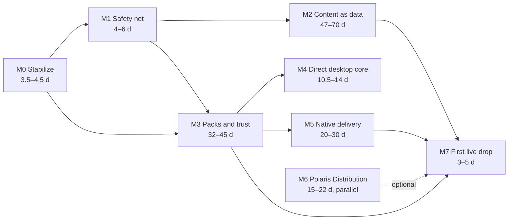

# Distribution v2: implementation plan

Date: 2026-09-29. Status: **ready to start once the design's decisions (§15) are made.**
Design: [`docs/design/2026-09-29-distribution-v2.md`](../design/2026-09-29-distribution-v2.md).
Research: [`docs/research/distribution-2026-09/`](../research/distribution-2026-09/README.md).

## How to use this plan

- Work is split into **milestones** (M0–M7) and **steps**. Every step has a **goal** (one sentence),
  **deliverables**, a **done when** list you can check, what it **depends on**, its **size** in
  agent-days, and what it can run **in parallel** with.
- Each step is one branch and one PR (`<type>(<scope>): …` Conventional Commit title), shippable on
  its own, behaviour-preserving unless the step says otherwise.
- Standing rules from `CONTRIBUTING.md` and `docs/plans/RESUME.md` apply: `./tests/run.sh` green (no
  `SCRIPT ERROR`), `ui/check_scripts.gd`, the sim smoke, screenshots across the device matrix for any
  visual change, never a windowed Godot, commit explicit paths only.
- **Prototypes** (P1–P8) are throwaway spikes in a scratch project; they report numbers and a
  go/no-go, and are scheduled before the step they de-risk.
- Steps marked **[Polaris]** happen in the (private) `polaris-key` repository under that repository's
  own rules; its detailed spec lives there.
- **Agent-days vs calendar time:** an agent-day is one focused work package. With two or three lanes
  in parallel and the maintainer's review of every PR, expect roughly 4–6 calendar months to M7.

## Overview

**Critical path to "a new weapons set ships as data on every channel's test track":** M0 → M1 → M2
(minimal path: 2.1, 2.2, 2.3a, 2.4, 2.5, 2.6 items only: ~22–29 d including M1) and M3 in parallel →
M5 (at least Apple + Android + Steam) → M7. M7 doesn't wait for M6: until the Polaris service exists,
the static signer of step 3.4 publishes (the client only trusts root-certified keys, so switching
later needs no client change).

**Lanes that can run at the same time:**

| Lane | Milestones |
|---|---|
| Core content (GDScript rules, tests, sim) | M1 → M2 |
| Delivery and trust (GDScript + CI) | M3 → M4 |
| Platform plugins (ObjC++, Kotlin, C++) | P1–P3 spikes → M5 |
| Polaris (TypeScript Worker + SDK) | M6 |

---

## Prerequisites (accounts, hardware, decisions)

| Item | Needed by | Notes |
|---|---|---|
| Decisions §15 of the design | M2/M3 start | at least 1–7, 9, 10 |
| Two YubiKeys (5 series, PIV) | 3.4 | release key + root A |
| Domain for `dl.` and `play.`; Cloudflare account with R2 | 3.4 | hardware 2FA on the Cloudflare account |
| Apple Developer Program, App Store Connect app record, API keys (App Manager + a Developer-role notary key) | 4.2, 5.1 | App Group + extension App IDs are created automatically by `-allowProvisioningUpdates` |
| Play Console app, developer-verification registration, service account | 0.5, 5.2 | offline app-signing key generated before the first open-testing release |
| Azure subscription + Artifact Signing identity validation (or OV certificate) | 4.2 | eligibility depends on location (design §6.3) |
| Steamworks partner account + app ($100), builder account | 5.3 | 30-day wait + 2 weeks Coming Soon before release |
| itch.io API key; Flathub account (a human opens the submission PR) | 5.3, 5.4 | |

---

## M0 Stabilize (3.5–4.5 days)

### 0.1 Stop offering pack updates on the legacy feed

- **Goal:** no shipped desktop build stages an update its binary can't start.
- **Why:** official 4.6+ templates abort on `--main-pack` (verified on rc.3); today a staged pack
  costs two failed launches and a skipped version.
- **Deliverables:**
  - `tools/ci/update_manifest.py`: a `--no-pack` / `--min-binary` option; `release.yml` publishes
    legacy manifests without a `pack` (or with `min_binary` = the new version) so old clients get the
    "new version" prompt with `binaries{}` URLs.
  - `game/update/updater.gd` / `update_policy.gd`: exported builds never stage packs (treat PACK as
    BINARY) until v2's Velopack path exists; keep the code for reference.
  - Test: policy returns BINARY for a manifest with a pack when running an exported template.
- **Done when:** the rc.3 Linux binary pointed at a test feed shows the prompt and never relaunches;
  `./tests/run.sh` green.
- **Depends on:** — **Size:** 0.5 d.

### 0.2 Correct distribution stamps

- **Goal:** every artifact knows which channel it belongs to, and stores never self-update.
- **Deliverables:** `release.yml` + `tools/ci/stamp_version.py`: separate stamping with the design's
  §5.1 values: `direct` (GitHub desktop; the legacy value `github` stays accepted as an alias),
  `steam`, `itch`, `apk` (sideload APK), `play` (AAB), `ios-sideload`, `appstore`, `testflight`,
  `web`, `flathub`, `dev`; per-distribution defaults in `update_policy.gd`; the App Store link from a
  variable (no placeholder id).
- **Done when:** the build manifest lists the right `distribution` for each file; a unit test covers
  each distribution's check/prompt behaviour.
- **Depends on:** — **Size:** 0.5–1 d.

### 0.3 CI hygiene

- **Goal:** secrets are released only to the jobs and refs that need them; builds are reproducible.
- **Deliverables:** environments `legacy-signing`, `release-signing`, `stores` (tag rules, reviewer
  where it matters) holding `UPDATE_SIGNING_KEY`, Apple, Android and store secrets; one global
  `concurrency` group for publishing; `workflow_dispatch` releases only from `main`; Xcode pinned
  (26.x); third-party actions pinned by SHA + Dependabot; no toolchain caches in release jobs (or
  re-verified against hashes committed in the repo); releases created as draft → upload → publish;
  `actions/attest-build-provenance` on release files.
- **Done when:** `actionlint` clean; a dry-run tag on a fork-free test repo or a `-rc` tag publishes
  correctly; repo-level secrets list contains only the asset secrets.
- **Depends on:** — **Size:** 1 d.

### 0.4 Updater hygiene

- **Goal:** close the small holes while the legacy updater still runs.
- **Deliverables:** `body_size_limit` = manifest size + free-space check; `https:`-only
  `open_download()`; bearer token only for the configured host (not across redirects); fix
  channel-switch-during-download staging the old channel's pack; don't count a user quit within
  `BOOT_OK_SECONDS` as a failed boot.
- **Done when:** new tests for each case pass.
- **Depends on:** — **Size:** 0.5–1 d. **Parallel:** 0.1–0.3.

### 0.5 Store housekeeping

- **Goal:** nothing store-side blocks or surprises us later.
- **Deliverables:** Play Console developer-verification check for `gg.vlad.diceroll` (today);
  Play internal uploads with `status: completed`; AltStore source with a top-level `downloadURL`;
  sideload IPA built from the store archive; GodotSteam from Codeberg if used.
- **Done when:** Play Console shows the package registered; the next rc reaches internal testers
  without a manual step; SideStore adds the source without errors.
- **Depends on:** — **Size:** 0.5 d.

### 0.6 Docs

- **Goal:** `docs/RELEASE.md` describes what the pipeline really does.
- **Deliverables:** upload key vs app-signing key; Gradle cache; per-channel behaviour after 0.1–0.2;
  a pointer to the v2 design; `2026-09-29-content-streaming.md` status line "superseded in part";
  README's "Desktop builds from GitHub update themselves" corrected.
- **Done when:** every statement in RELEASE.md matches the workflows and code after 0.1–0.2.
- **Depends on:** 0.1, 0.2. **Size:** 0.5 d.

---

## M1 Safety net (4–6 days)

### 1.1 Golden fingerprints

- **Goal:** any refactor of content or rules that changes behaviour fails CI.
- **Deliverables:** `tools/content_export.gd` (canonical JSON dump of every content table) and a
  golden `defs.fp`; `tests/test_content_golden.gd` running N bot runs × class × route × profile
  preset and comparing end-state hashes; a `--update-goldens` flag for deliberate changes.
- **Done when:** goldens are stable across three runs and across machines; a deliberate one-number
  change fails the test.
- **Depends on:** — **Size:** 1–2 d.

### 1.2 Saves never drop content

- **Goal:** a missing pack can never erase a player's unlocks, items or skins.
- **Deliverables:** profile v4 with a `dormant` bucket (unknown ids preserved and written back);
  run saves record unknown ids instead of crashing (`EnemyDefs.def`, `Runes.DEFS` guards); pet-rune
  storage by id, not index; migration from v3 with tests.
- **Done when:** round-trip tests with content removed and re-added are lossless; old saves load.
- **Depends on:** — **Size:** 2–3 d. **Parallel:** 1.1.

### 1.3 Stable ordering and seeds

- **Goal:** adding content never changes the outcome of an existing seed.
- **Deliverables:** every random draw from a list sorted by a stable order (the ids ledger once it
  exists; alphabetical until then); explicit seed hashing (replace `hash()` in seed derivation);
  `rng.pick(EventDefs.IDS)` and the rarity tables use sorted views.
- **Done when:** goldens re-baselined once, then stable; a test that appends a dummy entry to each
  table leaves existing seeds unchanged.
- **Depends on:** 1.1. **Size:** 1 d.

---

## M2 Content as data (47–70 days; minimal path ~22–29 days including M1)

### 2.1 ContentDB and base sets in JSON

- **Goal:** every content table is loaded from JSON through one registry, with identical behaviour.
- **Deliverables:** `core/content/content_db.gd` (load, merge ops, validation, freeze, fingerprint),
  `content_codec.gd`; `content/sets/*-base/` generated once from today's consts; `content/ids.lock.json`
  (append-only ledger with `order`); the `*Defs` classes become facades with static vars filled by
  `ContentDB.ensure()` (works in headless tests); `content/**` in the export `include_filter`.
- **Done when:** golden fingerprints unchanged; tests and sim green; the consts are gone.
- **Depends on:** 1.1, 1.3. **Size:** 4–5 d.

### 2.2 Constants in the DB

- **Goal:** balance numbers are patchable by data.
- **Deliverables:** `Balance`, `Economy`, `UnlockDefs.ASC_*` and per-type constants become static vars
  seeded from `core-base`; the `constants` op with a typed allow-list.
- **Done when:** goldens unchanged; a test `balance-*` set changes a number and the sim sees it.
- **Depends on:** 2.1. **Size:** 2 d.

### 2.3 Rules dispatch on rule ids (sub-steps can run in parallel worktrees)

- **Goal:** a new entry that uses existing rules works without touching code.
- **Sub-steps:**

  | Id | Scope | Main files | Size |
  |---|---|---|---|
  | 2.3a | **Items by `effect.rule` and `sec`** (rename the duplicate `"light"`; special cases become fields; bot combat model and `MetaRun.armory_stats` by rule; per-item `price`) | `core/item_logic.gd`, `core/content/items.gd`, `core/meta/meta_run.gd`, `core/bot.gd`, `core/bot_meta.gd` | 5–7 d |
  | 2.3b | Passives by rule + params | `combat.gd`, `game_flow.gd`, `run_state.gd`, `bot.gd` | 2–3 d |
  | 2.3c | Runes by declared trigger + effect | `combat.gd`, `runes.gd`, `class_logic.gd` | 2 d |
  | 2.3d | Potions by effect list (unknown op = validation error, not heal) | `game_flow.gd`, `potions.gd` | 1 d |
  | 2.3e | Pets by fire/perk/L5/L10 rule ids | `pet_logic.gd`, `game_flow.gd`, `combat.gd` | 2–3 d |
  | 2.3f | Biomes: old twists → parameterised twist ids; generic per-biome counters | `game_flow.gd`, `biomes.gd`, `profile.gd`, `unlocks.gd` | 2–3 d |
  | 2.3g | Enemies: tags (e.g. `skeleton`), boss `mechanic` + params, DB-driven unlockables | `enemies.gd`, `combat.gd`, `unlocks.gd` | 1–2 d |
  | 2.3h | Classes: `mechanic_params` in data | `class_logic.gd`, `heroes.gd` | 1–2 d |
  | 2.3i | Events by kind + weighted, optionally biome-scoped pools | `game_flow.gd`, `events.gd`, `event_modal.gd` | 2 d |
  | 2.3j | Affixes: the 5 id-wired affixes become parameterised kinds | `affixes.gd`, `combat.gd` | 1–2 d |
  | 2.3k | Minigame variants: numbers, props and rewards of existing minigames as data (new minigame kinds stay code) | `core/content/minigames.gd`, `core/minigames/*`, `game/minigames/props/*` | 1–2 d |

- **Done when (each):** goldens unchanged (item ids equal their rule owners today); a fixture set adds
  a new entry of that kind using only existing rules, and a test plays it.
- **Depends on:** 2.1 (2.2 for constants used by the rule). **Size:** 20–29 d total.

### 2.4 Capabilities, set manifests and CI validation

- **Goal:** CI refuses any set the core can't run, and the client hides sets it can't support.
- **Deliverables:** `core/content/content_api.gd` (`FORMAT`, `CAPS`); `set.json` schema; JSON Schemas
  per kind; `tools/content_validate.gd` (semantic pass) + a Python `jsonschema` step;
  automatic `requires_caps`; ids-ledger check; `content-check` job in `ci.yml` with a PR size diff.
- **Done when:** fixture sets with an unknown rule, a reused id, a missing look path or a bad schema
  each fail CI with a clear message.
- **Depends on:** 2.1, 2.3a. **Size:** 3–4 d.

### 2.5 Runs pin their content set

- **Goal:** a run, a replay or a sim always uses a fixed ruleset.
- **Deliverables:** `RunState.meta.content` (sets + `fp`) and save version bump; `ContentDB.view(set)`
  (sorted, filtered pools); `tools/sim.gd --sets=` and `fp` in its output; "new runs only" default for
  new sets.
- **Done when:** a run saved with a set and resumed without it shows the right state; sims report `fp`.
- **Depends on:** 2.1, 1.2. **Size:** 2–3 d.

### 2.6 Looks as data

- **Goal:** a new weapon, enemy or skin gets its visuals from JSON.
- **Deliverables:** `looks.json` per base set for items (`ItemMounts`), characters (`Character.MODELS`,
  parts, kits, skin textures), enemies (`EnemyRoster.LOOKS`), biomes (`Biome.LOOKS`, terrain, palette),
  music map, icons, encounter texts; builders registered as `look.*` capabilities; fallback looks.
- **Done when:** screenshot matrix unchanged for the affected scenarios; a fixture set adds a weapon
  with a mount from JSON and it renders in the Armory and in combat.
- **Depends on:** 2.1. **Size:** 5–8 d (items first: 2 d on the minimal path). Needs assets.

### 2.7 Declarative biome dressing

- **Goal:** new maps can ship as data.
- **Deliverables:** `{"kit": <existing>}` reuse with new sky/terrain/palette first; then the `spec`
  interpreter over the `Dressing` API (scatter, placements, set pieces, lights), proven by porting one
  biome.
- **Done when:** a fixture biome set using a kit renders; the ported biome's screenshots match.
- **Depends on:** 2.6, 2.3f. **Size:** 6–10 d. Needs assets.

### 2.8 Strings and localisation groundwork

- **Goal:** pack text uses keys from day one.
- **Deliverables:** `strings/<locale>.json` per set; a `Translation` built from them; `tr()` on the UI
  paths that show content text; CI requires keys for new sets.
- **Done when:** a fixture set's text shows through keys in the Armory, class select and encounter
  cards; CI rejects a new set with literal display text.
- **Depends on:** 2.1. **Size:** 2–4 d. Can come after M7.

### 2.9 Tests for packs

- **Goal:** the test suite stops fighting new content.
- **Deliverables:** split pinned-count tests (`test_armory.gd`) into fixture-based engine tests plus base
  snapshots; per-set sim smoke; load-order shuffle test for the merge.
- **Done when:** adding a fixture set changes no existing test; shuffling set order changes no `fp`.
- **Depends on:** 2.1. **Size:** 3–5 d, spread across 2.1–2.6.

---

## M3 Packs and trust (32–45 days)

### 3.1 Library packs, lean presets, embedded everywhere

- **Goal:** the game's art ships as data-only packs that every build embeds, with no behaviour change.
- **Deliverables:** `game/content/packs.gd` (pack → units → prefixes, allow-listed extensions);
  `tools/ci/build_packs.gd` (headless PCKPacker from the import cache, sorted, deterministic) +
  `packs.json`; lean base presets (`exclude_filter` `assets/**`); packs embedded in every artifact;
  forest colour-folder dedupe; per-pack UID maps registered at mount.
- **Done when:** every platform export boots with embedded packs and the screenshot matrix matches;
  the full download shrinks by the forest dedupe.
- **Depends on:** 0.2. **Size:** 4–6 d. **Prototypes:** P3 (Android mount timing), P4 (determinism).

### 3.2 Data-only validation

- **Goal:** no pack can carry code, in CI or at runtime.
- **Deliverables:** builder allow/deny lists and binary-resource script scan (design §7.7) with fixture
  packs that must fail; per-kind path/extension rules in `game/content/packs.gd` (`lib-*`, `art-*`,
  `music-*`) so shipped cores accept new pack ids; runtime PCK header/directory parser; **mandatory
  on-device scan** of binary resources for script types before first mount (cached per hash); pack
  documents (release key) required for any pack not in the build's snapshot.
- **Done when:** each smuggling fixture fails CI **and** is refused on the device; a pack without a pack
  document is refused; a new `art-*` pack id is accepted by an older build; scan cost measured on a
  low-end phone.
- **Depends on:** 3.1. **Size:** 3–4 d.

### 3.3 Polaris Godot SDK core [Polaris + vendored]

- **Goal:** the game can verify DIST-1 documents and pack hashes.
- **Deliverables:** `addons/polaris_key` (design §10.4): ES256 (raw → DER), Ed25519 (from the
  prototype), strict JWS, trust store (pins, root documents, scopes, floors, clock floor), document
  client (timestamp → release/catalog; fresh/stale/unverified), planner, resumable downloader
  (`HTTPClient`, Range, caps, streaming SHA-256); conformance runner (headless) for the shared DIST-1
  vectors.
- **Done when:** the shared vectors pass in Godot and in the publishing tools; tampering, rollback,
  freeze, floor (candidate then pause), scope-confusion and channel-confusion vectors rejected;
  verification runs on `WorkerThreadPool`.
- **Depends on:** 6.1 (the vectors; the SDK can start in parallel from the prototypes). **Size:** 5–7 d.

### 3.4 Root ceremony, R2, static signer

- **Goal:** real keys and real hosting exist, before the Polaris service does.
- **Deliverables:** ceremony script and a private runbook (three roots, 2 of 3; release key on a
  YubiKey with a cached touch policy; content + timestamp keys for the static phase), a public
  `docs/KEYS.md` with the policy only; `tools/dist/release_sign.py` (release and pack documents);
  root document v1; R2
  bucket + custom domain + cache rules + CORS + bucket locks; `tools/dist/` (catalog composer and
  signer, timestamp signer, upload with checksums) running in approval-gated environments; scheduled
  timestamp job with a manual fallback.
- **Done when:** `dl.<domain>/v2/timestamp.jws` verifies in the SDK against the pinned roots; objects
  under locked prefixes can't be overwritten.
- **Depends on:** 3.3, decisions 2, 3, 9. **Size:** 3–4 d.

### 3.5 ContentDelivery with Embedded and CDN backends

- **Goal:** the game resolves, verifies, downloads and mounts packs and the defs catalog per
  distribution.
- **Deliverables:** `game/content/content_delivery.gd` (backends, profile from `build_info.json`),
  pack store per OS (design §5.4; iOS no-backup; Web: browser cache + in-memory `/tmp` mounts, never
  `user://`), `.pck.zst` transfer with GDScript decompression,
  verification cache, staged mounting, eviction; ContentDB overlay from the downloaded catalog;
  Developer menu rows (state, catalog seq, packs, "check now", channel).
- **Done when:** a headless test mounts packs from each backend; a CDN catalog adds a fixture set that
  appears in a new run; offline boots use the snapshot; a revoked hash is refused.
- **Depends on:** 3.1, 3.2, 3.3, 2.1 (2.4 and 2.5 for the fixture-set part of "done when").
  **Size:** 5–7 d.

### 3.6 BootShell

- **Goal:** the loader from the previous proposal (§6 there) hosts trust, verification and mounting on
  every channel.
- **Deliverables:** `BootShell` evolving `MissingAssetsScreen`; stages and the morph into the title;
  offline/error states; Developer menu gesture from the first frame; boot-stage screenshot scenarios.
- **Done when:** screenshot matrix for every stage; a cold boot with all packs embedded looks like a
  clean splash.
- **Depends on:** 3.5. **Size:** 4–5 d.

### 3.7 Content train

- **Goal:** merging a set publishes it to `dev`; a `content/*` tag publishes to `beta`; promotion and
  rollback are one click.
- **Deliverables:** `_content-build.yml` (logical-hash reuse, build, validate, compat smoke),
  `content-release.yml`, `content-promote.yml`, `content-rollback.yml`, `content-gc.yml` (design §11);
  `tools/content.sh`; content release notes.
- **Done when:** a fixture set goes dev → beta → stable at 5 % → 100 % and back via rollback on a
  test channel, verified by the SDK through the real CDN.
- **Depends on:** 3.4, 3.5, 2.4. **Size:** 4–6 d.

### 3.8 Delta patches

- **Goal:** fixing an existing pack doesn't re-download it whole on our CDN.
- **Deliverables:** prototype P5 first; `tools/ci/pck_delta.py` (PCK v4 writer with Godot delta
  entries, per-file ≥ 10 % rule, removal entries) producing patches from the last three revisions of a
  changed pack; catalog `deltas[]`; native rehydration at boot (mount base + patch, re-pack with
  `PCKPacker`, verify, atomic swap); Web session overlay; a CI mount-and-rehydrate test that runs on
  every engine upgrade.
- **Done when:** a one-mesh fix to a library pack ships as a patch of a few KB–MB, the rehydrated pack's
  hash matches the catalog on desktop, Android, iOS and Web, and a wrong base is refused cleanly.
- **Depends on:** 3.7. **Size:** 3–4 d.

### 3.9 Smoke entry point for shipped builds

- **Goal:** CI can drive a real exported build (the templates refuse `-s`, `--path` and `--main-pack`).
- **Deliverables:** `main.gd` handles user arguments after `--` (`--dr-smoke=<scenario>`, headless
  boot, content-set checks, exit code) and a feed-URL override for the smoke; trust unchanged (real
  roots and keys; the override only changes the host); `compat-smoke` in `_content-build.yml` running
  each supported shipped core against a candidate catalog.
- **Done when:** the latest shipped Linux build boots headless against a candidate catalog in CI and
  fails the job when a set can't load.
- **Depends on:** 3.5. **Size:** 1–2 d.

---

## M4 Direct desktop core updates (10.5–14 days)

### 4.1 Velopack GDExtension

- **Goal:** direct builds update engine + code with small deltas, applying only what our release
  document lists.
- **Deliverables:** prototype P1 first; `dr_velopack` GDExtension over `velopack_libc` (Windows x64,
  macOS universal, Linux x64/arm64) calling `vpkc_app_run()` at CORE init; custom update source built
  from the verified release document; GDScript API (check, download with progress, apply and
  restart); Velopack channels mapped to stable/beta; signed downgrades for revoked versions; a
  CORE-level boot counter that re-applies the previous full package after two failed boots; the
  legacy `--main-pack` path removed.
- **Done when:** install → update → delta update → channel switch works on all three OSes with no
  window flash during hooks; a package whose hash isn't in the release document is refused; a
  deliberately crashing build rolls back by itself; a revoked version is downgraded on the next check.
- **Depends on:** 3.3. **Size:** 7–9 d.

### 4.2 Signed installers and release documents

- **Goal:** every direct download is signed, and core releases are authorised on hardware.
- **Deliverables:** `vpk pack` in `_core-build.yml` (Setup.exe + portable, `.pkg` + zip, AppImage),
  Artifact Signing (or the chosen fallback) via OIDC, Developer ID + notarization, minisign
  `SHA256SUMS`; `tools/dist/release_sign.py` (verifies attestations, signs every channel's release
  document on the YubiKey, uploads through the gateway or the static uploader);
  `core-release.yml` / `core-promote.yml` split (build once, promote many).
- **Done when:** a tag produces signed installers, a draft release and beta tracks; `release_sign`
  publishes a release document the game accepts; promotion needs no rebuild.
- **Depends on:** 4.1, 3.4. **Size:** 3–4 d.

### 4.3 Freeze the legacy feed

- **Goal:** old installs move to v2 installers, and the RSA key leaves GitHub.
- **Deliverables:** final legacy manifests (binary prompt to the v2 installers); RSA key to cold
  storage; `legacy-signing` environment removed; immutable releases on; AltStore source moved with a
  news entry; v2's first run deletes the legacy `user://updates/` folder.
- **Done when:** an rc.3 install sees the prompt and the v2 installer takes over; the key is gone from
  GitHub.
- **Depends on:** 4.2. **Size:** 0.5–1 d.

---

## M5 Native delivery per store (20–30 days)

### 5.1 Apple: App Store, TestFlight and Background Assets

- **Goal:** iOS/iPadOS builds ship through TestFlight/App Store and get new art as Apple-hosted packs.
- **Deliverables:** prototype P2 first; `dr_apple_assets` Objective-C++ GDExtension (manifest, status,
  ensure, APFS clone into Application Support, update-on-next-launch, signals on the main thread);
  `AppleAssetPacks` backend; an `EditorExportPlugin` (`_end_generate_apple_embedded_project`) or
  `xcodeproj` step adding the `StoreDownloaderExtension` target, App Group and Info.plist keys; pack
  documents inside each asset pack; `apple-assets` CI job (`ba-package`, App Store Connect upload,
  review submission, at most 10 packs per submission; the first packs go with the first app
  submission); Apple pack ids `s1.<pack>`; packs built with the oldest engine minor among supported App
  Store builds; min OS per decision 4; phased release in `core-promote`.
- **Done when:** a TestFlight build downloads an on-demand pack uploaded after install, verifies and
  mounts it; an updated pack applies on the next launch; the IPA alone plays a full offline run.
- **Depends on:** 3.5, 3.2. **Size:** 7–10 d.

### 5.2 Android: Play plugin, signing and the GitHub APK

- **Goal:** Play builds update in-app and the GitHub APK shares Play's signer.
- **Deliverables:** `DicerollPlay` Kotlin plugin (install source, In-App Updates, in-app review;
  PAD states later); APK export via Gradle; `noCompress 'pck'`; own app-signing key uploaded to Play
  App Signing; CI downloads Play's universal APK (`generatedapks`) for GitHub and checks it with
  `apksigner`; staged `userFraction` and `inAppUpdatePriority` in `core-promote`; x86_64 in the AAB for
  Play Games on PC (later); prototype P7 (signing matrix).
- **Done when:** internal-track install updates in-app; installing the GitHub APK over the Play build
  (and back) works on Android 14/16/17.
- **Depends on:** 0.5, 3.5. **Size:** 4–6 d.

### 5.3 Steam and itch

- **Goal:** Steam and itch builds carry packs as plain files, patched by the stores.
- **Deliverables:** per-OS depots + a shared packs depot; `InstalledFiles` backend; GodotSteam (from
  Codeberg) for DLC checks and `markContentCorrupt`; Steam Linux Runtime 4.0 (prototype P8); CI builds
  to `beta` automatically (default branch by hand); a packs-depot-only build per content release;
  `butler push --if-changed` for itch channels; prompt-only update card for direct itch downloads.
- **Done when:** a content release produces a Steam `beta` build whose update is only the new pack;
  itch app patches the same.
- **Depends on:** 3.1, 3.5. **Size:** 4–6 d.

### 5.4 Flathub

- **Goal:** Linux users and Steam Deck desktop mode get a store install.
- **Deliverables:** Flatpak manifest on the Godot BaseApp with our prebuilt PCK and packs, metainfo
  skeleton, `LicenseRef-proprietary` art licence; `distribution: flathub` (no self-update). Flathub's
  generative-AI policy applies: Vlad writes the store description and release notes, discloses AI
  assistance, and opens the submission PR himself.
- **Done when:** the Flatpak builds and runs locally and on a Deck; submission opened.
- **Depends on:** 3.1. **Size:** 2–3 d.

### 5.5 Web

- **Goal:** the web build reaches an interactive title fast and streams the rest.
- **Deliverables:** lean `index.pck` (core + `lib-ui`); staged library packs and on-demand set packs from
  R2 (CORS for the `play.` and itch origins), downloaded in memory with a 1–4 MiB chunk size and
  mounted from `/tmp`; builds in immutable `/v/<build>/` folders on R2 (the 39.5 MB wasm exceeds the
  25 MiB Workers/Pages file limit) with a `no-cache` `index.html`; itch HTML5 mirror within its limits;
  prototype P6.
- **Done when:** time to interactive title and peak memory measured on desktop Chrome/Safari and iOS
  Safari are within the targets set by P6.
- **Depends on:** 3.5. **Size:** 3–5 d.

### 5.6 Mac App Store and AltStore PAL (optional, after launch)

- **Goal:** extra Apple channels with no new pipeline.
- **Deliverables:** Mac build in the iOS app record (universal purchase), sandbox entitlements,
  Apple-hosted `defs` pack; AltStore PAL source and notarization.
- **Size:** 3–5 d each. Only when decided.

---

## M6 Polaris Distribution service (15–22 days, parallel) [Polaris]

### 6.1 Wire profile DIST-1

- **Goal:** Polaris and the Godot SDK agree byte-for-byte on distribution documents.
- **Deliverables:** the DIST-1 document family (broadcast documents, per-key `alg` ES256/EdDSA,
  General JSON for roots, the five `pkey-dist-*` types) and shared conformance vectors (documents,
  tampering, rollback, freeze, floors, scope confusion, rollout buckets).
- **Done when:** the vectors pass in the Worker, the publishing tools and the Godot SDK.
- **Depends on:** decisions 2–3. **Size:** 3–4 d.

### 6.2 Distribution Worker: gateway and signing

- **Goal:** CI publishes with no long-lived Cloudflare or signing secret.
- **Deliverables:** separate Worker deployment; GitHub OIDC verification against a publisher policy;
  presigned R2 PUTs; catalog composer + content signer with policy checks; release-document intake;
  timestamp cron + on-publish re-sign; halt/disable; the same pack script scan as the device before a
  catalog may reference a new pack; audit log; attack tests.
- **Done when:** a content job publishes to `beta` with no Cloudflare or signing secret in GitHub; a
  forged or replayed OIDC token, a catalog referencing a pack without a pack document, and a pack with
  an embedded script are all refused.
- **Depends on:** 6.1. **Size:** 6–9 d.

### 6.3 Rollouts, housekeeping, console, CLI

- **Goal:** rollouts, rollbacks and GC are one command or one click.
- **Deliverables:** candidate + ramp scheduling; GC planner; expiry and anomaly monitors; console
  Distribution section; `pkey dist …` CLI.
- **Done when:** a 5 → 25 → 100 % ramp advances on schedule, pauses on halt, and a rollback issues a
  new catalog every client accepts.
- **Depends on:** 6.2. **Size:** 5–7 d.

### 6.4 Switch Diceroll's CI to Polaris

- **Goal:** the static signer is retired without a client update.
- **Deliverables:** root document v2 certifying the Polaris content and timestamp keys; content train
  calling the gateway; static signer removed.
- **Done when:** a content release goes through Polaris end to end; old keys retired.
- **Depends on:** 6.2, 3.7. **Size:** 1–2 d.

---

## M7 First live drop (3–5 days)

M7 runs on each channel's **test track** (TestFlight external, Play closed testing, the Steam `beta`
branch, itch, direct and Web). Public launches follow each store's own lead times and are not part of
this milestone.

### 7.1 Data-only set

- **Goal:** prove "a new weapons set without a core update" on every channel.
- **Deliverables:** `weapons-<yyyy-mm>` set reusing existing rules and `lib-armory` art; beta → stable
  ramp; Steam/itch builds with the new snapshot; notes.
- **Done when:** testers on direct, Web, Android (Play closed testing and the GitHub APK), iOS
  (TestFlight and sideload), the Steam `beta` branch and itch see the set in new runs without
  installing a new core.
- **Depends on:** 2.3a, 2.6 (items), 3.7, and the channels' M5 steps. **Size:** 1–2 d.

### 7.2 Set with new art

- **Goal:** prove the art path, including Apple review and a Steam packs-depot build.
- **Deliverables:** `art-<set>` pack with its hardware-signed pack document, through the CDN, Steam/itch
  builds and an Apple-hosted asset pack (TestFlight external review).
- **Done when:** the set appears on each channel once its pack is verified there, and nowhere before.
- **Depends on:** 7.1, 5.1, 5.3. **Size:** 2–3 d.

---

## Estimates

| Milestone | Agent-days |
|---|---|
| M0 Stabilize | 3.5–4.5 |
| M1 Safety net | 4–6 |
| M2 Content as data | 47–70 |
| M3 Packs and trust | 32–45 |
| M4 Direct desktop core updates | 10.5–14 |
| M5 Native delivery per store | 20–30 |
| M6 Polaris Distribution | 15–22 |
| M7 First live drop | 3–5 |
| **Total** | **~135–197** (27–39 agent-weeks; roughly 4–6 calendar months with 2–3 lanes) |

## Definition of done for v2

- Every channel with a step in this plan (App Store/TestFlight, direct Windows/macOS/Linux, Steam,
  itch, Flathub, Play, GitHub APK, iOS sideload, Web) ships from CI with the right distribution profile.
  GOG, Epic, the Mac App Store, AltStore PAL and the Microsoft Store are later additions.
- A data-only set and an art set have gone through M7 on every channel's test track.
- No shipped build can stage or mount anything that isn't in a signed document or its own snapshot.
- Rollout, halt and rollback have been exercised on the beta channel.
- `docs/RELEASE.md`, `docs/KEYS.md` (public policy) and `docs/ASSETS.md` describe the system as
  built; the private key runbook exists and a root ceremony has been rehearsed.
