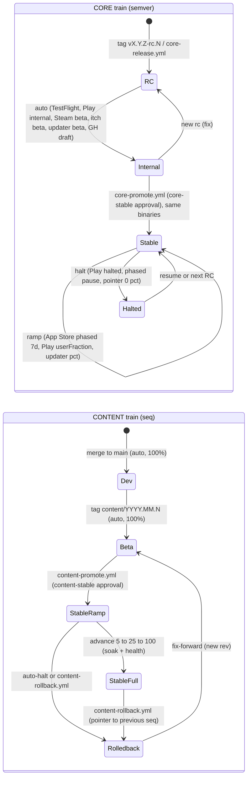
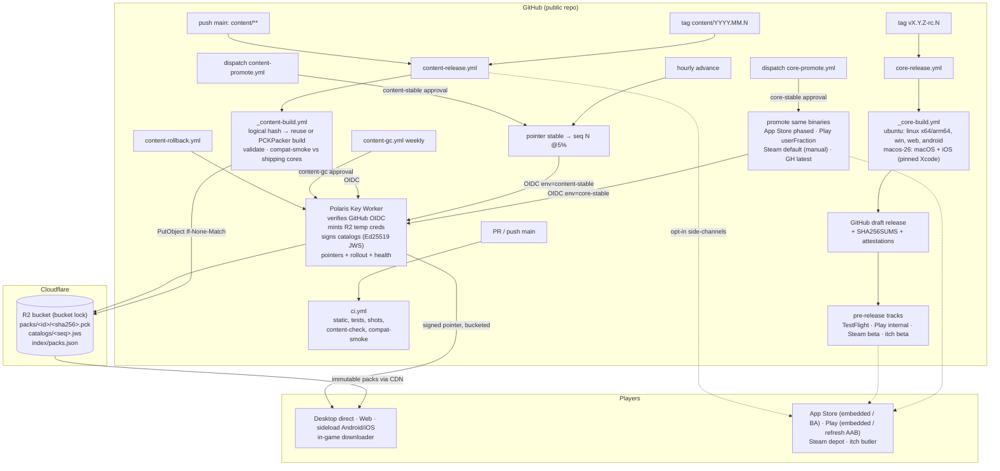
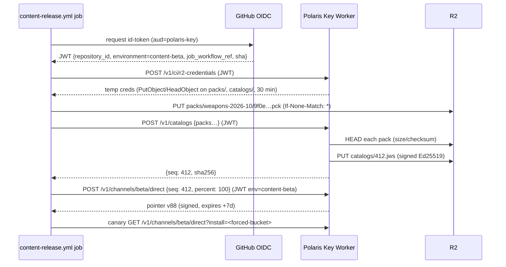

# 12 — CI/CD release orchestration: core train + content train

Date: 2026-09-29. Author: research agent (CI engineer). Status: **research + proposal**. Nothing is implemented.
Scope: GitHub Actions orchestration for Diceroll (public repo `vladzaharia/diceroll`, Godot 4.7.2, one
maintainer) once releases split into two trains:

1. a **core/binary** train (engine + GDScript, semver tags, goes through store review), and
2. a **content** train (data-only packs such as `weapons-2026-10`, frequent, no store review where the
   platform allows it).

Inputs I read (not modified): `.github/workflows/{ci,release,pr-title}.yml`,
`.github/actions/setup-diceroll/action.yml`, `tools/ci/*` (assets.py, update_manifest.py,
stamp_version.py, altstore_source.py, ios_build.sh, macos_package.sh, changelog_llm.py),
`tools/export.sh`, `docs/RELEASE.md`, `docs/ASSETS.md`, `cliff.toml`, and
`docs/design/2026-09-29-content-streaming.md` (the pack/loader design this builds on). Web facts
were checked on 2026-09-29; sources are at the end.

---

## 0. TL;DR (recommendations)

1. **Build once, promote many, on both trains.** Binaries are built once per tag and promoted by
   moving store tracks and channel pointers. They are never rebuilt for "final". Content packs
   are built once and are **content-addressed and immutable** (`packs/<id>/<sha256>.pck` on R2).
   Promotion `dev → beta → stable` and rollback only **re-point a signed channel pointer** to an
   immutable, signed catalog.
2. **The release manifest is the source of truth.** A signed **catalog** (immutable, monotonic
   `seq`) lists pack ids, sha256, sizes, `requires_api` and engine. A per-channel **pointer**
   (monotonic `version`, short expiry, rollout %) selects a catalog. This is a TUF-lite split: targets
   = catalog, timestamp = pointer. It gives anti-rollback, anti-freeze and staged rollout. Rollback is
   a *new* pointer version that points to an older catalog.
3. **Version content by identity, not semver.** Identity = `sha256`. Order = per-pack `rev`
   (monotonic integer assigned by CI). Name = the drop label (`weapons-2026-10`). Compatibility =
   one integer **content API level** (`requires_api` on the pack, `content_api` +
   `min_pack_api` on the core). Keep semver for the core only.
4. **Keep long-lived publishing secrets out of GitHub.** Content jobs use **GitHub OIDC → Polaris Key
   Worker**. The Worker verifies the job's token (`repository_id`, `environment`,
   `job_workflow_ref`) and then does three things:
   - mints **R2 temporary credentials** scoped to `PutObject` on `packs/` + `catalogs/`;
   - signs catalogs with its Ed25519 key (JWS);
   - moves channel pointers.

   Cloudflare has no native GitHub-OIDC federation for its API (its own CI docs still use API
   tokens), so the Worker is the federation point. It **is** worth building.
5. **Gate with environments and not with `vars.ENABLE_*` alone.** Required reviewers (you) on
   `*-stable` / store-production environments, and tag/branch deployment policies. Environment
   secrets are only released after approval. Use a tag **ruleset** for `v*` and `content/*`
   (no update/delete). Turn on **immutable releases** only *after* the rolling `channels` GitHub
   release moves to R2/Worker, because immutable releases forbid `gh release upload --clobber`.
6. **Pack determinism: don't depend on it, pin it.** CI computes a **logical hash** before building:
   engine major.minor + pack format + sorted (path, file hash) of the inputs. If a published pack
   with that logical hash exists, CI **reuses its bytes** and uploads nothing. R2 is the build cache.
   A nightly job rebuilds from a cold import and reports byte drift.

   Reasons not to trust byte-for-byte rebuilds:
   - Godot's own docs warn that exports are not fully deterministic.
   - 4.6+ has an open scene `unique_id` export regression (godot#115971, milestone 4.8).
   - The PCK header embeds the engine **patch** version, so any engine patch bump changes every
     pack's bytes.
7. **Per-platform content delivery:**

   | Platform | How content packs arrive |
   |---|---|
   | Web, direct desktop, sideload Android/iOS | CDN (R2) through the in-game downloader, staged rollout by the Worker |
   | Steam | a **content depot** auto-set live on a `content-beta` branch; default branch set live by hand (Steam requires it) |
   | itch | `butler push` (wharf delta), no review |
   | Google Play | Play Asset Delivery has **no asset-only updates**; asset packs update with app updates. Either (a) allow CDN downloads of data-only packs on Play (policy allows non-executable data) or (b) ship "content refresh" AABs (new versionCode, reviewed) |
   | App Store / TestFlight | ship everything embedded in v1; later self-hosted data packs, or Apple-hosted Background Assets. BA pack **versions update without a new app version but are submitted for review**, and `xcrun ba-package` needs a macOS runner |
8. **Proposed workflow set:**
   - `ci.yml` (+ content checks)
   - `core-release.yml` → `_core-build.yml` (reusable)
   - `core-promote.yml`
   - `_content-build.yml` (reusable)
   - `content-release.yml`
   - `content-promote.yml` (+ hourly rollout advance)
   - `content-rollback.yml`
   - `content-gc.yml`
   - `pr-title.yml`

   Publishing groups use the new `concurrency: … queue: max` (FIFO, May 2026). Light jobs run on
   `ubuntu-slim`.
9. **Costs.** Standard hosted runners stay **free for public repos** (including macOS and arm64). The
   real limits are **20 concurrent jobs / 5 macOS** (Free plan), 6 h per job, a 10 GB cache per repo
   (the Free plan can't buy more; entries are evicted 7 days after last access), and
   `ubuntu-slim`'s 15-minute cap. Larger runners are always billed, even on public repos. Don't use
   them.
10. **Fix now, independent of the redesign:**
    - `release.yml` selects "the newest Xcode". Pin it instead, e.g. `26.6`. The macOS 26 image now
      sits next to an Xcode 27 preview, and App Store uploads must use Xcode 26+ since 2026-04-28 and
      must not use beta toolchains.
    - Move store secrets into environments.
    - Create releases as **draft → upload → publish**.

---

## 1. The current pipeline (as-is) and what the two trains change

| Area | Today | Gap for two trains |
|---|---|---|
| `release.yml` | One monolith per tag `vX.Y.Z[-pre]`. `prepare` produces git-cliff + Claude notes, then three build jobs run in parallel (Linux: linux x64/arm64 + windows + web + desktop `.pck`; Linux: Android APK/AAB; `macos-26`: macOS dmg/zip notarized + iOS ipa + sideload ipa). Then `publish` (GitHub Release + rolling `channels` release) and optional store jobs gated by `vars.ENABLE_*` | Final and RC are separate builds (rebuild on promotion). Store secrets are repo-level (any job in the run can read them). No approval gates. No attestations. The `channels` release is mutated with `--clobber` (incompatible with immutable releases). Content ships only as one full `-desktop.pck` |
| Versioning | `stamp_version.py` bakes the full semver (incl. `-rc.N`) into `project.godot`, presets and `build_info.json`. Build code `M*1e6+m*1e4+p*100+(rc|99)` | Promoting an RC binary to stable without a rebuild needs the pre-release tag moved out of the in-game version string (see §2.1) |
| Updater | `update-<channel>.json` + RSA-3072 `.sig` (`UPDATE_SIGNING_KEY` in GitHub secrets). Full-PCK swap with boot rollback | Needs catalog/pointer schema v2, Ed25519 via the Worker, per-pack cache (design doc §5.4) |
| `ci.yml` | `plan` (changed paths, secrets available, matrix), static checks, tests, lavapipe screenshots (12 shards nightly), export smoke | Needs content checks (data-only, schema, budgets, compat vs. shipping binaries) and a determinism job |
| `setup-diceroll` | Godot + pruned templates cached per OS (SHA-512 verified). Age-encrypted asset bundles (incremental). Encrypted `.godot` import cache keyed by `runner.os` + lock hash | Fine. Once packs are built only on Linux, the macOS job no longer needs assets or import at all (lean base preset) |
| Apple | `macos-26`, picks `find /Applications -name "Xcode_*.app" \| sort -V \| tail -1` | **Risk**: the newest installed Xcode can be a beta. Pin it |
| Tags | Tag push `v*` or dispatch creates the tag | No ruleset. `cliff.toml` `tag_pattern = "v[0-9].*"` already keeps future `content/*` tags out of core notes (good) |

---

## 2. GitHub Actions: current facts that matter (verified 2026-09-29)

| Feature | Status today | Use in Diceroll |
|---|---|---|
| **Runner images** | `ubuntu-latest` = 24.04; `ubuntu-26.04` / `-arm` exist; `ubuntu-24.04-arm`; `windows-latest` = Windows Server 2025 (`windows-2025-vs2026` label too); `windows-11-arm`; `macos-latest` = **macos-26** arm64 (3-core M1, 7 GB); `macos-15`; `macos-15-intel` / `macos-26-intel`; `xcode-27` label (public preview). macOS 14 deprecated since Jul 6, unsupported Nov 2, 2026 | Keep `ubuntu-24.04` pinned for Godot/lavapipe until 26.04 is validated. Use `ubuntu-24.04-arm` to **run** the linux-arm64 export headless (today it's built but never executed). Keep `macos-26` |
| **Xcode on macos-26** | Image 20260907: macOS 26.6.2, **default Xcode 26.6** (17F113), also 26.5, 26.4.1, 26.3, 26.2, 26.1.1, 26.0.1; iOS SDKs up to 26.5. Xcode 27 is a separate preview image | Pin `XCODE_VERSION: "26.6"` → `sudo xcode-select -s /Applications/Xcode_26.6.app`. Apple requires Xcode 26 / iOS 26 SDK for uploads since **2026-04-28** |
| **arm64 Linux/Windows** | GA and free for public repos (Aug 2025), 4 vCPU Cobalt 100 | Free arm64 smoke tests |
| **`ubuntu-slim`** | GA Jan 2026: 1 vCPU / 5 GB, runs **in a container**, **15-minute job cap** | Pointer moves, signing calls, GC planning, rollout advance |
| **Larger runners** | Always billed, even on public repos; Team/Enterprise orgs only | Don't use |
| **Pricing** | Public repos: standard runners free. Hosted prices cut up to 39% from Jan 1, 2026. The self-hosted $0.002/min platform fee was **postponed** | $0 today. If the repo ever goes private, macOS minutes cost ~10× Linux |
| **Limits (Free plan)** | 20 concurrent jobs, **5 concurrent macOS**; 6 h/job; 35 days/run; 256 matrix jobs; GITHUB_TOKEN 1,000 API req/h/repo | Cap the nightly screenshot matrix (`max-parallel: 8`) so a hotfix isn't queued behind 12 shards |
| **Cache** | 10 GB/repo free; LRU eviction; default retention 7 days after last access. Going above 10 GB needs Pro/Team/Enterprise (pay-as-you-go), not the Free plan | Save caches only from `main`/tags (`actions/cache/restore` in PRs); pack reuse lives on R2, not in the cache |
| **Artifacts** | v4+ immutable, SHA-256 `digest` output (Mar 2025); `upload-artifact@v7` supports `archive: false` (single unzipped file); 500 artifacts/job | Pass `.pck` files unzipped, verify the digest in downstream jobs |
| **Reusable workflows** | 10 nesting levels, 50 unique reusable workflows per run; `secrets: inherit`; caller `env` is not propagated | `_core-build.yml`, `_content-build.yml` shared by CI and releases |
| **workflow_dispatch** | **25 inputs** (Dec 2025) | Promote forms (version, channel, platforms, %, store checkboxes) |
| **YAML anchors** | Supported since Sep 2025 (aliases yes, `<<:` merge keys **no**) | De-duplicate step lists (checkout + setup) |
| **Concurrency** | New `queue: max` → up to **100 queued runs FIFO** per group (May 2026); not combinable with `cancel-in-progress: true` | `content-publish`, `channel-<name>` groups never cancel, and run in order |
| **Environments** | Public repos on any plan: required reviewers (≤6), wait timer (≤30 days), branch/tag deployment policies, **prevent self-review** option, custom deployment protection rules (GitHub Apps, ≤6). **Environment secrets are only available after approval** | `content-stable`, `core-stable`, `appstore`, `play`, `steam`, `itch`, `content-gc`. Leave "prevent self-review" **off** (solo maintainer) |
| **OIDC** | `id-token: write`. Claims include `repository_id`, `repository_owner_id`, `environment`, `job_workflow_ref`, `ref`, `sha`, `run_id`, `check_run_id` (Nov 2025). **Immutable `sub`** (`repo:owner@id/repo@id:…`) is opt-in for existing repos and the default for repos created or renamed after 2026-07-15 | The Worker verifies `iss=https://token.actions.githubusercontent.com`, `aud=polaris-key`, `repository_id`, `environment`, `job_workflow_ref`. Match on IDs, not names |
| **Cloud OIDC** | AWS, GCP, Azure federate natively. **Cloudflare API: no GitHub OIDC federation**; the official Workers CI guide still uses a scoped API token | Do the OIDC → Cloudflare exchange in Polaris Key. Optional: GCP Workload Identity Federation to impersonate the Play service account (no JSON key) |
| **Artifact attestations** | `actions/attest-build-provenance@v3` (`id-token: write`, `attestations: write`); public repos use public-good Sigstore; `gh attestation verify` | Attest binaries **and** packs. Players' clients still trust the Ed25519 catalog, and attestations are for audit and local verification |
| **Immutable releases** | GA 2025-10-28. Once published, assets can't be added/changed/deleted, the tag is locked, and a deleted release's tag can't be reused. Title/notes stay editable. Recommended flow: **draft → upload → publish** | Enable after `channels` moves off GitHub Releases. Content GitHub releases (notes + catalog JSON) are fine as immutable |
| **Rulesets (tags)** | Restrict creation/update/deletion by pattern; bypass by role/app | `v*`, `content/*`: create = admin only, no update/delete |
| **Merge queue** | Only for org-owned public repos (and GHEC). **Not available for a user-owned repo** | Not an option unless the repo moves to an org. Use "require branch up to date" |
| **GITHUB_TOKEN-created events** | Don't trigger new runs, except `workflow_dispatch` / `repository_dispatch` | Chain trains with `workflow_call`, or `gh workflow run` with GITHUB_TOKEN |

---

## 3. Release orchestration patterns for games (and what to adopt)

### 3.1 Release trains

- **Core train (semver `vX.Y.Z`).**
  - Cadence: as needed (weeks).
  - Contents: engine bump, GDScript, UI, loader, the **content API level**, and the store listing.
  - Every store sees it: App Store/TestFlight review, Play review, a Steam build, itch, GitHub.
  - Pre-releases `-rc.N` go to internal/beta tracks; stable = **promotion of the last RC's
    binaries**.
- **Content train (`content/YYYY.MM.N`).**
  - Cadence: frequent (days).
  - Contents: data-only packs (meshes, textures, audio, JSON defs).
  - Flow: merge to `main` → auto **dev**; tag `content/2026.10.0` → auto **beta**; manual approval →
    **stable** with staged rollout.
  - Store channels get it through their own side-channels (§4.9).
- **Decoupling rule.** A content release may require only an API level that at least one
  *published* core already supports. A core release may raise the API level. Old cores simply ignore
  packs they can't read (`requires_api > content_api`).

### 3.2 Build once, promote many

Industry reference:

- **Unity CCD** models this with **releases** (immutable snapshots of entries) and **badges** (movable
  pointers, e.g. `latest`). Promotion copies a release between buckets/environments without copying
  entries, and rollback = move the badge.
- The store equivalents are TestFlight build → App Store submission of the *same* build, Play
  internal → production of the *same* versionCode, and Steam build → `SetAppBuildLive` on another
  branch.

For Diceroll:

| Train | Built once | Promotion = |
|---|---|---|
| Core | `core-release.yml` on `vX.Y.Z-rc.N` → draft GitHub release + TestFlight + Play internal + Steam `beta` + itch `*-beta` + updater `beta` pointer | `core-promote.yml`: submit that TestFlight build to App Store (phased release), move that versionCode to Play production (`userFraction`), `SetAppBuildLive` Steam default (manual confirm), publish GitHub release as latest, move the updater `stable` pointer |
| Content | `content-release.yml`: packs + catalog `seq=N` → `dev` (and `beta` on tag) | `content-promote.yml`: pointer `stable` → catalog N at 5% → 25% → 100% |

**What makes the core promotable without a rebuild:**

- Stop baking `-rc.N` into anything the player sees. Stamp `version = X.Y.Z` in `project.godot`
  and the display string. Keep `rc.N` only in the build number (already there: `…01…98 | 99`) and in
  `build_info.json.prerelease`.
- Derive the channel at runtime from the pointer, not from `build_info.channel`.
- The iOS `CFBundleShortVersionString` is already `X.Y.Z` and `CFBundleVersion` is monotonic. An RC
  build is therefore **already submittable** to the App Store as-is. Same for Play (versionCode).
- The `vX.Y.Z` tag must point at the same commit as the promoted RC. `core-promote.yml` checks this
  and refuses otherwise.
- The GitHub "final" release reuses the RC's assets. They are *copied*, not rebuilt; file names
  change but bytes are the same, and SHA256SUMS + attestations prove it.

### 3.3 Manifests as source of truth: catalog + pointer (TUF-lite)

TUF separates **targets** (what files and hashes), **snapshot** (consistent set) and **timestamp**
(freshness, short expiry, online key). It prevents rollback (`version` must not decrease), indefinite
freeze (`expires`) and mix-and-match attacks.

Diceroll maps this as:

- **Catalog** (targets+snapshot, immutable, signed once when published):
  `catalogs/<seq>.jws` on R2, `Cache-Control: immutable`.
- **Pointer** (timestamp, one per channel × platform-class, signed on every change, `expires` ≈
  7–14 days, re-signed by a Worker cron): served by the Worker.

```jsonc
// catalog (JWS payload, alg "Ed25519" per RFC 9864; "EdDSA" if the client lib predates it)
{
  "schema": 2, "seq": 412, "created": "2026-10-02T14:03:11Z",
  "engine": "4.7", "pack_format": 1,
  "packs": [
    {"id": "core3d",           "rev": 7,  "sha256": "b3c1…", "size": 18123456, "requires_api": 5,
     "role": "assets", "stage": 2, "required": true,  "platforms": ["*"]},
    {"id": "weapons-2026-10",  "rev": 1,  "sha256": "9f0e…", "size": 1623004,  "requires_api": 7,
     "role": "assets", "deps": ["core3d"], "platforms": ["*"]},
    {"id": "defs-2026-10",     "rev": 3,  "sha256": "11aa…", "size": 48211,    "requires_api": 7,
     "role": "defs", "deps": ["weapons-2026-10"], "platforms": ["*"],
     "patches": [{"from": "0c9d…", "sha256": "77e1…", "size": 3112}]}
  ],
  "source": {"commit": "abc1234", "run": "https://github.com/…/actions/runs/…", "attestation": "sha256:…"},
  "notes_url": "https://github.com/vladzaharia/diceroll/releases/tag/content%2F2026.10.0"
}
// pointer (Worker-signed, short-lived)
{ "channel": "stable", "platform": "direct", "version": 88, "expires": "2026-10-12T00:00:00Z",
  "catalog": {"seq": 412, "sha256": "…"}, "previous": {"seq": 405, "sha256": "…"},
  "rollout": {"percent": 25, "salt": "r412"}, "floor_seq": 390, "force": false }
```

Client rules (for the loader/updater agent; CI must produce data that satisfies them):

- accept a pointer only if `version` > last seen and it hasn't expired;
- effective catalog = `max(embedded_seq, pointer.seq)`, **unless** the pointer carries a signed
  `force: true` (explicit rollback below the embedded snapshot);
- mount only packs with `requires_api ≤ content_api` and `≥ min_pack_api`, and whose
  `engine` major.minor matches;
- keep the last-known-good pack set for instant rollback.

### 3.4 Staged rollout and rollback

- **Bucketing.**
  - The Worker computes `bucket = H(salt ‖ install_id) mod 10000`.
  - `bucket < percent*100` → candidate catalog, else `previous`. This is the standard deterministic
    hashing that LaunchDarkly, Unleash and GrowthBook use.
  - It is sticky per install, and widening the % only ever adds installs.
  - Change `salt` per rollout so the same 5% of players aren't always first.
  - `install_id` is a random UUID in `user://`, not an account identifier.
- **Advancement.**
  - `content-promote.yml` has an hourly `schedule` job on `ubuntu-slim`. It reads the Worker's
    health counters: boot-success and pack-rollback beacons the updater already knows how to detect
    (its "two failed boots" logic).
  - It advances 5 → 25 → 100 after a soak (e.g. ≥ 24 h and ≥ N boots with a rollback rate
    < 0.5%), or **halts** (percent → 0) automatically.
  - At indie scale, "time + zero rollbacks" is the realistic gate.
- **Rollback.**
  - `content-rollback.yml` writes pointer `version+1` → `catalog = previous`. It needs no review
    (fast path); main branch only.
  - Because catalogs and packs are immutable and clients keep the previous set, rollback is
    instant and costs no bandwidth.
- **Core rollouts use each store's own mechanism:**
  - App Store phased release: 1/2/5/10/20/50/100% over 7 days, pausable;
  - Play `tracks.update` with `status: inProgress, userFraction` (halt = `status: halted`);
  - Steam has no %: use branches;
  - direct desktop = the updater `stable` pointer with rollout %, same Worker logic.

### 3.5 Versioning content packs

| Option | Pros | Cons | Verdict |
|---|---|---|---|
| Semver per pack | familiar | "breaking" is meaningless for meshes, and compatibility really depends on the **core**, so semver invites wrong ranges | no |
| Content hash only | exact, dedupes for free | no order, no human name | identity only |
| **Hash + monotonic `rev` + drop label + integer API level** | exact identity, ordering for anti-rollback and deltas, readable names, one-number compatibility | needs an allocator for `rev` (CI reads the last published rev from the index/Worker) | **adopt** |

- **Split heavy from light.** Each drop = an **assets pack** (meshes/textures/audio, rarely changes)
  plus a **defs pack** (JSON item/biome/enemy definitions, KBs, changes often). A balance tweak
  re-ships a 50 KB defs pack, and the 20 MB assets pack keeps its hash.
- **Additive drops.** Prefer new packs (`weapons-2026-11`) over rewriting old ones. Old hashes stay
  cached forever. Consolidate at core major releases (the API floor bump retires old packs).
- **Content API.**
  - Core declares `content_api = 7` (defs schema version it understands, content hooks) and
    `min_pack_api = 5`.
  - Rules:
    - additive schema changes → same level;
    - removal/rename/semantic change → new level plus a migration in core;
    - per-level JSON Schemas live in `content/schema/api-<n>/`.

### 3.6 Changelogs per content release

- Conventional Commits already exist (`pr-title.yml` allows `balance`). Add a scope convention:
  `feat(content/weapons): …`, `balance(defs): …`, `fix(content/biome.magma): …`.
- Content notes: `git-cliff --include-path "content/**" --tag-pattern "content/.*"` (per pack:
  `--include-path "content/packs/weapons-2026-10/**"`). git-cliff supports `include_paths` /
  `exclude_paths` / `tag_pattern` in config and on the CLI.
- Core notes: keep `tag_pattern = "v[0-9].*"` and add `exclude_paths = ["content/**"]`.
- Reuse `changelog_llm.py` for player-facing "New this week" text. The in-game "What's new" reads
  `notes` from the catalog (≤ 500 chars, like Android).

### 3.7 Store submission automation in 2026: fastlane vs direct APIs

| Store | 2026 state | Recommendation for one maintainer |
|---|---|---|
| **Apple** | App Store Connect API (JWT from a `.p8` team key) now covers a **Build Upload API**, webhooks (build processed, version state), TestFlight feedback, **Background Assets** management, and independent review submissions. `altool`/Transporter still work. **Uploads must be built with Xcode 26+ / iOS 26 SDK since 2026-04-28.** Phased release 7 days | Keep `apple-actions/upload-testflight-build@v5` for the upload. Add a ~150-line Python ASC client (`tools/ci/asc.py`: attach build to version, set "What's new", submit for review, enable phased release, poll/receive webhook). fastlane (`pilot`, `deliver`) with an API key is still fine, but it adds Ruby+Bundler for 3 calls. Choose fastlane only if metadata/screenshots management is wanted |
| **Google Play** | Publishing API v3 **edits**: `bundles.upload` → `tracks.update` (`releases[].status` `inProgress/halted/completed`, `userFraction`, `inAppUpdatePriority` 0–5) → `edits.commit`. **PAD asset packs update only with an app update** (install-time with the base; fast-follow/on-demand patched on update). Target API **36 required for new apps/updates since 2026-08-31** (extension to Nov 1) | Keep `r0adkll/upload-google-play` for upload. Do promotion with a small `tools/ci/play.py` (edits API: move the *same* versionCode between tracks, set `userFraction`). Consider GCP Workload Identity Federation (`google-github-actions/auth`) → impersonate the Play service account, so no JSON key. Add a CI gate that asserts `targetSdk ≥ 36` in the AAB |
| **Steam** | `steamcmd +run_app_build`. SteamPipe uploads only changed chunks. **`SetLive` can't target the default branch** (App Admin panel, or Web API `ISteamApps/SetAppBuildLive` with a publisher key + `steamid` + Steam Mobile confirmation for released apps). DLC = depots | `game-ci/steam-deploy@v3` → `beta` / `content-beta` branches automatically. Default branch: manual click (or `SetAppBuildLive` + phone confirm) inside `core-promote` / `content-promote` |
| **itch.io** | `butler push <dir> user/game:channel --userversion X --if-changed` (wharf patching) | Same as today, plus `--if-changed` |
| **Microsoft Store** | `msstore` CLI + Partner Center API, MSIX-centric | Out of scope (not a channel today) |

### 3.8 Keeping store builds and CDN manifests in sync

- **Each binary embeds a content snapshot.** At core build time, `_core-build.yml` resolves the
  **embedded set** = the latest `stable` catalog whose packs are all `requires_api ≤` this build's
  `content_api` (plus any packs the new core needs, e.g. from `beta`). It embeds those packs and the
  **signed** catalog JWS. `build-manifest.json` records `embedded_catalog_seq` and `content_api`.
- **Later the CDN serves `seq = N+k`.** Old binaries filter by `requires_api`, and newer compatible
  packs download. Packs whose sha256 matches an embedded one are **never downloaded** (the client
  checks embedded hashes first).
- **Ordering rules:**
  1. Content that needs API `n+1` can go to the CDN before the core that supports it ships. Old cores
     ignore it, so it's harmless and pre-warms caches.
  2. A store build never embeds a catalog that isn't signed and published.
  3. The pointer's `floor_seq` ≥ the oldest supported store build's embedded seq, so a normal pointer
     never "downgrades" a fresh store install. Only `force: true` can.
- **Apple BA / Play sync.** For store-hosted content, the platform-class pointer (`appstore`,
  `play`) may reference catalog N only after the store reports the asset pack **approved/live**.
  `content-promote.yml` polls App Store Connect (asset pack version state) before moving the
  `appstore` pointer.

---

## 4. Pack pipeline design

### 4.1 Stages

```
content/packs/<id>/pack.json  +  assets.lock.json units  +  content/defs/**.json
      │ plan: which packs changed? (logical hash vs published index)
      ▼
build (ubuntu-24.04, canonical)  ──► validate ──► compat-smoke (matrix: supported core binaries)
      │                                                     │
      ▼                                                     ▼
delta (optional, zstd --patch-from vs rev-1, rev-2) ──► upload R2 (If-None-Match:*, immutable keys)
      ▼
catalog.py (seq = last+1) ──► Polaris Key signs (JWS Ed25519) ──► catalogs/<seq>.jws
      ▼
pointer: dev (auto) / beta (tag) / stable (approval + rollout)
      ▼
store side-channels (opt-in): Apple BA (macOS), Steam content depot, itch butler, Play refresh AAB
      ▼
post-publish smoke (fetch through the real CDN + Worker, headless boot)  ──► notes + GitHub release
```

### 4.2 Inputs

- `content/packs/<id>/pack.json`: `{id, label, role: assets|defs, units: ["assets/kaykit/weapons_x", …],
  defs: ["content/defs/weapons/*.json"], prefixes: ["res://assets/kaykit/weapons_x/"],
  requires_api, deps, budget_mb, platforms}`. This refines `game/content/packs.gd` from the
  design doc into data that both CI and the game read.
- Asset units come from `assets.lock.json` (unit hash already defined; `uid=` lines already excluded).
- Defs are **JSON** validated by JSON Schema. Not `.tres`: a `.tres` can reference scripts, and JSON
  keeps packs trivially data-only.

### 4.3 Build (headless Godot, one canonical runner)

- `tools/ci/build_packs.gd` (PCKPacker, per design doc §5.2): for each pack, add `<file>.import` +
  `dest_files` from `.godot/imported/`, and defs verbatim.
- **Sort the file list.** PCKPacker writes the directory in add order.
- **No PCK encryption for public packs.** Encryption uses random IVs → a different hash every time
  (godot#98904). 4.4 added a seed option (#98918) if encryption is ever wanted.
- Zero padding is deterministic since #81280.
- **Logical hash first:**
  `L = sha256("engine=4.7\nformat=1\n" + sorted("<pck path>\t<sha256(bytes)>\n"))`.
  - If the published index (`index/packs.json` on R2, or `GET /v1/packs?logical=…` on the Worker)
    already has `L`, **reuse** that `sha256`/`rev` and skip build and upload.
  - Only when `L` is new: build, assign `rev = last_rev(id)+1`, upload.
- Why pin bytes instead of trusting rebuilds:
  - the PCK header stores **engine major/minor/patch** (`pck_packer.cpp`), so 4.7.2 → 4.7.3 changes
    every pack's bytes although loaders accept older-patch packs;
  - re-imports can differ;
  - 4.6+ exported scenes carry non-deterministic `unique_id`s unless re-saved (godot#115971, open,
    milestone 4.8), so run *Project → Tools → Upgrade Project Files* after each engine bump;
  - `.gdc` determinism was fixed (#96854) but is irrelevant for data-only packs.
- **Universal packs.** Import both S3TC/BPTC and ETC2/ASTC (`import_etc2_astc=true`). The design doc
  measured the texture delta as negligible (~+3 MB). One pack sha256 then serves every platform: one
  R2 object, one Steam/itch file, and a simpler catalog.
- Also follow SteamPipe's pack guidance: localized changes, stable ordering, no names or timestamps
  in pack files, bounded pack size. It helps Steam/itch/Play deltas too.

### 4.4 Validation (fail the build)

| Check | How |
|---|---|
| **Data-only** | List the PCK (GodotPckTool `--action list`, or a Godot script that parses the directory). Reject `.gd .gdc .gde .cs .dll .so .dylib .gdextension .wasm`, `.remap` → script, `project.binary`, `uid_cache.bin`, `global_script_class_cache.cfg`, `extension_list.cfg` |
| **Path allow-list** | Every path under the pack's `prefixes` (or `.godot/imported/<file-from-allowed-import>`). No `res://` escapes, no `..`, no absolute paths |
| **No collisions** | Path set ∩ core main pack = ∅ and ∩ every other published pack = ∅. With `replace_files=false` a collision is silently ignored at runtime, so it **must** fail in CI |
| **Schema** | `check-jsonschema` against `content/schema/api-<requires_api>/*.schema.json`, plus a headless GDScript loader test that parses every def with the **core's** real parser |
| **Reference integrity** | Every resource path a def references exists in (pack ∪ deps ∪ core). Every content id is unique across all published packs |
| **API level** | `requires_api ≤ core.content_api(main)`. If it's `>` the latest *released* core, warn: "no shipping binary can use this yet" |
| **Budgets** | Per-pack `budget_mb`; per-channel totals (web first-load, iOS IPA cellular limit 200 MB for embedded sets). Fail on over-budget, and warn on a > 10% jump vs. the previous rev (PR comment with size diff) |
| **Licensing** | Units from EXTRA/paid packs are flagged. Fail if a public bucket target includes a unit marked `redistribute: false` (see design doc Q5) |
| **Engine** | `engine` major.minor = core's |

Fork PRs have no asset secrets, so they run schema + reference checks on defs only. Same-repo PRs
run everything.

### 4.5 Delta generation

- Packs are 0.05–20 MB. Whole-object replacement is fine at launch.
- Hook for later: `zstd --patch-from=<rev-1.pck> <rev.pck> -o <to>.from-<from>.zst` (use `--long` when
  the window > 128 MiB). Publish only if it saves ≥ 30%, for the last 2 revs, listed under
  `packs[].patches`. The client verifies the reconstructed sha256.
- Steam (SteamPipe binary deltas), itch (wharf) and Play (patches on app update) do their own deltas.
  Stable file order helps them.
- **Not** Godot's 4.6 delta-encoded patch PCKs for content: their base packs must be byte-identical
  to what's loaded, and the docs warn that re-exports may differ. They could suit *code* packs on
  direct desktop later.

### 4.6 Upload to R2 (immutable, content-addressed)

- Keys:
  - `packs/<id>/<sha256>.pck`
  - `patches/<id>/<to>.from-<from>.zst`
  - `catalogs/<seq>.jws` (+ `.json` for humans)
  - `index/packs.json` (Worker-owned)
- Headers: `Cache-Control: public, max-age=31536000, immutable`; `Content-Type: application/octet-stream`.
  Custom metadata: `logical`, `git_sha`, `run_id`.
- **`If-None-Match: *` on PutObject** (R2 supports conditional PutObject). Never overwrite. A 412
  with matching bytes = already uploaded = fine.
- Credentials: job → GitHub OIDC token (`aud=polaris-key`) → Worker →
  **R2 temporary credentials** (locally signed, bound to one bucket, `actions:
  ["PutObject","HeadObject","GetObject"]`, `prefixPaths: ["packs/","patches/","catalogs/"]`, TTL
  30 min). No `DeleteObject` for CI. No long-lived R2 key in GitHub.
- Guard rails: an **R2 bucket lock** with 30–90 days retention on `packs/` and `catalogs/`, so even
  a leaked admin token can't delete fresh content. CORS on the bucket for `*.itch.zone` if the itch
  HTML5 build fetches packs cross-origin. The self-hosted web build should use a same-origin Worker
  route.
- Cost: R2 has no egress fees. Standard storage is $0.015/GB-month after 10 GB free; Class A is
  $4.50/M after 1 M free. Content volumes here are pennies.

### 4.7 Catalog generation and signing

- `tools/ci/catalog.py` builds the unsigned catalog from `index/packs.json` plus the pack set of
  this release. It asks the Worker for `seq` (monotonic, allocated by the Worker so concurrent runs
  can't collide; the workflow also serializes with `queue: max`).
- `POST /v1/catalogs` (OIDC). The Worker:
  - re-validates the schema;
  - `HEAD`s every referenced object (exists; size and checksum match);
  - checks `requires_api` sanity;
  - signs a JWS with its Ed25519 key (WebCrypto/`node:crypto` in Workers support Ed25519);
  - writes `catalogs/<seq>.jws`.
- **Keys:**
  - catalog signing key (Worker secret, rotatable);
  - pointer key (online, used by the Worker cron);
  - **dev key** (maintainer laptop, trusted by clients only for channel `dev`).
  - Clients pin two public keys per role (current + next) for rotation.
- **Migration.** Existing binaries verify RSA `update-<channel>.json.sig`. Keep dual-publishing the
  RSA-signed legacy manifest (still from `UPDATE_SIGNING_KEY`, now as an environment secret of
  `core-stable`) until `min_supported` passes the first Ed25519-aware core. Then retire the RSA key.

### 4.8 Publish per channel

| Channel | Trigger | Gate | Rollout |
|---|---|---|---|
| `dev` | push to `main` touching `content/**`, `tools/ci/assets.lock.json` | none (branch policy `main`) | 100% |
| `beta` | tag `content/YYYY.MM.N` (ruleset: admin-only create) or dispatch | env `content-beta` (tag policy `content/*`, no reviewer) | 100% |
| `stable` | `content-promote.yml` dispatch | env `content-stable` (**required reviewer**) | 5 → 25 → 100, auto-advance/halt |

The Worker authorizes each pointer move by the OIDC `environment` claim, e.g.
`environment == "content-stable"` and `job_workflow_ref ==
"vladzaharia/diceroll/.github/workflows/content-promote.yml@refs/heads/main"`. The GitHub approval
is enforced *before* the job can mint that token. The Worker therefore needs no second approval UI.

### 4.9 Store side-channels (opt-in, `vars.ENABLE_*` + environments)

| Target | Job | Runner | Notes |
|---|---|---|---|
| Apple BA (App Store/TestFlight) | `apple-ba` | `macos-26` (for `xcrun ba-package`) | Upload through the ASC API / `altool` / Transporter. Asset-pack **versions are submitted for review** but need **no new app version**. 200 GB hosting included. Needs a BA downloader extension in the Xcode project (client work, other agent). Until then: embed in the IPA, or self-host data packs (2.5.2 forbids downloaded *code*; data is fine) |
| Steam | `steam-content` | ubuntu | Content depot (one depot shared by all OS packages) → build → `SetLive: content-beta`. Default branch = manual in App Admin, or `SetAppBuildLive` + mobile confirm |
| itch | `itch-content` | ubuntu | `butler push` full dir per channel (binary unchanged → wharf ships only pack diffs), `--if-changed` |
| Google Play | `play-content` (only if CDN downloads stay off on Play) | ubuntu | Rebuild the AAB **with the same code** (core tag's commit) + the new install-time asset packs, bump versionCode (use a "content revision" slot, e.g. `…NN` → needs a build-code scheme with room), internal track → promote. Reviewed. Simpler alternative: enable CDN downloads for data-only packs on Play (Device & Network Abuse bans downloaded dex/JAR/.so, not data) |

### 4.10 Smoke tests

1. **Pre-publish compat matrix** (`compat-smoke`, ubuntu-24.04, `max-parallel: 3`):
   - For each core in `{latest stable, latest beta, min_supported}`: `gh release download
     vX.Y.Z -p '*linux-x86_64.tar.gz'` → verify SHA256SUMS and `gh attestation verify`.
   - Run `./Diceroll.x86_64 --headless -- --content-catalog=file://…/catalog.json
     --content-trust=ci --scenario=content_smoke` against a local static server of `build/packs`.
   - The scenario mounts every pack, loads every content id's resources, runs a 20-run sim with the
     new items forced into loot tables, and exits non-zero on `SCRIPT ERROR` / missing resources.
   - Packs whose `requires_api` exceeds a core's level must be **skipped by that core**, and the
     test asserts that too.
   - The `ci` trust mode needs a **CI key** accepted only when the binary runs `--headless` with a
     `file://` / loopback catalog. Alternatively sign with the dev key and use `--content-channel=dev`.
2. **Screenshots** of new items: reuse `shoot_ci.sh` (lavapipe) with a `content_showcase` scenario;
   report-only.
3. **Post-publish canary** (`ubuntu-slim` can't run Godot comfortably, so use `ubuntu-24.04`): the
   same headless boot, but against the **real** Worker URL for channel `dev`/`beta` with a forced
   bucket (`install_id` chosen to fall inside the rollout), proving CDN + signature + pointer end
   to end.
4. **Arm64**: run the same smoke on `ubuntu-24.04-arm` (free) with the linux-arm64 binary.

### 4.11 Rollback and garbage collection

- **Rollback.** `content-rollback.yml` (inputs: channel, platform-class, `to_seq` default
  `previous`) → the Worker writes pointer `version+1`. Use `force: true` only to go below a store
  build's embedded snapshot (rare; requires `content-stable` approval).
- **Hotfix.** Fix-forward is usually better: a new defs pack rev → beta → stable at 100% with
  approval. The pipeline is ~15 minutes end to end.
- **GC** (`content-gc.yml`, weekly, `ubuntu-slim`) is mark and sweep.
  - Roots:
    1. catalogs referenced by any pointer version in the last 180 days, or by the last 20 versions
       of each channel;
    2. catalogs embedded in any core release ≥ `min_supported`, from the build manifests;
    3. catalogs referenced by `dev` in the last 14 days.
  - Mark: every pack/patch referenced by root catalogs.
  - Sweep: objects that are unmarked **and** older than the bucket-lock window (30–90 days).
  - The job always writes a dry-run plan to the job summary. Deletion needs `workflow_dispatch
    apply=true` + env `content-gc` (reviewer) + a *separate* Worker capability (`gc` scope, since CI
    creds can't delete).
  - Never GC `index/`. Keep pointer history in D1/KV forever (tiny).
- GitHub side: keep the `channels` release until immutable releases are enabled. Artifacts keep
  7–30 day retention as today.

---

## 5. Local developer workflow

One script, `tools/content.sh`, uses **the same code paths as CI** (build_packs.gd, validators,
catalog.py):

```sh
tools/content.sh new weapons-2026-10            # scaffold content/packs/weapons-2026-10/{pack.json} + defs stub
tools/content.sh build weapons-2026-10          # headless PCKPacker → build/packs/<id>.pck + packs.json (logical hash)
tools/content.sh check [weapons-2026-10]        # data-only, allow-list, collisions, schema, refs, budgets, api
tools/content.sh run --editor                   # source run with packs mounted from build/packs (DICEROLL_CONTENT_DIR)
tools/content.sh run --binary=v0.9.2            # test against the SHIPPING binary (below)
tools/content.sh publish --channel dev [packs…] # one command to publish to dev
```

- **`run --binary=vX.Y.Z` (test a pack against a shipping binary):**
  1. `gh release download vX.Y.Z` for the host OS (`linux-x86_64.tar.gz` / `macos.zip` /
     `windows-x86_64.zip`) into `~/.cache/diceroll/bin/X.Y.Z`. Then `sha256sum -c` and
     `gh attestation verify`.
  2. Write `build/content-local/catalog.json` (the current `index` + local packs), sign it with the
     **dev key** (`~/.config/diceroll/content-dev.key`), and serve it on `127.0.0.1:8765`.
  3. Launch the binary with `--content-channel=dev --content-base-url=http://127.0.0.1:8765/`.
     Release binaries honor these flags only on self-updating distributions (`github`, sideload,
     `dev`), and only for channel `dev`, which trusts only the dev key. Store builds ignore them.
     This is the same pattern as today's `DICEROLL_UPDATE_BASE_URL`, but guarded by the key.
  4. Optional `--headless --scenario=content_smoke` = exactly the CI compat test.
- **`publish --channel dev`.** The recommended path is a thin wrapper around
  `gh workflow run content-release.yml -f channel=dev -f packs=weapons-2026-10 --ref <branch>`
  followed by `gh run watch`. CI holds the OIDC identity and assets, and nothing sensitive stays on
  the laptop. A fully local path is also possible:
  1. `wrangler login` or a Cloudflare Access service token → Worker `/v1/dev/r2-credentials`;
  2. upload;
  3. `/v1/catalogs` with `channel=dev` only.
  Use it for offline iteration. The Worker refuses local identities for beta/stable.
- On a phone (sideload builds), the existing dev menu gets a third update channel, **dev**, so a
  device can follow the dev pointer.

---

## 6. Target workflow set

### 6.1 Files, triggers, jobs

| File | Triggers | Jobs (runner) | Environment / gate | Secrets & permissions |
|---|---|---|---|---|
| `ci.yml` (extend) | PR, push `main`, nightly, dispatch | `plan` · `static` · `test` · `shots` (matrix, `max-parallel: 8`) · `shots-report` · `export-smoke` · **new** `content-check` (calls `_content-build.yml` with `publish: false`; PR summary with size diff; compat smoke vs latest stable binary) · **new nightly** `determinism` (cold import → build packs → compare logical+bytes vs index; arm64 smoke) | none | `ASSETS_AGE_KEY`, `ASSETS_DEPLOY_KEY` (repo-level; forks skip). `contents: read` |
| `pr-title.yml` | PR | `conventional` | — | `pull-requests: read` |
| `_core-build.yml` (reusable) | `workflow_call` (version, distributions, sign) | `desktop-web` (ubuntu-24.04; lean base presets + embedded snapshot), `android` (ubuntu-24.04), `apple` (macos-26, **pinned Xcode**, no asset import once lean), `arm64-smoke` (ubuntu-24.04-arm), `attest` | `release-signing` for signing steps (tags `v*` only) | Signing: `MACOS_CERT_*`, `APPLE_API_KEY_*`, `APPLE_TEAM_ID`, `ANDROID_KEYSTORE_*`. `id-token: write`, `attestations: write` |
| `core-release.yml` (replaces `release.yml`) | tag `v*` · dispatch(version) | `prepare` (notes) → `build` (uses `_core-build`) → `publish-draft` (GitHub **draft** release: assets, SHA256SUMS, build manifest) → `pre-release tracks` in parallel: `testflight`, `play-internal`, `steam-beta`, `itch-beta`, `updater-beta` (Worker pointer) | `store-upload` (no reviewer, tag policy `v*`); `core-beta` | Per-env: `APPLE_API_KEY_*` / `PLAY_*` (or WIF) / `STEAM_*` / `BUTLER_API_KEY` / OIDC to Worker. `ANTHROPIC_API_KEY` in `prepare` |
| `core-promote.yml` | dispatch(version, targets[], rollout %, notes override) | `verify` (tag = RC commit, attestations) → `github-latest` (copy RC assets into final draft → publish) · `updater-stable` (pointer + %) · `appstore` (ASC: submit + phased) · `play-prod` (same versionCode, `userFraction`) · `steam-default` (manual or `SetAppBuildLive` + phone) · `itch-stable` | `core-stable` (**reviewer**), `appstore`, `play`, `steam`, `itch` (reviewers) | As above. `contents: write` only in `github-latest` |
| `_content-build.yml` (reusable) | `workflow_call` (packs, ref, publish) | `plan` (logical hashes vs index) → `build` (ubuntu-24.04) → `validate` → `compat-smoke` (matrix of shipping cores) | none | `ASSETS_*` |
| `content-release.yml` | push `main` (paths `content/**`, lock) → dev · tag `content/*` → beta · dispatch(channel dev\|beta, packs) | `build` (uses `_content-build`) → `upload` (OIDC→temp creds) → `catalog` (Worker sign) → `pointer` → `canary` (real CDN) → `notes` + GitHub release `content/…` (tags only) → side-channels `apple-ba` (macos-26), `steam-content`, `itch-content`, `play-content` (all opt-in) | `content-upload` (branch `main` + tags `content/*`), `content-dev` / `content-beta`, store envs for side-channels | **No R2/Cloudflare secrets**: `id-token: write`. Side-channels use store env secrets |
| `content-promote.yml` | dispatch(seq, channel, platform-classes, %) · `schedule: '17 * * * *'` (advance/halt) | `verify` (catalog signed, compat-smoke passed for this seq, store-hosted packs live) → `promote` (`ubuntu-slim`) · `advance` (`ubuntu-slim`, schedule) | `content-stable` (**reviewer**) for manual promotes. The scheduled advance uses `content-rollout` (branch `main` only, no reviewer; it can only follow an approved plan's ramp) | OIDC only |
| `content-rollback.yml` | dispatch(channel, platform-classes, to_seq) · `workflow_call` from `advance` on halt | `rollback` (`ubuntu-slim`) | `content-rollback` (branch `main`, no reviewer: speed) | OIDC only |
| `content-gc.yml` | weekly schedule (plan) · dispatch(apply) | `plan` (`ubuntu-slim`) → `apply` | `content-gc` (**reviewer**) | OIDC (Worker `gc` scope) |

Concurrency:

```yaml
# content-release.yml / content-promote.yml / content-rollback.yml
concurrency:
  group: content-${{ inputs.channel || (startsWith(github.ref, 'refs/tags/content/') && 'beta') || 'dev' }}
  queue: max            # FIFO, never cancel a publish (cannot combine with cancel-in-progress)
# core-release.yml
concurrency: { group: core-release-${{ github.ref }}, cancel-in-progress: false }
# ci.yml keeps cancel-in-progress for PRs
```

### 6.2 Environments

| Environment | Deployment policy | Reviewers | Secrets |
|---|---|---|---|
| `release-signing` | tags `v*` | — | Apple cert/API key, team id, Android keystore |
| `store-upload` | tags `v*` | — | App Store Connect API key (App Manager), Play SA or WIF config, Steam builder, butler |
| `core-beta` | tags `v*` | — | (OIDC) + legacy `UPDATE_SIGNING_KEY` until migrated |
| `core-stable` | `main` (dispatch) | Vlad | (OIDC) + legacy `UPDATE_SIGNING_KEY` |
| `appstore`, `play`, `steam`, `itch` | `main` + tags `v*`, `content/*` | Vlad | per store |
| `content-upload`, `content-dev` | `main`, tags `content/*` | — | none (OIDC) |
| `content-beta` | tags `content/*`, `main` (dispatch) | — | none |
| `content-stable` | `main` | Vlad (self-review allowed) | none |
| `content-rollout`, `content-rollback` | `main` | — | none |
| `content-gc` | `main` | Vlad | none |

Rulesets: tags `v*` and `content/*` (create = admin bypass only; block update + delete); `main`
(PR required; status checks `Static checks`, `Scripts, tests, balance smoke`, `content-check`,
`Conventional Commit title`; admin bypass for the solo maintainer). Actions settings: default token
read-only; require approval for outside contributors' workflows.

### 6.3 Promotion model



### 6.4 End-to-end diagram



### 6.5 Content publish sequence



### 6.6 CI-minute cost and concurrency

| Run | Jobs | Wall time (est.) | Cost (public repo) |
|---|---|---|---|
| PR (code) | static, test, 1 quick-shots shard, content-check | 10–20 min | $0 |
| PR (content only) | static, content-check (+compat smoke ×3) | 8–15 min | $0 |
| Nightly | 12 shot shards (`max-parallel: 8`), export smoke, determinism, arm64 smoke | ~45 min | $0 |
| Core release | 3× ubuntu + 1× macos-26 (+ arm64 smoke) | 30–45 min (macOS is the long pole) | $0 |
| Content release | build/validate/smoke on ubuntu, publish steps on `ubuntu-slim` | 10–20 min; ~5 min when every pack is reused | $0 |
| Apple BA side-channel | macos-26 | ~10 min | $0 (counts against the **5 macOS** concurrency) |
| Promote / rollback / advance / GC | `ubuntu-slim` | < 2 min each (15-minute hard cap) | $0 |

**Ways to keep macOS/iOS time low** (it's free here, but it's the wall-clock and concurrency
bottleneck):

- **Lean base presets** (exclude `assets/**`). The Apple job then skips asset fetch, decrypt and
  import entirely and embeds the Linux-built packs from an artifact. This saves the import time and
  keeps plaintext assets off macOS.
- Pin Xcode. One Apple job, not a matrix. Build the sideload IPA from the same archive when possible
  (today it's a second `xcodebuild build`). Keep the simulator build out of release runs.
- Optional: export, sign and notarize the **macOS .app on Linux** with Godot's rcodesign support
  (`GODOT_MACOS_*` env vars). DMG creation still needs macOS; ship zip-only, or keep a tiny macOS DMG
  step.
- Save caches only from `main`/tags (the 10 GB cap and 7-day idle eviction; the Free plan can't
  expand). Rough budget: Godot+templates per OS, ~28 MB encrypted bundles, ~70–100 MB encrypted
  import cache per OS, shader cache, Gradle.

---

## 7. Migration plan (incremental; each step is shippable)

1. **Hygiene (½ day):**
   - pin Xcode;
   - move store/signing secrets into environments;
   - add tag rulesets;
   - switch to draft → publish in `release.yml`;
   - add `actions/attest-build-provenance@v3` for `dist/*`;
   - add `--if-changed` to butler;
   - add `max-parallel` to shots;
   - add the arm64 headless smoke.
2. **Promotable core (1 day):**
   - stop baking `-rc.N` into the display version;
   - split `release.yml` into `core-release.yml` + `_core-build.yml`, and add `core-promote.yml` with
     Play track promotion + an ASC submission script.
3. **Polaris Key MVP (other agent / Worker work):**
   - OIDC verification;
   - R2 temp creds;
   - catalog signing;
   - pointer + rollout;
   - the R2 bucket with a lock.
4. **Content pipeline (2–3 days):**
   - `pack.json` + schemas;
   - `build_packs.gd` + validators;
   - `_content-build.yml` in CI (validate only);
   - then `content-release.yml` to `dev`/`beta`;
   - compat smoke against shipping binaries.
5. **Stable content + rollout:** `content-promote.yml`, auto-advance, `content-rollback.yml`,
   health beacons in the updater.
6. **Move `channels` off GitHub Releases** (updater pointer via Worker, dual-signed during the
   transition), then **enable immutable releases**.
7. **Side-channels** as each store goes live: Steam content depot, itch, Play policy decision, Apple BA
   (after the client-side BA extension exists).
8. **GC** after ~3 months of history.

## 8. Risks and open questions

- **Play:** CDN data downloads on Play (one train, fast) vs. refresh AABs (review, versionCode
  scheme). Needs a decision, and it affects the build-code layout.
- **iOS:** App Store content via self-hosted data packs vs. Apple BA (reviewed per version, macOS
  packaging, needs a native extension). v1 = embedded.
- **Online signing key in the Worker.** Accept it (TUF's timestamp key is online too), but keep the
  catalog key separate from the pointer key, keep keys rotatable, and pin two keys per role in
  clients.
- **Engine patch bumps change all pack bytes.** Treat an engine bump as a core release that also
  republishes all packs (one big download on self-updating channels). Say so in the notes.
- **A solo maintainer approving their own deployments** is by design (no "prevent self-review"). The
  gate protects against accidents and compromised automation, not insiders.
- **Merge queue** is unavailable on a user-owned repo. Moving to an org would unlock it, and also
  larger-runner options that aren't needed.

---

## Sources

GitHub Actions / platform
- Hosted runner labels and specs: https://docs.github.com/en/actions/reference/runners/github-hosted-runners
- Runner images README (available images, macOS 14 deprecation): https://github.com/actions/runner-images
- macOS 26 arm64 image (Xcode list, default 26.6, announcements): https://github.com/actions/runner-images/blob/main/images/macos/macos-26-arm64-Readme.md
- arm64 hosted runners GA for public repos: https://github.blog/changelog/2025-08-07-arm64-hosted-runners-for-public-repositories-are-now-generally-available/
- 1 vCPU `ubuntu-slim` GA: https://github.blog/changelog/2026-01-22-1-vcpu-linux-runner-now-generally-available-in-github-actions/
- 2026 pricing changes (public repos free; self-hosted fee postponed): https://github.com/resources/insights/2026-pricing-changes-for-github-actions ; https://github.blog/changelog/2025-12-16-coming-soon-simpler-pricing-and-a-better-experience-for-github-actions/
- Larger runners always billed: https://docs.github.com/billing/managing-billing-for-your-products/managing-billing-for-github-actions
- Limits (concurrency 20/5 macOS, 6 h, matrix 256, cache): https://docs.github.com/en/actions/reference/limits
- Cache above 10 GB (pay-as-you-go, retention/eviction): https://github.blog/changelog/2025-11-20-github-actions-cache-size-can-now-exceed-10-gb-per-repository/
- Immutable releases GA + docs: https://github.blog/changelog/2025-10-28-immutable-releases-are-now-generally-available/ ; https://docs.github.com/en/code-security/concepts/supply-chain-security/immutable-releases
- Reusable workflows (10 levels / 50 workflows): https://docs.github.com/en/actions/reference/workflows-and-actions/reusing-workflow-configurations
- workflow_dispatch 25 inputs: https://github.blog/changelog/2025-12-04-actions-workflow-dispatch-workflows-now-support-25-inputs/
- Environments, reviewers, prevent self-review, custom protection rules: https://docs.github.com/en/actions/reference/workflows-and-actions/deployments-and-environments
- Concurrency `queue: max`: https://github.blog/changelog/2026-05-07-github-actions-concurrency-groups-now-allow-larger-queues
- OIDC concepts/claims: https://docs.github.com/en/actions/concepts/security/openid-connect ; `check_run_id` claim: https://github.blog/changelog/2025-11-13-github-actions-oidc-token-claims-now-include-check_run_id/ ; immutable `sub`: https://github.blog/changelog/2026-04-23-immutable-subject-claims-for-github-actions-oidc-tokens
- Triggering workflows from workflows (GITHUB_TOKEN): https://docs.github.com/en/actions/how-tos/write-workflows/choose-when-workflows-run/trigger-a-workflow
- YAML anchors: https://github.blog/changelog/2025-09-18-actions-yaml-anchors-and-non-public-workflow-templates/
- Merge queue availability: https://docs.github.com/en/pull-requests/how-tos/merge-and-close-pull-requests/merging-a-pull-request-with-a-merge-queue
- Rulesets: https://docs.github.com/en/repositories/configuring-branches-and-merges-in-your-repository/managing-rulesets/available-rules-for-rulesets
- Artifact attestations: https://github.com/actions/attest-build-provenance ; artifact digest: https://github.blog/changelog/2025-03-18-github-actions-now-supports-a-digest-for-validating-your-artifacts-at-runtime ; upload-artifact (`archive: false`): https://github.com/actions/upload-artifact

Cloudflare
- Workers CI with API tokens (no OIDC federation documented): https://developers.cloudflare.com/workers/ci-cd/external-cicd/github-actions/
- R2 S3 API compatibility (PutObject If-None-Match): https://developers.cloudflare.com/r2/api/s3/api/
- R2 temporary credentials (scoped by bucket/actions/prefix): https://developers.cloudflare.com/r2/api/s3/temporary-credentials/ ; tokens: https://developers.cloudflare.com/r2/api/tokens/
- R2 bucket locks: https://developers.cloudflare.com/changelog/post/2025-03-06-r2-bucket-locks/ ; https://developers.cloudflare.com/r2/buckets/bucket-locks/
- R2 pricing: https://developers.cloudflare.com/r2/pricing/
- Workers `node:crypto` (Ed25519 supported; only ed448 excluded) and WebCrypto: https://developers.cloudflare.com/workers/runtime-apis/nodejs/crypto/ ; https://developers.cloudflare.com/workers/runtime-apis/web-crypto/

Apple
- Upload requirement Xcode 26 / iOS 26 SDK from 2026-04-28: https://developer.apple.com/news/upcoming-requirements/
- Background Assets (Apple-hosted, update without app build; review; `ba-package`; upload tools): https://developer.apple.com/documentation/backgroundassets/creating-managed-asset-packs ; https://developer.apple.com/documentation/backgroundassets/downloading-apple-hosted-asset-packs ; https://developer.apple.com/documentation/appstoreconnectapi/managing-apple-hosted-background-assets ; WWDC25 session 325: https://developer.apple.com/videos/play/wwdc2025/325
- App Store Connect API 2026 overview (Build Upload API, webhooks, BA): https://stora.sh/blog/2026-05-14-app-store-connect-api-2026-automation-guide
- fastlane with ASC API key: https://docs.fastlane.tools/app-store-connect-api/
- Phased release schedule: https://9to5mac.com/2019/03/19/phased-release-macos-apps/ ; https://bitrise.io/blog/post/how-to-minimize-the-negative-impact-of-a-faulty-release-with-a-staged-rollout
- App Review Guidelines (2.5.2): https://developer.apple.com/app-store/review/guidelines/

Google
- Play Asset Delivery (updates tied to app updates): https://developer.android.com/guide/playcore/asset-delivery
- Publishing API tracks / staged rollout: https://developers.google.com/android-publisher/tracks ; https://developers.google.com/android-publisher/api-ref/rest/v3/edits.tracks ; edits: https://developers.google.com/android-publisher/edits
- Target API 36 from 2026-08-31: https://developer.android.com/google/play/requirements/target-sdk
- Device and Network Abuse policy: https://support.google.com/googleplay/android-developer/answer/9888379

Steam / itch / Microsoft
- SteamPipe uploading (SetLive default-branch restriction, pack-file guidance, DLC depots, config.vdf in CI): https://partner.steamgames.com/doc/sdk/uploading
- `ISteamApps/SetAppBuildLive`: https://partner.steamgames.com/doc/webapi/ISteamApps
- butler push: https://itch.io/docs/butler/pushing
- msstore CLI in GitHub Actions: https://learn.microsoft.com/en-us/windows/apps/publish/msstore-dev-cli/github-actions

Godot
- Packs, patches, delta encoding, non-determinism warning: https://docs.godotengine.org/en/4.7/tutorials/export/exporting_pcks.html
- macOS export from Linux (rcodesign, no DMG, `GODOT_MACOS_*`): https://docs.godotengine.org/en/4.7/tutorials/export/exporting_for_macos.html
- iOS export requires macOS + Xcode: https://docs.godotengine.org/en/4.7/tutorials/export/exporting_for_ios.html
- PCKPacker source (header stores engine major/minor/patch; add order): https://github.com/godotengine/godot/blob/master/core/io/pck_packer.cpp
- Deterministic padding fix: https://github.com/godotengine/godot/pull/81280
- Encrypted PCK non-determinism + seed option: https://github.com/godotengine/godot/issues/98904 ; https://github.com/godotengine/godot/pull/98918
- `.gdc` non-determinism fix: https://github.com/godotengine/godot/issues/96854
- 4.6+ scene `unique_id` export non-determinism (open, 4.8): https://github.com/godotengine/godot/issues/115971
- `.import` UIDs not deterministic: https://github.com/godotengine/godot/issues/105181
- CI helpers: https://github.com/chickensoft-games/setup-godot ; https://github.com/abarichello/godot-ci

Patterns / specs
- TUF roles, rollback/freeze attacks, versions/expiry: https://theupdateframework.github.io/specification/latest/ ; https://theupdateframework.io/docs/metadata/ ; https://theupdateframework.io/docs/security/
- Unity CCD releases/badges/promotion: https://docs.unity.com/en-us/ccd ; https://docs.unity.com/en-us/ccd/cli-walkthrough
- RFC 9864 (fully-specified `Ed25519` JOSE alg, `EdDSA` deprecated): https://www.rfc-editor.org/rfc/rfc9864
- Percentage rollout bucketing: https://spacecamp.launchdarkly.com/lesson-3/how-percentage-rollouts-work
- git-cliff monorepo/path/tag options: https://git-cliff.org/docs/usage/monorepos ; https://git-cliff.org/docs/configuration/git
- zstd `--patch-from`: https://github.com/facebook/zstd/blob/dev/programs/zstd.1.md
